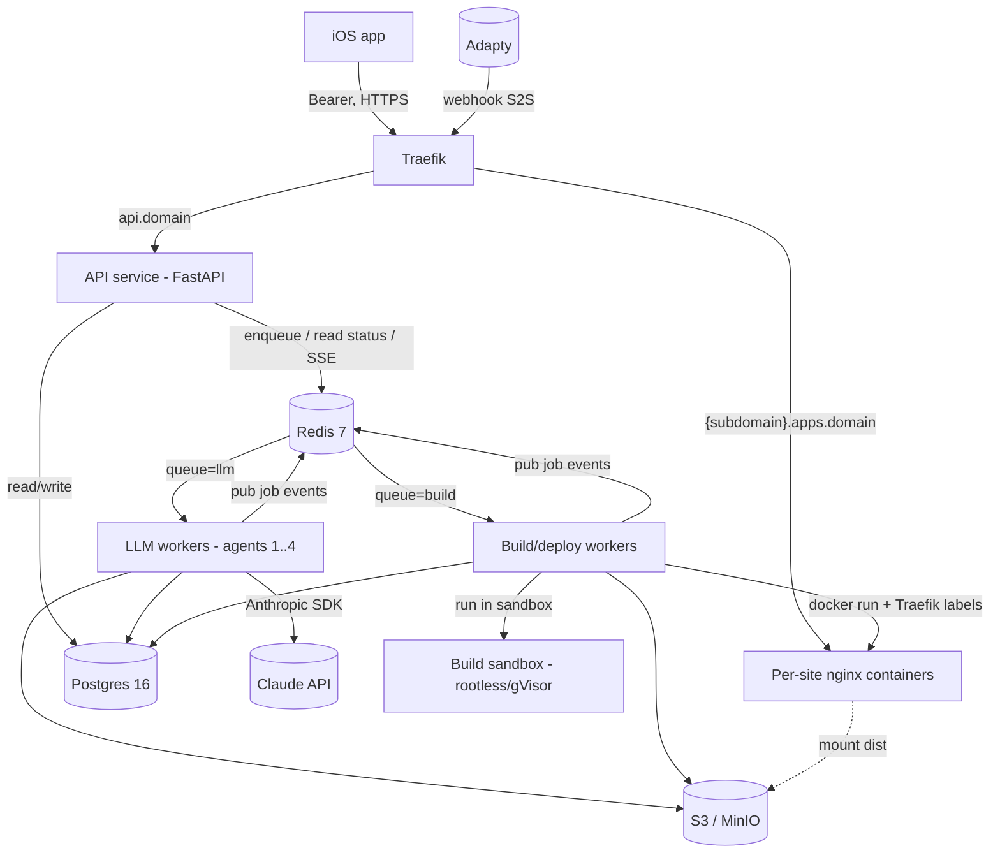

# 01 — Architecture

## Компоненты

| Компонент | Технология | Роль |
|---|---|---|
| **API service** | FastAPI (stateless) | REST для iOS, auth, приём джоб, статус/SSE. Не делает LLM-вызовов и сборок инлайн — только кладёт работу в очередь и читает статус из Redis/Postgres. |
| **Pipeline orchestrator** | state-machine + диспетчер, живёт в воркерах | Управляет переходами state-машины джобы. Не один длинный task, а task-на-состояние (см. [ADR-001](adr/ADR-001-state-machine-dispatcher.md)). |
| **LLM workers** | Celery, `queue=llm` | Агенты 1–4 через Anthropic SDK. Масштабируются по rate-limit Claude. |
| **Build/deploy workers** | Celery, `queue=build` | `vite build` в песочнице, nginx-контейнер, Traefik-route, health-check. Масштабируются по CPU. Отдельная очередь от LLM. |
| **Build sandbox** | rootless/gVisor контейнер | Изолированное выполнение сборки недоверенного LLM-кода. |
| **Traefik v3** | reverse-proxy | Динамический роутинг `{subdomain}.apps.domain` по Docker-лейблам; фронтит API на `api.domain`. |
| **Per-site nginx** | nginx:alpine, контейнер на сайт | Отдаёт статику сайта; лейблы для Traefik. |
| **Postgres 16** | SQLAlchemy 2.0 async + Alembic | System of record. |
| **Redis 7** | — | Брокер Celery + result backend, SSE pub/sub (`job:{id}`), счётчики rate-limit/budget, кэш статуса. |
| **S3 / MinIO** | MinIO в dev | Исходники (`source.tgz`), артефакты сборки (`dist/`), build-логи. В Postgres только ссылки. |
| **Billing (Adapty)** | модуль `app/billing` | Обработчик вебхуков Adapty, server-side проверка прав (`getProfile`), маппинг тарифа → квоты. |

## Границы (инварианты)

- **API не трогает Docker и Claude.** Только Postgres + Redis (очередь, статус). Любая тяжёлая работа делегируется воркерам.
- **Воркеры не отдают HTTP клиенту.** Результат пишется в Postgres + публикуется в Redis pub/sub; клиент читает через API (poll/SSE).
- **Redis — единственная точка синхронизации** между API и воркерами: воркеры пишут статус/события, API читает.
- **LLM-очередь и build-очередь раздельны** — независимое масштабирование, разные профили ресурсов (rate-limit vs CPU).
- **Сборка LLM-кода — только в песочнице**, никогда на хосте воркера.

## Диаграмма компонентов



## Поток happy-path

```mermaid
sequenceDiagram
    participant iOS
    participant API
    participant Redis
    participant LLMW as LLM worker
    participant BLDW as Build worker
    participant Site

    iOS->>API: POST /projects (промт, Idempotency-Key)
    API->>Redis: enqueue (queue=llm, Agent 1)
    API-->>iOS: 202 {job_id}
    LLMW->>LLMW: Agent 1 → вопросы
    LLMW->>Redis: pub events; state=AWAITING_CLARIFICATION
    Note over LLMW,Redis: пауза — ноль задач в очереди
    iOS->>API: GET /jobs/{id}/questions
    iOS->>API: POST /jobs/{id}/answers
    API->>Redis: enqueue (queue=llm, Agent 2) — резюм
    LLMW->>LLMW: Agent 2 → спека → Agent 3 → source.tgz в S3
    LLMW->>Redis: enqueue (queue=build)
    BLDW->>BLDW: vite build в песочнице → nginx + Traefik route
    BLDW->>Site: health-check 200
    BLDW->>Redis: pub events; state=LIVE, live_url
    iOS->>API: GET /jobs/{id} → LIVE + live_url
```

## State machine джобы генерации

```
CREATED → INTERVIEWING → AWAITING_CLARIFICATION → SPECCING → BUILDING
        → DEPLOYING → LIVE
DEPLOYING → FIXING → BUILDING → DEPLOYING   (цикл починки: фикс → пересборка, retry-budget)
FIXING → FAILED                            (бюджет/попытки исчерпаны)
LIVE → FIXING → LIVE                       (post-delivery правки, новый Revision)
```

Подробности переходов, гардов цикла FIXING и резюма — в [modules/pipeline/03-architecture.md](modules/pipeline/03-architecture.md).

## Deployment topology

- **Dev (Windows):** весь стек в Docker Desktop / WSL2 через `docker-compose.dev.yml`. dev ≈ prod.
- **Prod:** Linux / Docker. API stateless → реплики за Traefik. LLM-воркеры и build-воркеры — на отдельных хостах (build-хосты с песочницей). Подробности — [07-deployment.md](07-deployment.md).
