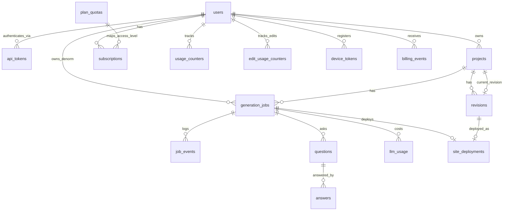

# 03 — Data Model (Postgres 16)

Принцип: **Postgres — system of record для метаданных. Все крупные бинарные артефакты (исходники `source.tgz`, `dist/`, build-логи) — в S3/MinIO, в БД хранятся только ссылки (`*_ref` = S3-ключ).** Adapty — источник истины по подпискам, `subscriptions` — локальный кэш.

ID: префиксные opaque строки (`u_`, `p_`, `j_`, `r_`, `d_`). Все таймстампы — `timestamptz` (UTC). Денежные величины — `numeric(10,4)` USD.

## ER-диаграмма

## users

| Поле | Тип | Заметки |
|---|---|---|
| `id` | text PK | `u_...`. Используется как Adapty `customer_user_id` ([Q-BILLING-3](99-open-questions.md#q-billing-3)). |
| `apple_sub` | text NULL UNIQUE | **Sprint 3.** Стабильный `sub` из Apple identity token (Sign in with Apple, [ADR-007](adr/ADR-007-sign-in-with-apple.md)). Identity-якорь upsert'а пользователя. NULL допустим только для legacy S1 seeded-юзера. UNIQUE-индекс. |
| `api_key_hash` | text NULL | **Legacy (S1).** argon2id-хэш единственного seeded Bearer-ключа. С Sprint 3 реальные токены живут в `api_tokens` (мульти-устройство, индексируемый lookup). Поле сохранено на время миграции (fallback-путь, [ADR-008](adr/ADR-008-indexed-api-key-lookup.md) → «Миграционный путь»); становится nullable. |
| `adapty_customer_user_id` | text NULL UNIQUE | Связка с Adapty профилем = `users.id`. Создаётся при первом входе iOS ([Q-BILLING-3](99-open-questions.md#q-billing-3) resolved). |
| `monthly_budget_usd` | numeric(10,4) | Технический потолок затрат Claude на юзера (отдельно от бизнес-квоты). |
| `status` | text | `active` / `suspended`. |
| `created_at` | timestamptz | |

## api_tokens (Sprint 3)

Реальные opaque Bearer-токены пользователя. **Мульти-устройство:** N активных строк на `user_id` (по токену на устройство). Индексируемый O(1) lookup по `key_id` ([ADR-008](adr/ADR-008-indexed-api-key-lookup.md)) — закрывает [TD-004](100-known-tech-debt.md#td-004).

| Поле | Тип | Заметки |
|---|---|---|
| `id` | text PK | `t_...`. Адресует токен в `DELETE /v1/auth/tokens/{id}`. |
| `user_id` | text FK→users NOT NULL | Владелец. Индекс по `(user_id)` для листинга устройств. |
| `key_id` | text NOT NULL UNIQUE | **Публичный** индексируемый префикс ключа (`[a-z0-9]{16}`, не секрет). Точка O(1) lookup: `WHERE key_id = :key_id AND revoked_at IS NULL`. UNIQUE-индекс — **единственная** точка поиска токена ([ADR-008](adr/ADR-008-indexed-api-key-lookup.md)). |
| `key_hash` | text NOT NULL | argon2id-хэш **секретной** части ключа. Сам секрет не хранится/не восстановим. Один constant-time argon2-verify после lookup по `key_id`. |
| `device_label` | text NULL | Опц. человекочитаемая метка устройства (для UI списка устройств). |
| `created_at` | timestamptz NOT NULL | Момент выдачи. |
| `last_used_at` | timestamptz NULL | Обновляется при успешной аутентификации (для UI/аудита; апдейт best-effort, вне горячей транзакции). |
| `revoked_at` | timestamptz NULL | NULL = активен. Отзыв (`DELETE /v1/auth/tokens/{id}`/logout) выставляет `now()` — мягкий revoke без удаления строки (аудит). Lookup игнорирует `revoked_at IS NOT NULL`. |

> Формат ключа, выдаваемого клиенту: `lv_<key_id>_<secret>` ([ADR-008](adr/ADR-008-indexed-api-key-lookup.md)). В БД — только `key_id` (открыто) + argon2-хэш `secret`. Миграция `api_tokens` вводится в Sprint 3.

## projects

| Поле | Тип | Заметки |
|---|---|---|
| `id` | text PK | `p_...` |
| `user_id` | text FK→users | Изоляция: все запросы фильтруются по `user_id`. |
| `prompt` | text | Исходный промт пользователя. |
| `current_revision_id` | text FK→revisions NULL | Текущая «good» ревизия (для rollback). |
| `title` | text NULL | Опц. человекочитаемое имя. |
| `created_at` | timestamptz | |
| `deleted_at` | timestamptz NULL | **Sprint 4.** Soft-delete-маркер ([ADR-011](adr/ADR-011-project-delete-gc.md)). `NULL` = активен. `DELETE /projects/{pid}` ставит `now()` → проект исключается из всех `GET`-листингов/деталей (фильтр `deleted_at IS NULL`) и из подсчёта `max_projects` quota-gate (`projects_used` считает только `deleted_at IS NULL`); ставится Celery `project.gc` (полный GC ресурсов → hard-delete строки). Миграция `20260602_0003`. |

## generation_jobs

| Поле | Тип | Заметки |
|---|---|---|
| `id` | text PK | `j_...` |
| `project_id` | text FK→projects | |
| `user_id` | text FK→users NOT NULL | Денормализация владельца (= `projects.user_id`). Нужен для unique-constraint идемпотентности и фильтрации tenant-изоляции без join. Индекс по `(user_id)`. |
| `state` | enum NOT NULL | `CREATED, INTERVIEWING, AWAITING_CLARIFICATION, SPECCING, BUILDING, DEPLOYING, LIVE, FIXING, FAILED`. **Диспетчер маршрутизирует по этой колонке.** Индекс по `(state)`. |
| `kind` | text | `generation` / `edit` (post-delivery правка) / `rollback` (**Sprint 5** — джоба re-deploy сохранённой good-ревизии, ручной `POST .../rollback`; [ADR-014 §B](adr/ADR-014-edit-limit-revision-rollback.md), [modules/deploy/03-architecture.md §7](modules/deploy/03-architecture.md#7-rollback-ревизии-sprint-5--re-deploy-good-ревизии-adr-014)). `kind='rollback'`-джоба **не** проходит через `FIXING` — это прямой re-deploy `is_good`-ревизии (`BUILDING/DEPLOYING → LIVE`), без Agent 4 / fix-loop. Не инкрементирует ни `usage_counters`, ни `edit_usage_counters` ([ADR-014 §A](adr/ADR-014-edit-limit-revision-rollback.md)). |
| `idempotency_key` | text NULL | Партиальный UNIQUE-индекс `(user_id, idempotency_key) WHERE idempotency_key IS NOT NULL`. Опирается на денормализованный `user_id` (см. выше). Для дедупа `POST /projects` и `/edits`. |
| `retry_count` | int | Текущая глубина fix-loop. Правило инкремента — единственный нормативный источник [pipeline §C(a)](modules/pipeline/03-architecture.md#c-четыре-гарда-от-бесконечного-цикла-и-runaway-затрат): инкремент **на каждом применённом патче** (`FIXING → BUILDING`), не на невалидном патче и не на инфра-ретраях Celery ([ADR-006](adr/ADR-006-celery-retry-vs-domain-fixing.md)). Гард (a). |
| `max_fix_attempts` | int | Hard cap (a). Инициализируется из env `MAX_FIX_ATTEMPTS` (default 3) при создании джобы. |
| `budget_usd` | numeric(10,4) | Cost cap джобы (b). Инициализируется из env `JOB_BUDGET_USD` (в S3.5 — per-plan `plan_quotas.job_budget_usd`). |
| `spend_usd` | numeric(10,4) | Накопленные затраты (сумма `llm_usage.cost_usd`). |
| `wall_clock_deadline` | timestamptz NULL | Wall-clock cap (c). `created_at + JOB_WALL_CLOCK_BUDGET_S` (default 3600 s). NULL ⇒ гард выключен. |
| `last_failure_signature` | text NULL | **Внутреннее guard-state.** Хэш сигнатуры предыдущего фейла для no-progress detection (d). Алгоритм — [ADR-005](adr/ADR-005-no-progress-failure-signature.md). |
| `failure_event_pending` | boolean NOT NULL default false | **Внутреннее guard-state** (как `last_failure_signature`). Различает новый distinct failure-event от crash-resume reprocessing того же лога reconciler'ом в no-progress гарде (d). Выставляется при рождении нового failure-event (`enter_fixing` и обработка невалидного патча Agent 4), сбрасывается гардом no-progress. Семантика — [pipeline §C(d)](modules/pipeline/03-architecture.md#d-no-progress-detection); миграция `20260602_0002`. Уточняет [ADR-005](adr/ADR-005-no-progress-failure-signature.md). |
| `spec_tz` | text NULL | Финальная спека (output Agent 2). Если большая — `spec_ref` в S3 (решение: текст ≤ 16 KB inline, иначе ref). |
| `failure_log_ref` | text NULL | S3-ключ лога последнего фейла (`logs/{job_id}/build.log`). Вход Agent 4. Перезаписывается каждым витком. |
| `failure_reason` | text NULL | Машинный код при `FAILED`. Перечень S2: `build_unrecoverable`, `budget_exhausted`, `wall_clock_exceeded`, `no_progress`, `fixer_gave_up`, `invalid_agent_output`, `infra_error`, `clarification_timeout` ([modules/pipeline/03-architecture.md → §C](modules/pipeline/03-architecture.md#c-четыре-гарда-от-бесконечного-цикла-и-runaway-затрат)). **S4:** добавлен `project_deleted` — джоба отменена удалением проекта ([ADR-011](adr/ADR-011-project-delete-gc.md), [modules/deploy/03-architecture.md §6](modules/deploy/03-architecture.md#6-gc-при-удалении-проекта-sprint-4--delete-projectsid-adr-011-закрывает-td-003q-deploy-3)). **S5:** добавлен `edit_failed_rolled_back` — edit-джоба (`kind=edit`) исчерпала гарды, откатилась на прежнюю `is_good`-ревизию; падает **только** edit-джоба, сайт остаётся `LIVE` на прежней ревизии ([ADR-014 §C](adr/ADR-014-edit-limit-revision-rollback.md), [modules/pipeline/03-architecture.md → post-delivery edit](modules/pipeline/03-architecture.md#post-delivery-edit-live--fixing--live--контракт-зафиксирован-реализация-в-sprint-5)). Без расширения enum `state` — терминал `FAILED`. **S5 (rollback):** провал re-deploy при ручном rollback (`kind='rollback'`) переиспользует существующий `infra_error` — новый reason-код **не** вводится (re-deploy сохранённой good-ревизии без LLM/новой сборки дерева; фейл = инфра/health, не доменный build-fail). Здоровье прежнего деплоя не затрагивается — прежняя good-ревизия остаётся `active` ([ADR-014 §B](adr/ADR-014-edit-limit-revision-rollback.md), [modules/deploy/03-architecture.md §7](modules/deploy/03-architecture.md#7-rollback-ревизии-sprint-5--re-deploy-good-ревизии-adr-014)). **Prod-фикс ([ADR-019](adr/ADR-019-reconciler-all-active-states-agent-graceful-fail.md)):** добавлены `agent_unavailable` (LLM недоступен — `429`/`5xx`/timeout исчерпали ретраи **или** `401`/`403`/`400` без ретрая → graceful-fail шага агента, [pipeline §G](modules/pipeline/03-architecture.md#g-graceful-fail-шага-агента-при-недоступности-llm-adr-019)) и `stuck_timeout` (reconciler терминализировал джобу, провисевшую в активном LLM-фазном state дольше `STUCK_THRESHOLD_S` без живой таски — предохранитель concurrency-leak, [pipeline §E2](modules/pipeline/03-architecture.md#e2-reconciler-застрявших-активных-состояний-crash-resume--concurrency-leak-guard-adr-019)). |
| `last_transition_at` | timestamptz NOT NULL default now() | **[ADR-019] — heartbeat прогресса джобы.** Момент последнего входа в текущий `state`. Обновляется транзакционно при **каждой** смене `state` (та же транзакция, что `state`+`job_events`+publish), и **только** при ней — прочие апдейты строки (`spend_usd` cost-ledger, `failure_log_ref`, guard-state) его **не** трогают. Reconciler (§E2) использует именно его (а не `updated_at`, который дёргается cost-ledger'ом и ложно сбрасывал бы heartbeat) для stuck-критерия активных нетерминальных состояний → fail-stuck/ре-диспетчеризация против concurrency-leak. Нормативно — [modules/pipeline/03-architecture.md → §E2](modules/pipeline/03-architecture.md#e2-reconciler-застрявших-активных-состояний-crash-resume--concurrency-leak-guard-adr-019). Миграция: новая (backfill существующих строк значением `updated_at`). |
| `created_at` / `updated_at` | timestamptz | |

> Терминальные/устойчивые состояния, где задач в очереди нет: `AWAITING_CLARIFICATION`, `LIVE`, `FAILED`. Sweeper (beat) экспайрит `AWAITING_CLARIFICATION` по TTL.

> **Текст instruction правки (`POST /edits`) — отдельной колонки нет (Sprint 5).** `generation_jobs` **не** несёт колонки `instruction`: текст правки хранится в append-only `job_events` как `payload` события `edit_requested` (`event_type='edit_requested'`). `job_events` — уже источник истины событий джобы (аудит + вход SSE), edit-instruction естественно ложится туда без новой колонки/миграции. Это **единственный** нормативный источник хранения instruction; вход Agent 4 в edit-цикле читает её оттуда. Нормативно — [modules/pipeline/03-architecture.md → post-delivery edit](modules/pipeline/03-architecture.md#post-delivery-edit-live--fixing--live--контракт-зафиксирован-реализация-в-sprint-5), форма payload — [job_events](#job_events).

## job_events

Аудит + источник для SSE. Append-only.

| Поле | Тип | Заметки |
|---|---|---|
| `id` | bigserial PK | |
| `job_id` | text FK→generation_jobs | Индекс по `(job_id, id)`. |
| `event_type` | text | `state_changed`, `agent_started`, `question_posted`, `build_failed`, `fix_attempted`, `deployed`, `failed`, `edit_requested`, ... Для fix-loop: `build_failed` (с `payload.failure_class`/`failure_signature`), `fix_attempted` (с `payload.retry_count`). **Sprint 5:** `edit_requested` (`kind='edit'`) несёт в `payload` текст правки пользователя (`payload.instruction`) — **единственный** источник хранения instruction (отдельной колонки `generation_jobs.instruction` нет, см. примечание под `generation_jobs`). Несёт историю витков, т.к. `failure_log_ref` перезаписывается. |
| `from_state` / `to_state` | text NULL | Для переходов. |
| `payload` | jsonb | Доп. данные события. |
| `created_at` | timestamptz | |

## questions / answers

| `questions` | Тип | Заметки |
|---|---|---|
| `id` | text PK | |
| `job_id` | text FK→generation_jobs | |
| `position` | int | Порядок. |
| `text` | text | Текст вопроса (output Agent 1). |
| `kind` | text NULL | `choice` / `free_text` (опц. для UI). |
| `options` | jsonb NULL | Варианты для `choice`. |

| `answers` | Тип | Заметки |
|---|---|---|
| `id` | text PK | |
| `question_id` | text FK→questions | |
| `job_id` | text FK→generation_jobs | Денормализация для резюма. |
| `text` | text | Ответ пользователя. |
| `created_at` | timestamptz | |

## revisions

| Поле | Тип | Заметки |
|---|---|---|
| `id` | text PK | `r_...` |
| `project_id` | text FK→projects | |
| `revision_no` | int | Монотонный per-project. UNIQUE `(project_id, revision_no)`. Адресует ревизию в `POST /projects/{pid}/revisions/{revision_no}/rollback` (**Sprint 5**, [ADR-014](adr/ADR-014-edit-limit-revision-rollback.md)). |
| `source_artifact_ref` | text | S3-ключ `source.tgz` этой ревизии. **Sprint 5:** источник пересборки при rollback, если `dist` целевой ревизии недоступен ([ADR-014 §B](adr/ADR-014-edit-limit-revision-rollback.md)). |
| `created_from_job_id` | text FK→generation_jobs | Какая джоба породила ревизию (генерация или правка `kind=edit`). |
| `is_good` | bool | `true` = успешно задеплоенная ревизия. **Sprint 5:** rollback (ручной — `POST .../rollback`; авто — при неудачной правке) откатывает `projects.current_revision_id` на ревизию с `is_good=true` (передеплой готового `dist` или пересборка из `source_artifact_ref`). Rollback **не** создаёт новую ревизию и **не** меняет `is_good` существующих ([ADR-014](adr/ADR-014-edit-limit-revision-rollback.md)). |
| `created_at` | timestamptz | |

> **Rollback ([ADR-014](adr/ADR-014-edit-limit-revision-rollback.md), Sprint 5):** rollback меняет, какая good-ревизия активна (`projects.current_revision_id`), переиспуская deploy-lifecycle: новый деплой целевой ревизии подтверждается health `200` → прежний `active`-деплой `→ superseded` (teardown). Health-fail нового деплоя оставляет прежнюю ревизию активной (без downtime). Нормативно — [modules/api/02-api-contracts.md → rollback](modules/api/02-api-contracts.md#post-projectspidrevisionsrevision_norollback-sprint-5), [modules/deploy/03-architecture.md §7](modules/deploy/03-architecture.md#7-rollback-ревизии-sprint-5--re-deploy-good-ревизии-adr-014).

## site_deployments

| Поле | Тип | Заметки |
|---|---|---|
| `id` | text PK | `d_...` |
| `project_id` | text FK→projects | |
| `revision_id` | text FK→revisions | |
| `subdomain` | text UNIQUE | Opaque-идентификатор деплоя (`[a-z0-9]{16}`, **не** `project_id`), генерируется при деплое. **Single normative source идентификатора деплоя**; колонка не переименовывается. В режиме `SITE_ROUTING_MODE=subdomain` — хост `{subdomain}.apps.domain`; в режиме `path` ([ADR-017](adr/ADR-017-path-based-site-routing.md)) то же значение служит сегментом пути `site_id` → `{APPS_DOMAIN}/s/{site_id}`. Единый для Traefik router rule, `live_url` и health-check (в обоих режимах). Устойчив к смене проекта/ревизии, opaque и **не реюзается** (защита от takeover). |
| `live_url` | text | Режим `subdomain`: `https://{subdomain}.apps.domain/`. Режим `path` ([ADR-017](adr/ADR-017-path-based-site-routing.md)): `https://{APPS_DOMAIN}/s/{site_id}/` (со слешем). Нормативный формат по режиму — [modules/deploy/03-architecture.md §2A](modules/deploy/03-architecture.md#2a-path-based-routing-s-site_id-prod--site_routing_modepath-adr-017). |
| `dist_artifact_ref` | text | S3-ключ собранного `dist/`. |
| `build_log_ref` | text NULL | S3-ключ build-лога. |
| `container_id` | text NULL | ID nginx-контейнера. Имя контейнера детерминировано (`site_{subdomain}`) — основа cleanup-before-run и teardown. GC при удалении проекта — [Q-DEPLOY-3](99-open-questions.md#q-deploy-3). |
| `status` | text | Машина состояний деплоя: `building` / `active` / `superseded` / `failed`. Полный lifecycle, легальные переходы и обязательный teardown на фейловых/вытесняющих переходах — [modules/deploy/03-architecture.md → §5 Lifecycle сайт-деплоя](modules/deploy/03-architecture.md#5-lifecycle-сайт-деплоя-state-machine-site_deploymentsstatus). **`torn_down` переименован в `failed`** (deploy не прошёл health-gate и снесён); «снесён при вытеснении новой ревизией» = `superseded`. |
| `created_at` | timestamptz | |

## llm_usage (cost-ledger)

| Поле | Тип | Заметки |
|---|---|---|
| `id` | bigserial PK | |
| `job_id` | text FK→generation_jobs | Индекс. |
| `agent` | text | `agent1`..`agent4`. |
| `model` | text | Использованная модель Claude. |
| `input_tokens` / `output_tokens` / `cache_read_tokens` / `cache_write_tokens` | int | Учёт prompt caching. |
| `cost_usd` | numeric(10,4) | Себестоимость вызова. |
| `created_at` | timestamptz | |

---

## Биллинг

### subscriptions (локальный кэш Adapty)

| Поле | Тип | Заметки |
|---|---|---|
| `id` | text PK | |
| `user_id` | text FK→users | |
| `access_level` | text | Маппится на `plan_quotas.access_level` (`free`/`pro`). Источник истины — Adapty. Нет строки `subscriptions` ⇒ трактуется как `free`. |
| `product_id` | text NULL | Adapty product (привязка product_id↔access_level — в дашборде Adapty, внешняя зависимость; `plan_quotas` ключуется по `access_level`). |
| `status` | text | `active` / `expired` / `grace` / `billing_issue`. На гейте (quota-gate) пропускаются **только** `active` и `grace`; `billing_issue`/`expired` → `402` ([modules/billing/03-architecture.md §4](modules/billing/03-architecture.md#4-entitlements--quota-gate)). State-machine переходов по `event_type` — единственный нормативный источник [modules/billing/03-architecture.md §2.3/§6](modules/billing/03-architecture.md#23-маппинг-event_type--subscriptions-нормативная-таблица). Политика сайтов при `expired`/refund: grace `GRACE_PERIOD_DAYS` (7) → teardown ([08-product-decisions.md §3.5-6](08-product-decisions.md#sprint-35--billing-adapty), [Q-BILLING-1](99-open-questions.md#q-billing-1)). |
| `store` | text | `app_store` / ... |
| `started_at` / `expires_at` | timestamptz | |
| `grace_until` | timestamptz NULL | Дедлайн grace-периода (`expire/refund + GRACE_PERIOD_DAYS`). `subscription_sweep` (beat) сносит сайты при `status='grace' AND grace_until < now()`. Renew/started в grace → `grace_until=NULL` (teardown отменён). NULL вне grace. [modules/billing/03-architecture.md §6](modules/billing/03-architecture.md#6-grace-период-сайтов-q-billing-1). |
| `will_renew` | bool | |
| `adapty_transaction_id` | text | |
| `raw` | jsonb | Сырой профиль/событие Adapty. |
| `synced_at` | timestamptz | Последняя ресинхронизация (`getProfile`). TTL свежести — `BILLING_RESYNC_INTERVAL_S`; протух ⇒ lazy-ресинк на гейте/`/billing/me`. |

### plan_quotas

| Поле | Тип | Заметки |
|---|---|---|
| `access_level` | text PK | `free` / `pro` (premium = `pro`, [Q-BILLING-1](99-open-questions.md#q-billing-1) resolved). |
| `monthly_generations` | int | Бизнес-квота генераций/мес. |
| `max_concurrent_jobs` | int | Cap конкурентных активных джоб (энфорс — quota-gate; в S3 rate-limit/cap опираются на дефолт free до подключения billing). Счёт активных джоб **kind-агностичен** (`generation`/`edit`/`rollback` все занимают слот) — нормативный источник [modules/billing/03-architecture.md §4.3](modules/billing/03-architecture.md#4-entitlements--quota-gate); следствие на Free (`=1`) и наблюдаемость — [TD-012](100-known-tech-debt.md#td-012). |
| `max_projects` | int NULL | `NULL` = безлимит (Pro). |
| `job_budget_usd` | numeric(10,4) | Технический потолок Claude на джобу для тарифа. |
| `monthly_edits` | int NULL | **Sprint 5** ([ADR-014](adr/ADR-014-edit-limit-revision-rollback.md)). Бизнес-квота **правок** (`kind='edit'`)/мес — **отдельная** от `monthly_generations` ([08 §5-2](08-product-decisions.md#sprint-5--realtime--edits)). `NULL` = безлимит (Pro). Энфорс — quota-gate на `/edits` против `edit_usage_counters.edits_used`. |

**Сидинг `plan_quotas` (нормативная таблица — [08-product-decisions.md → Sprint 3.5](08-product-decisions.md#sprint-35--billing-adapty) / [§5-2](08-product-decisions.md#sprint-5--realtime--edits)):**

| `access_level` | `monthly_generations` | `max_projects` | `max_concurrent_jobs` | `job_budget_usd` | `monthly_edits` |
|---|---|---|---|---|---|
| `free` | 3 | 1 | 1 | 5.0000 (env `JOB_BUDGET_USD`) | 5 |
| `pro` | 100 | `NULL` (безлимит) | 3 | 5.0000 (env `JOB_BUDGET_USD`) | `NULL` (безлимит) |

> `monthly_edits` сидится Alembic data-migration **Sprint 5** (дополняет существующие строки Free/Pro). Значения — [08 §5-2](08-product-decisions.md#sprint-5--realtime--edits).

> Две независимые величины: бизнес-квота (`monthly_generations`) vs себестоимость (`job_budget_usd`). Значения тарифов — [Q-BILLING-1](99-open-questions.md#q-billing-1) (resolved); себестоимость/калибровка — [Q-COST-1](99-open-questions.md#q-cost-1) (Sprint 6).

### usage_counters

| Поле | Тип | Заметки |
|---|---|---|
| `user_id` | text FK→users | PK `(user_id, period)`. |
| `period` | text | `YYYY-MM`. |
| `generations_used` | int | Инкремент на **успешный старт генерации** (`kind='generation'`), не на `POST /projects` и не на `/answers`. Атомарный upsert `ON CONFLICT (user_id, period) DO UPDATE`, идемпотентно по `job_id` (guard от двойного инкремента при Celery-реплее). Точка инкремента — нормативно [modules/billing/03-architecture.md §5](modules/billing/03-architecture.md#5-учёт-usage_counters). Сверяется с `plan_quotas.monthly_generations` на гейте. Правки (`kind='edit'`, S5) **не** инкрементируют этот счётчик — у них отдельный `edit_usage_counters` ([ADR-014](adr/ADR-014-edit-limit-revision-rollback.md), [08 §5-2](08-product-decisions.md#sprint-5--realtime--edits)). |

### edit_usage_counters (Sprint 5)

Отдельный помесячный счётчик **правок** (`kind='edit'`) — лимит правок независим от квоты генераций ([ADR-014](adr/ADR-014-edit-limit-revision-rollback.md), [08 §5-2](08-product-decisions.md#sprint-5--realtime--edits)). Структурно зеркалит `usage_counters`.

| Поле | Тип | Заметки |
|---|---|---|
| `user_id` | text FK→users | PK `(user_id, period)`. |
| `period` | text | `YYYY-MM` (UTC). |
| `edits_used` | int | Инкремент на **успешный старт edit-джобы** (`kind='edit'`, постановка первой `task_fix`-edit), **не** на `POST /edits` и **не** на rollback. Атомарный upsert `ON CONFLICT (user_id, period) DO UPDATE`, идемпотентно по `job_id`. Сверяется с `plan_quotas.monthly_edits` на quota-gate `/edits`. Нормативная точка — [modules/billing/03-architecture.md §7](modules/billing/03-architecture.md#7-граница-s5-edits). |

> Rollback (`POST .../rollback`) **не** инкрементирует `edit_usage_counters` — это передеплой существующей good-ревизии без новой генерации/правки ([ADR-014 §A](adr/ADR-014-edit-limit-revision-rollback.md)).

### device_tokens (Sprint 5)

APNs device tokens для push-нотификаций ([ADR-013](adr/ADR-013-apns-push-from-job-events.md)). **Мульти-устройство:** N токенов на user.

| Поле | Тип | Заметки |
|---|---|---|
| `id` | text PK | `dev_...`. |
| `user_id` | text FK→users NOT NULL | Владелец. Индекс по `(user_id)` для выборки устройств при отправке push. |
| `apns_token` | text NOT NULL | APNs device token (hex). UNIQUE `(user_id, apns_token)` — upsert при регистрации `POST /v1/devices`. |
| `platform` | text NOT NULL | `ios` (зарезервировано на будущие платформы). |
| `environment` | text NOT NULL | `sandbox` / `production` — определяет APNs-хост (`api.sandbox.push.apple.com` / `api.push.apple.com`). |
| `created_at` | timestamptz NOT NULL | Момент регистрации. |
| `last_push_at` | timestamptz NULL | Последняя успешная доставка (аудит, best-effort). |
| `invalidated_at` | timestamptz NULL | NULL = активен. Выставляется `now()` при APNs `410 Unregistered`/`400 BadDeviceToken` или явной отписке `DELETE /v1/devices/{token}`. Выборка для push игнорирует `invalidated_at IS NOT NULL`. |

> APNs credentials (`.p8`-ключ, `APNS_*`) — **внешняя зависимость пользователя** (Apple Developer), не в БД; хранятся как секрет/конфиг-артефакт ([07-deployment.md](07-deployment.md), [ADR-013](adr/ADR-013-apns-push-from-job-events.md)).

### billing_events (Adapty webhook ledger)

| Поле | Тип | Заметки |
|---|---|---|
| `id` | bigserial PK | |
| `adapty_event_id` | text UNIQUE NOT NULL | **Идемпотентность** обработки вебхуков (`= webhook.event_id`). Единственная точка дедупа; повтор → `200` no-op. |
| `event_type` | text | Adapty webhook v2: `subscription_started` / `subscription_renewed` / `subscription_expired` / `subscription_refunded` / `billing_issue_detected` / `access_level_updated`. Маппинг → `subscriptions` — нормативно [modules/billing/03-architecture.md §2.3](modules/billing/03-architecture.md#23-маппинг-event_type--subscriptions-нормативная-таблица). |
| `user_id` | text FK→users NULL | После маппинга. |
| `payload` | jsonb | Сырой вебхук. |
| `processed_at` | timestamptz NULL | NULL = принят, не обработан. |
| `received_at` | timestamptz | |
