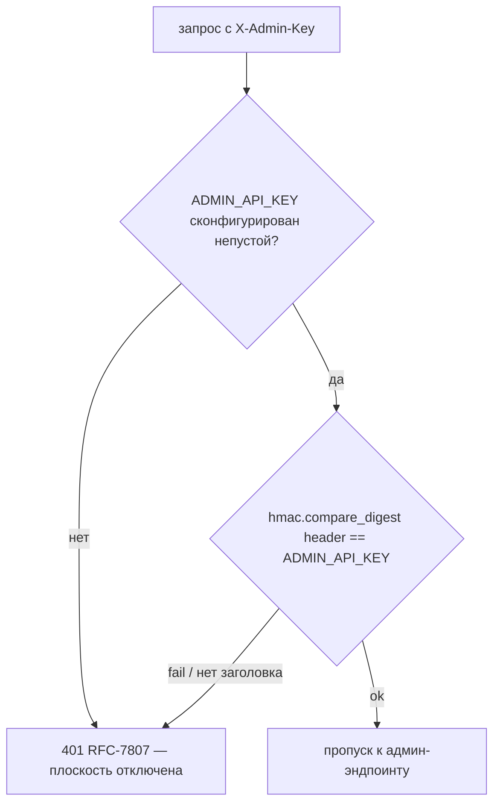

# admin — Architecture ([ADR-021](../../adr/ADR-021-admin-plane-and-bonus-credits.md))

Операторская плоскость: один секрет `ADMIN_API_KEY` (не RBAC), login-as, бонус-кредиты. Работает в dev и prod; безопасность — секрет, **не** среда.

## Слои (`app/admin`)
- **dependency `require_admin`** — аутентификация админ-эндпоинтов по `X-Admin-Key`.
- **login-as** — выпуск пользовательского Bearer за `user_id` (через `auth.token_service`), upsert юзера без `apple_sub`.
- **credits** — начисление/коррекция бонус-генераций (ledger `credit_grants` + `users.bonus_generations_balance`); чтение баланса+квоты.

## 1. `require_admin` ([ADR-021 §A](../../adr/ADR-021-admin-plane-and-bonus-credits.md))

- Заголовок — **`X-Admin-Key`** (отдельный от `Authorization` — не конфликтует с Bearer-парсингом `current_user`).
- Сравнение — **constant-time** `hmac.compare_digest(provided, settings.admin_api_key.get_secret_value())` (stdlib `hmac`, без новой зависимости).
- **Пустой `ADMIN_API_KEY`** (`None`/`""`) → всегда `401` (один код-путь; `compare_digest` против пустого никогда не проходит). Эндпоинты **видны** в публичной схеме (§4), но без валидного `X-Admin-Key` недоступны (`401`) — видимость защиту не ослабляет.
- Провал → `401` RFC-7807 без раскрытия причины (как auth-провалы `current_user`).
- **Среда не гейтит** — `settings.environment` в `require_admin` не используется (dev И prod).

## 2. Login-as ([ADR-021 §B](../../adr/ADR-021-admin-plane-and-bonus-credits.md))

`POST /v1/admin/login-as` (`require_admin`):
1. Резолв юзера по `body.user_id`:
   - найден → берём его;
   - не найден (или `user_id` опущен) → создаём `users` (`id` = переданный или сгенерированный `u_...`, **`apple_sub=NULL`**, `adapty_customer_user_id=users.id`, `status='active'`, `bonus_generations_balance=0`). Минимальный upsert — зеркалит создание в `/auth/apple`, но без Apple-якоря.
2. `auth.token_service`: генерация `key_id`+`secret`, insert `api_tokens` (`key_hash=argon2id(secret)`, `device_label` = `body.device_label` или `"admin-login"`).
3. Ответ `{ api_key: "lv_<key_id>_<secret>", token_id, user_id }` — ключ **один раз** (как `/auth/apple`).

> **`apple_sub=NULL` для admin-created юзеров** — расширение инварианта S1 (раньше NULL только для seed-юзера). UNIQUE по `apple_sub` сохраняется (NULL не нарушает UNIQUE в Postgres). [03-data-model → users](../../03-data-model.md#users).

## 3. Бонус-генерации (кредиты, [ADR-021 §D](../../adr/ADR-021-admin-plane-and-bonus-credits.md))

Модель и семантика списания — единый нормативный источник [billing §10](../billing/03-architecture.md#10-бонус-генерации-кредиты-adr-021); data-model — [credit_grants](../../03-data-model.md#credit_grants-бонус-генерации-adr-021) + `users.bonus_generations_balance`. Здесь — админ-точки записи:

- **`POST /v1/admin/users/{user_id}/credits`** `{ amount, reason? }`:
  - `404` если `user_id` нет.
  - **Идемпотентность:** `Idempotency-Key` → если строка `credit_grants(user_id, idempotency_key)` уже есть, no-op, вернуть текущий баланс.
  - Атомарно в одной транзакции: `INSERT credit_grants(amount, reason, idempotency_key, created_by='admin')` + `UPDATE users SET bonus_generations_balance = bonus_generations_balance + :amount`.
  - **Инвариант `>= 0`:** при `amount < 0` и `balance + amount < 0` → `409`, rollback (строка не пишется). `amount == 0` → `422`.
- **`GET /v1/admin/users/{user_id}`** — те же агрегаты, что `GET /billing/me` ([billing §2](../billing/02-api-contracts.md#2-get-v1billingme)) + `bonus_generations_balance`, но за указанного `user_id`. `404` если нет.

> Списание кредитов (на старте генерации) — **не** здесь: атомарный декремент `users.bonus_generations_balance` на квота-гейте/usage ([billing §10.3](../billing/03-architecture.md#10-бонус-генерации-кредиты-adr-021)), без строки `credit_grants`. `credit_grants` — только входящие начисления/коррекции.

## 3.5. Выдача pro-подписки ([ADR-037](../../adr/ADR-037-admin-grant-pro-subscription.md))

`POST /v1/admin/users/{user_id}/subscription` (`require_admin`) — ставит `subscriptions.access_level=pro`/`status=active` выбранному юзеру на срок или бессрочно, без симуляции Adapty-вебхука. **Токены НЕ начисляет** (это ось `/credits`, §3) — нормативное разделение осей.

- **Резолв юзера:** `admin_service.get_user(user_id)` → `404` если нет (юзер **не** создаётся, в отличие от login-as §2 — [ADR-037 §A](../../adr/ADR-037-admin-grant-pro-subscription.md)).
- **Срок (тело):** `duration_days` ∨ `expires_at` (взаимоисключающи; оба `null` → бессрочно `expires_at=NULL`). Оба заданы / `duration_days<=0` / `expires_at` не в будущем → `422`.
- **Установка подписки — новый helper `subscription_state.apply_admin_grant`** (единый нормативный источник механики — [billing §12](../billing/03-architecture.md#12-admin-grant-pro-подписки-adr-037)): переиспользует `_ensure_row` (одна строка на `user_id`, idempotent upsert), ставит `access_level=pro`, `status=active`, `grace_until=NULL`, `will_renew=false`, `expires_at` из параметра, `started_at=now()` если не задан, `synced_at=now()`, `store='admin'`, `product_id=NULL`, `raw={source:'admin_grant',...}`. **Не** прямой upsert из `admin_service` (не дублирует state-machine [billing §2.3](../billing/03-architecture.md#23-маппинг-event_type--subscriptions-нормативная-таблица)).
- **Ответ `200`** — `AdminUserResponse` (тот же снимок `build_billing_snapshot`, что `GET /admin/users/{user_id}`).
- **Аудит:** `logger.info("admin_grant_subscription", extra={user_id, access_level:'pro', expires_at, duration_days})`.

> **Без миграции/env/новых зависимостей** — переиспользуется таблица `subscriptions` (все поля уже есть). **Сосуществование с реальной Adapty-подпиской/ресинком** (ресинк/вебхук могут перезаписать grant) и **энфорс срока** (`expires_at` сейчас не триггерит истечение) — осознанные следствия, [ADR-037 §Consequences](../../adr/ADR-037-admin-grant-pro-subscription.md) + [Q-ADMIN-1](../../99-open-questions.md#q-admin-1).

## 4. Публичная OpenAPI ([ADR-021 §C revision](../../adr/ADR-021-admin-plane-and-bonus-credits.md))
- Все `/v1/admin/*` — **`include_in_schema=True`** (ВИДИМЫ в `/openapi.json` и `/docs`) под тегом **«Администрирование»** ([api §B.4/§B.5](../api/02-api-contracts.md#b4-группировка-по-доменам--tags-нормативный-перечень-русские-названия)). Роутер объявлен `APIRouter(prefix="/admin", tags=["Администрирование"])`.
- **Security — per-operation `AdminKey`, НЕ глобальный `BearerAuth`.** Кастомный `app.openapi()` (`main.py`) объявляет схему `AdminKey` (`type: apiKey`, `in: header`, `name: X-Admin-Key`) в `components.securitySchemes` и навешивает `security=[{AdminKey: []}]` на каждую операцию `/v1/admin/*`, чтобы Swagger `Authorize` принимал админ-ключ. Обычные (не-admin) эндпоинты наследуют глобальный `BearerAuth`.
- **Денилист утечки маркеров действует:** docstring/`summary` админ-роутов — русский, без `Sprint`/`ADR`/`TD`/имён агентов; grep-чек-лист [api §B.7](../api/02-api-contracts.md#b7-чек-лист-для-reviewerqa-grep-критерии-чистоты-openapijson) применяется к видимым админ-эндпоинтам (`admin`/`login-as`/`X-Admin-Key` легитимны, процессные маркеры — нет).
- Контракт видимости закреплён тестом `tests/contract/test_admin_openapi_visible.py`.

## Конвенции
- `ADMIN_API_KEY` в логах **никогда** не печатается (как Bearer-секрет). В Sentry — scrubbing (добавить в denylist, [05-security → Observability](../../05-security.md#observability-как-security-сигнал)).
- Префиксный opaque ID кредит-гранта: `cg_`.
