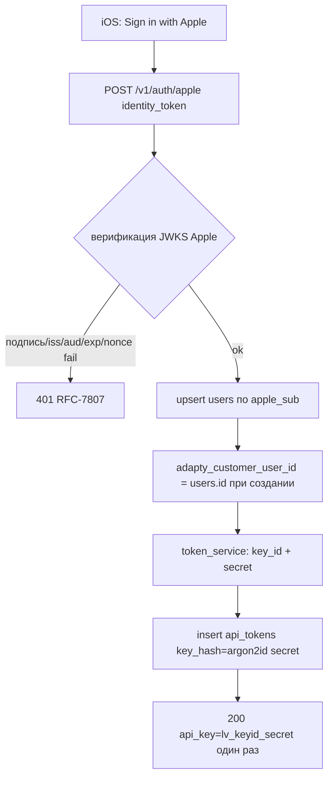

# auth — Architecture (Sprint 3)

## Слои (`app/auth`)
- **apple_verify** — верификация Apple identity token по JWKS (кэш ключей по `kid`), проверка `iss`/`aud`/`exp`/`nonce`.
- **token_service** — генерация `lv_<key_id>_<secret>`, запись/чтение/revoke `api_tokens`, argon2id хэш/verify.
- **dependency `current_user`** — Bearer-аутентификация всех запросов через индексируемый lookup (заменяет O(N)-перебор S1).
- **rate_limit** — Redis token bucket на ключ; **concurrency_cap** — счётчик активных джоб на user.
- Маппинг user ↔ Adapty (`adapty_customer_user_id = user.id`) — создаётся при первом входе.

## 1. Sign in with Apple flow ([ADR-007](../../adr/ADR-007-sign-in-with-apple.md))

- **JWKS-кэш:** ключи Apple кэшируются по `kid`; при неизвестном `kid` — refresh JWKS. Верификация офлайн (без вызова Apple на каждый логин).
- **Upsert по `apple_sub`:** identity-якорь — `sub` Apple-токена (не email; «Hide My Email» даёт релейный/отсутствующий email).

## 2. Токен-модель и O(1) lookup ([ADR-008](../../adr/ADR-008-indexed-api-key-lookup.md))

**Формат ключа клиента:** `lv_<key_id>_<secret>`.
- `key_id` — публичный индексируемый префикс (`[a-z0-9]{16}`, не секрет);
- `secret` — высокоэнтропийная секретная часть (≥ 32 байта энтропии); в БД — только `argon2id(secret)`.

**Lookup на каждом Bearer-запросе (dependency `current_user`):**
1. распарсить `Authorization: Bearer lv_<key_id>_<secret>` → извлечь `key_id`, `secret`;
2. `SELECT * FROM api_tokens WHERE key_id = :key_id AND revoked_at IS NULL` (UNIQUE-индекс → одна строка);
3. **один** `argon2.verify(row.key_hash, secret)` (constant-time);
4. успех → `current_user = row.user_id`; best-effort апдейт `last_used_at` (вне горячей транзакции);
5. любой провал (нет строки / verify fail / отозван / неверный формат) → `401`.

> **TD-004 closed:** ровно один argon2-verify на запрос, независимо от числа юзеров/токенов. Тест обязан подтвердить, что число argon2-verify не растёт с числом пользователей.

**Мульти-устройство:** N строк `api_tokens` на `user_id`, каждая со своим `key_id`. Логин с нового устройства = новая строка; существующие токены не трогаются.

**Revoke:** `DELETE /v1/auth/tokens/{id}` → `revoked_at = now()` (мягкий, строка сохраняется для аудита). Lookup игнорирует `revoked_at IS NOT NULL` → отозванный ключ сразу даёт `401`.

## 3. Миграционный путь S1 → S3 ([ADR-008](../../adr/ADR-008-indexed-api-key-lookup.md) → «Миграционный путь»)

- `users.api_key_hash` (S1 seeded) становится **nullable** legacy-полем; реальные токены — в `api_tokens`.
- Dependency `current_user`:
  1. если ключ имеет префикс `lv_` → **новый путь** (lookup `api_tokens` по `key_id`);
  2. иначе → **legacy fallback**: проверка против seeded `users.api_key_hash` (единственный S1-юзер) — сохраняет совместимость существующих integration-тестов S1/S2.
- Полный отказ от legacy-пути — после перевода тестов/окружения на новый формат (отметка в тестах). **Не ломает** обратную совместимость на время перехода.

## 4. Cross-tenant изоляция
- `current_user` из токена — единственный источник владельца; все запросы фильтруются по `user_id` (общая конвенция [modules/api/03-architecture.md](../api/03-architecture.md)).
- Авторизация владения на каждом `/{id}` (включая `DELETE /auth/tokens/{id}` → `404` для чужого токена, не раскрываем существование).

## 5. Rate-limit (60 req/min на ключ)
- **Redis token bucket** на `key_id` (gранулярность — токен, не user: мульти-устройство масштабирует независимо).
- Ключ Redis: `rl:{key_id}`; bucket 60 токенов / 60 s refill. Превышение → `429` + `Retry-After`.
- Применяется в middleware после `current_user` (нужен `key_id`). Анонимные `/auth/apple` лимитируются отдельным bucket по IP (защита от брутфорса логина) — `rl:apple:{ip}`.

## 6. Cap конкурентных генераций (1 free / 3 pro)
- **Счётчик активных джоб** на `user_id` (джоба «активна», пока не в терминальном `LIVE`/`FAILED`/`AWAITING_CLARIFICATION`).
- Проверяется на `POST /projects` и `/edits` **до** постановки задачи: `active_jobs(user) >= max_concurrent_jobs(access_level)` → `402` (RFC-7807, `reason=concurrency_limit`, см. каноникализацию ниже).
- Источник лимита — `plan_quotas.max_concurrent_jobs` по `access_level`. **В Sprint 3** реального billing нет → используется **дефолт free** (`max_concurrent_jobs = 1`) как заглушка. **С Sprint 3.5** заглушка заменена: `access_level` берётся из `billing.entitlements.resolve_access_level(user_id)` (реальный free/pro из `subscriptions`), лимит — `resolve_max_concurrent_jobs` ([modules/billing/03-architecture.md §4](../billing/03-architecture.md#4-entitlements--quota-gate)). Точка интеграции зафиксирована.
- **Код ответа (каноникализация S3.5):** превышение cap → `402 reason=concurrency_limit` (RFC-7807, единый payment-gate billing — [modules/billing/02-api-contracts.md §3](../billing/02-api-contracts.md#3-quota-gate-на-post-v1projects-и-post-v1projectspidedits)). `429` остаётся **только** за rate-limit 60/min (§5). Прежняя S3-формулировка «`429`/`402`» уточнена: для concurrency — `402`.
- Реализация счётчика: авторитет — Postgres (`COUNT` активных `generation_jobs` по `user_id`, согласовано с денормализованным `generation_jobs.user_id`); Redis-счётчик как быстрый гейт — опционально (та же логика, что [TD-006](../../100-known-tech-debt.md#td-006) для бюджета, не блокирует S3).

## 7. Admin login-as: upsert юзера без `apple_sub` ([ADR-021](../../adr/ADR-021-admin-plane-and-bonus-credits.md))

`POST /v1/admin/login-as` (админ-плоскость, [modules/admin/03-architecture.md §2](../admin/03-architecture.md#2-login-as-adr-021)) переиспользует `token_service` для выпуска пользовательского Bearer за указанного `user_id`, минуя Apple Sign-In:
- **Резолв юзера:** `body.user_id` найден → берём; не найден (или опущен) → создаём `users` (`id` = переданный или `u_...`, **`apple_sub=NULL`**, `adapty_customer_user_id=users.id`, `status='active'`, `bonus_generations_balance=0`).
- **`apple_sub=NULL` допустим** для admin-created юзеров (расширение S1-инварианта seed-юзера; UNIQUE по `apple_sub` не нарушается — NULL вне UNIQUE в Postgres). [03-data-model → users](../../03-data-model.md#users).
- **Выпуск токена** — тот же `token_service` (новая строка `api_tokens`, `device_label` = `body.device_label` или `"admin-login"`), `lv_<key_id>_<secret>` один раз.
- Защита эндпоинта — `require_admin` (`X-Admin-Key`), **не** Bearer. Контракт — [modules/admin/02-api-contracts.md](../admin/02-api-contracts.md).

## Конвенции
- Все секреты ключей — только argon2-хэш в БД; в логах — только `key_id`, **никогда** `secret`.
- Auth-провалы → `401` без раскрытия конкретной непрошедшей проверки.
- Префиксные opaque ID: `u_`, `t_`.
