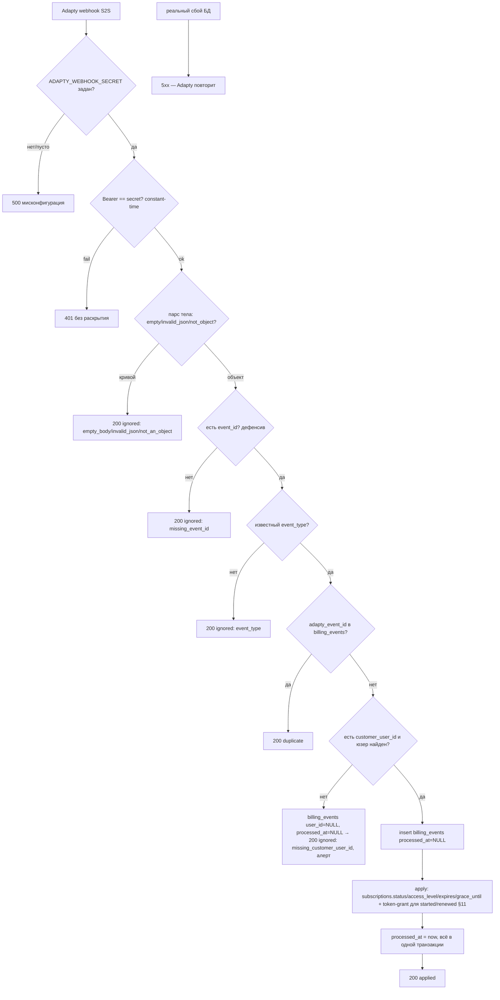
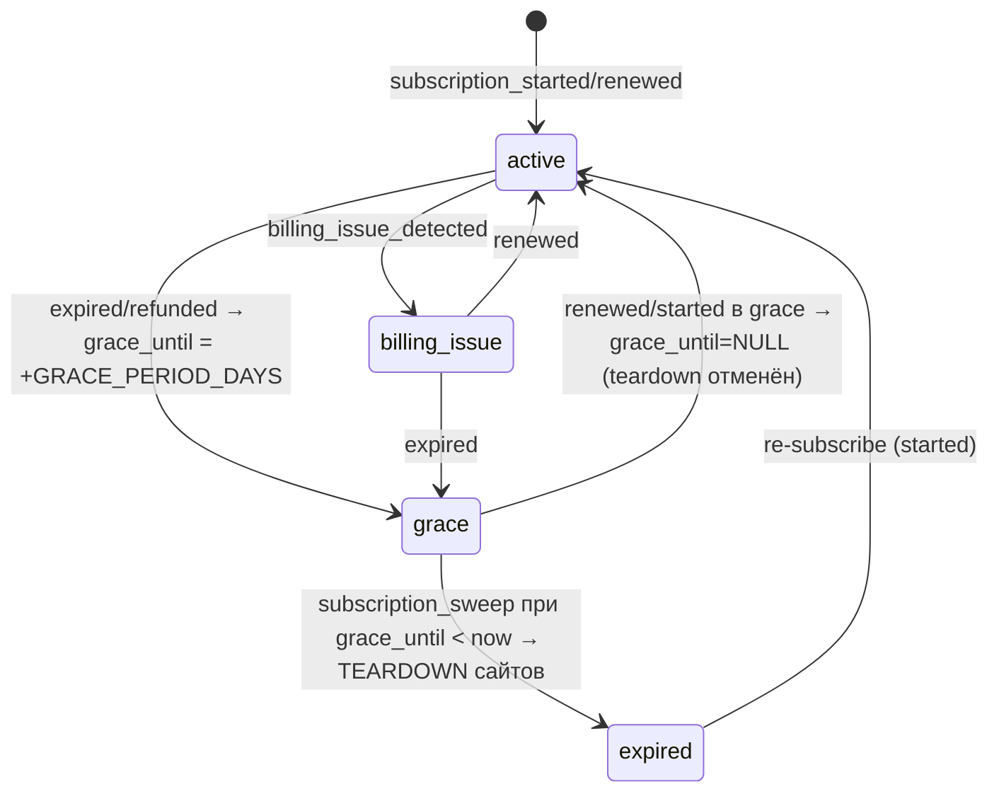

# billing — Architecture (исполняемый контракт Sprint 3.5)

## Источник истины
Adapty — источник истины по подпискам/правам. Локальный `subscriptions` — кэш, поддерживаемый вебхуками (основной канал) + периодическим `getProfile`-ресинком (fallback на пропущенные вебхуки) ([ADR-004](../../adr/ADR-004-adapty-source-of-truth.md), [ADR-009](../../adr/ADR-009-billing-idempotency-resync-grace.md)). На гейте по умолчанию читается кэш `subscriptions` (без `getProfile` на горячем пути).

## 1. Компоненты и точки интеграции

| Компонент | Модуль | Точка вызова |
|---|---|---|
| `webhook_handler` | `app/billing/webhook_handler` | `POST /v1/billing/webhook/adapty` (роутинг — `api`) |
| `adapty_client` | `app/billing/adapty_client` | httpx → Adapty Server-side API v2 (`getProfile`) |
| `resync` (beat) | `app/billing/resync` | Celery-beat `billing.resync`, интервал `BILLING_RESYNC_INTERVAL_S` |
| `entitlements` | `app/billing/entitlements` | `resolve_access_level(uid)` / `resolve_max_concurrent_jobs(uid)` — **заменяет S3-заглушку free** в `auth` ([auth §6](../auth/03-architecture.md)) |
| `quota_gate` | `app/billing/quota_gate` | FastAPI-dependency на `POST /projects` (S3.5) и `/edits` (контракт; активен с S5) |
| `usage` | `app/billing/usage` | инкремент `usage_counters` на успешном старте генерации |
| `subscription_sweeper` (beat) | `app/billing/subscription_sweeper` | Celery-beat `billing.subscription_sweep`, интервал `SUBSCRIPTION_SWEEP_INTERVAL_S` — grace-teardown сайтов |

---

## 2. Webhook handler (`POST /v1/billing/webhook/adapty`)

### 2.1 Авторизация ([ADR-027 §A](../../adr/ADR-027-adapty-webhook-bearer-token-grant.md))
- `Authorization: Bearer <ADAPTY_WEBHOOK_SECRET>`, сравнение **constant-time** (`hmac.compare_digest`). HMAC-проверка подписи **убрана** с webhook-пути. Это **не** пользовательский Bearer (`token_service`), а статический секрет вебхука.
- Неверный/отсутствующий токен → `401` (без раскрытия причины). `ADAPTY_WEBHOOK_SECRET` пуст/не задан → `500` (мисконфигурация сервера).
- **Авторизация ВСЕГДА до парсинга тела.** Секрет — secret manager/env ([05-security §Adapty webhook](../../05-security.md#adapty-webhook-не-bearer)).
- **Always-200-on-bad-input:** после успешной авторизации любой кривой payload → `200 {"status":"ignored",...}`; `5xx` — только на реальный внутренний сбой (БД). Нормативная таблица кодов/тел — [02-api-contracts §1](02-api-contracts.md#коды-ответов-и-always-200-on-bad-input-adr-027-b). Дефенсивный парсинг полей (`event_id||id`, `event_type.lower()`, `customer_user_id`-цепочка, `vendor_product_id`-цепочка, `expires_at`) — [02-api-contracts §1 Body](02-api-contracts.md#body-дефенсивный-парсинг--поля-разбросаны-по-версиям-sdk-adr-027-c).

### 2.2 Идемпотентность
`billing_events.adapty_event_id` UNIQUE — единственная точка дедупа. Повтор → `200` no-op. Insert ledger-строки и апдейт `subscriptions` — в **одной транзакции** с `processed_at=now()`; при ошибке апдейта транзакция откатывается, строка остаётся `processed_at=NULL` (добивается ресинком/повтором доставки).

### 2.3 Маппинг `event_type` → `subscriptions` (нормативная таблица)

`status` ∈ `active` / `expired` / `grace` / `billing_issue`. На гейте пропускаются **только** `active` и `grace` (§4). Единственный нормативный источник переходов по событиям:

| `event_type` Adapty | `status` после | `access_level` | `grace_until` | `will_renew`/`expires_at` |
|---|---|---|---|---|
| `subscription_started` | `active` | из `profile.access_level` | `NULL` | из `subscription.*` · **+ token-grant по тиру** (§11) |
| `subscription_renewed` | `active` | из профиля | `NULL` | из payload · **+ token-grant по тиру** (§11) |
| `access_level_updated` | `active` (если профиль активен), иначе по правилам ниже | новое значение | без изменения | без изменения |
| `subscription_cancelled` ([ADR-027 §F](../../adr/ADR-027-adapty-webhook-bearer-token-grant.md)) | сохраняется текущий (`active`/`grace` по фактической дате; **не** немедленный teardown) | сохраняется | без изменения (snос — по `subscription_expired`, когда наступит) | **`will_renew=false`** · **токены НЕ начисляем** |
| `subscription_expired` | `grace` | сохраняется текущий до teardown | `expires_at + GRACE_PERIOD_DAYS` | `will_renew=false` · без начисления |
| `subscription_refunded` | `grace` | сохраняется | `now() + GRACE_PERIOD_DAYS` | `will_renew=false` |
| `billing_issue_detected` | `billing_issue` | сохраняется | `NULL` | `will_renew` из payload |
| `subscription_renewed`/`started` когда текущий `status ∈ {grace, billing_issue}` | `active` | из профиля | **`NULL`** (отмена pending-teardown, §6) | из payload · **+ token-grant по тиру** (§11) |

> **`subscription_cancelled` ([ADR-027 §F](../../adr/ADR-027-adapty-webhook-bearer-token-grant.md)):** означает «подписка не продлится» (`will_renew=false`) — пользователь отменил автопродление, но доступ сохраняется до конца оплаченного периода. Сам по себе cancelled **не** меняет `status` (не делает grace немедленно) и **не** трогает токены `bonus_generations_balance`. Фактический переход в `grace`→`expired` происходит позже, по `subscription_expired` (когда период истечёт). Если Adapty не шлёт отдельный `subscription_expired` после cancelled — `getProfile`-ресинк (§3) приведёт `status` в соответствие по `expires_at`.

> `access_level` при `grace` сохраняется (не обнуляется в `free`) — пользователь в grace **сохраняет доступ генерации** (`status=grace` проходит гейт §4), но его сайты под pending-teardown по `grace_until` (§6). Это согласовано с продуктовым решением «renew в grace → сайт остаётся» ([08 §3.5-6](../../08-product-decisions.md#sprint-35--billing-adapty)).

### 2.4 Маппинг пользователя
`customer_user_id` → `users.adapty_customer_user_id` = `users.id` ([Q-BILLING-3](../../99-open-questions.md#q-billing-3)). Создаётся при первом входе iOS (Sign in with Apple, [ADR-007](../../adr/ADR-007-sign-in-with-apple.md)) → анонимных профилей нет. Неизвестный `customer_user_id` → `billing_events(user_id=NULL, processed_at=NULL)`, `200`.

---

## 3. Ресинк (`getProfile`)

### 3.1 Периодический (Celery beat `billing.resync`)
- Интервал — `BILLING_RESYNC_INTERVAL_S` (env). Тянет `getProfile` для пользователей с протухшим `subscriptions.synced_at` (старше TTL) или с `status ∈ {grace, billing_issue}` (нужна свежесть перед teardown).
- Обновляет `subscriptions.access_level`/`status`/`expires_at`/`will_renew`/`synced_at`/`raw`. **Идемпотентно:** повторный ресинк того же профиля даёт тот же результат (upsert по `user_id`).
- **Rate-limit к Adapty API:** клиент (`adapty_client`) ограничивает RPS к Adapty (Redis token-bucket, ключ `adapty:rl`); ресинк батчируется, чтобы не превысить квоту Adapty Server-side API. Транзиентные ошибки/`429` от Adapty → backoff-ретрай (Celery), не валит весь батч.
- **Sprint 6 (scale, закрытие [TD-009](../../100-known-tech-debt.md#td-009), [ADR-016](../../adr/ADR-016-scale-topology-redis-pool.md)):** выборка протухших — `.limit(BILLING_RESYNC_BATCH_SIZE)` + курсор `synced_at ASC` (самые протухшие первыми; хвост — на последующих beat-тиках), вместо неограниченного скана. Наблюдаемость — `lovable_billing_resync_batch` (размер батча) + `lovable_adapty_resync_lag_seconds` (макс. возраст `synced_at` среди протухших) ([observability §2.6/2.7](../observability/03-architecture.md#26-queue--worker-scale)); Grafana-alert при lag > `2×BILLING_RESYNC_INTERVAL_S`. Per-user rate-limit к Adapty (`adapty:rl`) сохраняется. До S6 последовательная схема приемлема.
- **Источник истины — вебхуки; ресинк — fallback** на пропущенные вебхуки ([Q-BILLING-2](../../99-open-questions.md#q-billing-2)). Ресинк **не** перетирает более свежее вебхук-состояние: сравнение по таймстампу события/профиля (вебхук с `received_at > synced_at` приоритетен; ресинк пишет только если профиль новее закэшированного).

### 3.2 Lazy (по требованию, при гейте)
- На гейте/`GET /billing/me`, если `synced_at` старше TTL — best-effort `getProfile` перед решением. При недоступности Adapty — **fail-open на кэш** (читаем `subscriptions` как есть; не блокируем пользователя из-за недоступности Adapty на горячем пути). Это покрывает окно между пропущенным вебхуком и следующим beat-ресинком.

---

## 4. Entitlements + quota-gate

`entitlements.resolve_access_level(user_id)` — читает `subscriptions` (lazy-ресинк по §3.2 при протухшем кэше); нет строки → `free`. `resolve_max_concurrent_jobs(user_id)` = `plan_quotas[access_level].max_concurrent_jobs`. Эти две функции — **реальная замена S3-заглушки free** в модуле `auth` ([auth §6](../auth/03-architecture.md)): S3 хардкодил `max_concurrent_jobs=1`; с S3.5 значение берётся из `plan_quotas` по реальному `access_level`.

`quota_gate` — FastAPI-dependency, вызывается из middleware `api` на `POST /projects` и `/edits` **до** постановки задачи:

1. `access_level` пользователя из `subscriptions` (кэш; §3.2). `status ∈ {active, grace}` → проходит; `billing_issue`/`expired`/нет активной подписки на платном → `402 reason=no_entitlement`. Free-тариф всегда активен (его `status` дефолтно `active`).
2. `max_projects` (только `POST /projects`): `COUNT(projects WHERE user_id)` `>= max_projects` (и `max_projects IS NOT NULL`) → `402 reason=project_limit`.
3. `max_concurrent_jobs`: `active_jobs(user) >= max_concurrent_jobs` → `402 reason=concurrency_limit`. `active_jobs` — `COUNT` нетерминальных `generation_jobs` (та же логика, что [auth §6](../auth/03-architecture.md), но по реальному `access_level`). **Нормативно (единый источник, Sprint 5):** этот `COUNT` **kind-агностичен** — нетерминальные джобы `kind ∈ {generation, edit, rollback}` ([ADR-014](../../adr/ADR-014-edit-limit-revision-rollback.md)) **все занимают слот** `max_concurrent_jobs`. Следствие на Free (`max_concurrent_jobs=1`): in-flight `rollback`/`edit` блокирует старт новой `generation`/`edit` (`402 reason=concurrency_limit`) — документированное поведение тарифа. **Sprint 6 (закрытие наблюдаемостью [TD-012](../../100-known-tech-debt.md#td-012)):** отказ старта из-за занятого слота инструментируется `lovable_concurrency_block_by_kind_total{blocked_kind,holder_kind}` ([observability §2.7](../observability/03-architecture.md#27-billing--quota-billing)). **Продуктовое решение S6:** rollback/edit **остаются** в cap (семантика слота не меняется); долг закрывается метрикой, не изменением поведения — [TD-012](../../100-known-tech-debt.md#td-012)/[observability §6](../observability/03-architecture.md#6-scale-наблюдаемость-и-закрытие-долга-cross-ref-adr-016). Пересмотр (вывести rollback из cap) — отдельным ADR при существенной доле блокировок на дашборде Billing, не в S6.
4. **Бизнес-квота генераций с учётом бонус-кредитов ([ADR-021](../../adr/ADR-021-admin-plane-and-bonus-credits.md)):** эффективный лимит `kind=generation` = `plan_quotas.monthly_generations` (за `period`) **+** `users.bonus_generations_balance`. Пропуск, если `usage_counters.generations_used < monthly_generations` **ИЛИ** `users.bonus_generations_balance > 0`; иначе (плановая квота исчерпана **и** нет кредитов) → `402 reason=quota_exhausted`. Бонус-кредиты учитываются **только** для `kind=generation`; правки (`kind=edit`) гейтятся `monthly_edits` (§7), кредиты их не покрывают. Семантика баланса/списания — §10.

Любое нарушение → `402` (RFC-7807, `required_entitlement` + `reason`, [02-api-contracts §3](02-api-contracts.md#3-quota-gate-на-post-v1projects-и-post-v1projectspidedits)). Успех → разрешить старт.

> **Каноникализация кода concurrency:** в S3 cap отдавал `429`/`402` из `auth`; в S3.5 единый payment-gate возвращает `402 reason=concurrency_limit`. `429` остаётся **только** за rate-limit (60 req/min, [auth §5](../auth/03-architecture.md)). Это уточнение S3-формулировки, не пересмотр решения.

---

## 5. Учёт `usage_counters`

- Инкремент `usage_counters.generations_used` (атомарный `INSERT ... ON CONFLICT (user_id, period) DO UPDATE SET generations_used = generations_used + 1`) — на **УСПЕШНОМ старте генерации**, не на `POST /projects` и **не** на `/answers`.
- **Точка инкремента:** переход джобы из `CREATED` в активную обработку (фактический старт Agent 1 / постановка первой task пайплайна) для `kind='generation'`. Идемпотентность по джобе: инкремент привязан к первому старту конкретной `job_id` (guard от двойного инкремента при Celery `acks_late`/реплее — флаг/событие на джобе, не повторяется при crash-resume).
- `period` = `YYYY-MM` (UTC) на момент старта. Сверка с `plan_quotas.monthly_generations` — в quota-gate (§4).
- Гейт (§4) проверяет квоту **до** старта; инкремент — **на** успешном старте. Окно «прошёл гейт, но старт не случился» инкремент не делает (квота не сгорает на неуспехе постановки).
- **Списание плановой квоты vs бонус-кредита ([ADR-021](../../adr/ADR-021-admin-plane-and-bonus-credits.md), §10):** на успешном старте generation-джобы меняется **ровно одна** из двух величин — пока `usage_counters.generations_used < monthly_generations`, инкрементируется `usage_counters.generations_used` (как описано выше); когда плановая квота за `period` исчерпана и `users.bonus_generations_balance > 0`, вместо инкремента счётчика **декрементируется** `users.bonus_generations_balance` на 1 (кредит). Тот же idempotency-guard по `job_id` покрывает обе ветки (двойного списания при Celery-реплее/crash-resume нет). Плановая квота тратится **первой** — кредиты не сгорают раньше времени.

---

## 6. Grace-период сайтов ([Q-BILLING-1](../../99-open-questions.md#q-billing-1), [ADR-009](../../adr/ADR-009-billing-idempotency-resync-grace.md))

При `subscription_expired`/`subscription_refunded` (§2.3): `subscriptions.status=grace`, `grace_until = expire/now + GRACE_PERIOD_DAYS` (env `GRACE_PERIOD_DAYS=7`, [08 §3.5-6](../../08-product-decisions.md#sprint-35--billing-adapty)).

### State-machine `subscriptions.status` (grace-ветка)

### `billing.subscription_sweep` (Celery beat, `SUBSCRIPTION_SWEEP_INTERVAL_S`)
- Выбирает `subscriptions WHERE status='grace' AND grace_until < now()`.
- Для каждого: **teardown всех `active` сайтов пользователя** — все `site_deployments.status='active'` по `projects.user_id` пользователя. Teardown переиспользует deploy-механику (`docker rm -f {container} + route freed`, идемпотентно) — та же операция, что happy-path-fail teardown ([deploy §5 «Teardown»](../deploy/03-architecture.md#5-lifecycle-сайт-деплоя-state-machine-site_deploymentsstatus)). После сноса: `site_deployments.status = superseded` (ресурс снят без фейла деплоя) либо отдельная пометка billing-teardown — **финализируется при реализации**; нормативно — контейнер+route сняты, строка БД сохранена для аудита.
- После успешного teardown сайтов: `subscriptions.status = expired` (grace отработан). Идемпотентно: повторный sweep уже `expired` пользователя — no-op (нет `active` деплоев).
- **Renew в grace отменяет teardown:** вебхук `subscription_renewed`/`started` в `status=grace` → `status=active`, `grace_until=NULL` (§2.3). Sweep больше не выберет пользователя → сайты остаются. Гонка (renew одновременно со sweep) разрешается через `SELECT ... FOR UPDATE` строки `subscriptions` в sweep: если к моменту захвата строка уже `active` — sweep её пропускает.
- Какие сайты гасятся: **только реально задеплоенные `active` сайты пользователя**. `building`/`failed`/`superseded` деплои не трогаются (уже не обслуживают трафик).

> Связь с deploy: teardown — это deploy-операция (`docker rm -f` + освобождение Traefik-route), billing лишь **инициирует** её по истечении grace. GC полного удаления проекта (volume/S3/реюз субдомена) — отдельная задача S4 ([Q-DEPLOY-3](../../99-open-questions.md#q-deploy-3)); grace-teardown гасит **контейнер+route**, не удаляет проект/ревизии/артефакты (re-subscribe → редеплой из сохранённой ревизии возможен).

---

## 7. Граница S5: `/edits`

`POST /projects/{pid}/edits` реализуется в **Sprint 5** (post-delivery правки, [08 §5-2](../../08-product-decisions.md#sprint-5--realtime--edits)). Quota-gate контракт на `/edits` зафиксирован в S3.5 ([02-api-contracts §3](02-api-contracts.md#3-quota-gate-на-post-v1projects-и-post-v1projectspidedits)) и **активируется автоматически**, когда роут появится: та же dependency `quota_gate` подключается к `/edits`.

- **В S3.5:** `quota_gate` реально энфорсится только на `POST /projects` (единственный существующий generation-роут). `/edits` не реализован → гейт на нём фактически бездействует.
- **В S5 (исполняемый контракт, [ADR-014](../../adr/ADR-014-edit-limit-revision-rollback.md)):** при подключении `/edits` правки гейтятся **отдельным лимитом** (не из квоты генераций — [08 §5-2](../../08-product-decisions.md#sprint-5--realtime--edits)):
  - dependency `quota_gate` параметризуется `kind`: для `kind='edit'` сверяет `edit_usage_counters.edits_used < plan_quotas.monthly_edits` (вместо `monthly_generations`) → нарушение `402 reason=edit_quota_exhausted`; плюс `access_level` активен (`status ∈ {active, grace}`) и `max_concurrent_jobs` (edit-джоба = активная джоба). `max_projects` для `/edits` **не** проверяется (проект существует).
  - **Счётчик правок** — отдельная таблица `edit_usage_counters(user_id, period, edits_used)` ([03-data-model → edit_usage_counters](../../03-data-model.md#edit_usage_counters-sprint-5)). Инкремент `edits_used` — на **успешном старте edit-джобы** (`kind='edit'`, постановка первой `task_fix`-edit), атомарный upsert `ON CONFLICT (user_id, period) DO UPDATE`, идемпотентно по `job_id` (тот же guard, что generations §5). **Не** на `POST /edits` и **не** на rollback.
  - **Rollback** (`POST .../revisions/{n}/rollback`) — передеплой существующей good-ревизии без LLM/новой сборки нового дерева → **квотой не гейтится** (ни generations, ни edits).
  - Сидинг `plan_quotas.monthly_edits` (Free=5, Pro=NULL) — Alembic data-migration S5 ([03-data-model → plan_quotas](../../03-data-model.md#plan_quotas)).

---

## 8. Две независимые величины
- **Бизнес-квота** (`plan_quotas.monthly_generations`) — потолок числа генераций (энфорс — quota-gate).
- **Технический cost-cap** (`plan_quotas.job_budget_usd` → `generation_jobs.budget_usd`, `users.monthly_budget_usd`) — потолок себестоимости Claude (модуль `pipeline`, [Q-COST-1](../../99-open-questions.md#q-cost-1)). Не путать: исчерпание квоты → `402` на гейте; исчерпание бюджета → `FAILED(budget_exhausted)` внутри пайплайна.

## 9. Сидинг `plan_quotas`
Alembic data-migration сидит Free + Pro. Нормативные значения — [03-data-model → plan_quotas](../../03-data-model.md#plan_quotas) и [08 §3.5](../../08-product-decisions.md#sprint-35--billing-adapty): Free = 3 ген/1 проект/1 конкурентная; Pro = 100 ген/безлимит проектов/3 конкурентных. access_level имена `free`/`pro`. Реальные Adapty product IDs привязываются в дашборде Adapty (**внешняя зависимость**) — `plan_quotas` ключуется по `access_level`, не по product_id.

---

## 10. Бонус-генерации (кредиты, [ADR-021](../../adr/ADR-021-admin-plane-and-bonus-credits.md))

Кредиты — начисляемый админом запас генераций **сверх** плановой месячной квоты. Нормативная модель — [03-data-model → credit_grants](../../03-data-model.md#credit_grants-бонус-генерации-adr-021) + `users.bonus_generations_balance`. Начисление/просмотр — админ-плоскость ([modules/admin/02-api-contracts.md](../admin/02-api-contracts.md)).

### 10.1 Модель величины
- **Источник истины баланса** — денормализованная колонка `users.bonus_generations_balance INT` (O(1)-чтение на гейте/`billing/me`). Append-only `credit_grants` хранит **историю начислений/коррекций** (аудит + идемпотентность), не сам остаток.
- **Инвариант:** `bonus_generations_balance >= 0`. Накопительный — **НЕ обнуляется помесячно** (в отличие от `usage_counters`, ключуемого `period`); переносится между периодами.

### 10.2 Начисление (админ)
- `POST /v1/admin/users/{user_id}/credits` `{ amount, reason? }` ([admin §3](../admin/02-api-contracts.md)): атомарно в одной транзакции — insert `credit_grants(amount, reason, idempotency_key, created_by='admin')` **и** `UPDATE users SET bonus_generations_balance = bonus_generations_balance + :amount`. `amount > 0` — начисление; `amount < 0` — операторская коррекция (но результат не < 0: при попытке увести в минус → `409`, транзакция откатывается).
- **Идемпотентность** — заголовок `Idempotency-Key` (опц.): UNIQUE `credit_grants(user_id, idempotency_key)` → повтор no-op, возврат текущего баланса. Без ключа каждый вызов = новое начисление.

### 10.3 Списание (на старте генерации)
- На успешном старте generation-джобы (та же точка, что инкремент `usage_counters` — §5) меняется **ровно одна** величина: плановая квота **или** кредит. Порядок: **плановая квота первой** — пока `usage_counters.generations_used < plan_quotas.monthly_generations`, тратится она (инкремент `generations_used`); по её исчерпании и при `bonus_generations_balance > 0` — декремент `bonus_generations_balance` на 1.
- Идемпотентность по `job_id` (тот же guard, что §5) — обе ветки защищены от двойного списания при Celery-реплее/crash-resume.
- Кредиты применяются **только** к `kind=generation`. `kind=edit` — `monthly_edits`/`edit_usage_counters` (§7), кредиты не покрывают. `kind=rollback` — не гейтится и не списывает (§4/§7).

### 10.4 Отражение в `GET /billing/me`
- Добавляется `quota.bonus_generations_remaining` = `users.bonus_generations_balance`.
- `generations_remaining = max(0, monthly_generations - generations_used) + bonus_generations_balance` (плановый остаток + кредиты). Нормативный контракт — [02-api-contracts §2](02-api-contracts.md#2-get-v1billingme).

---

## 11. Token-grant по тиру подписки ([ADR-027](../../adr/ADR-027-adapty-webhook-bearer-token-grant.md))

`subscription_started`/`subscription_renewed` (включая renewed/started в grace/billing_issue) **дополнительно** к апдейту `access_level`/`status` (§2.3 — существующий quota-gate сохраняется) начисляют пакет генераций в `bonus_generations_balance` по тиру `vendor_product_id`. **Кредиты дополняют, не заменяют** access_level-модель: плановая квота тратится первой (§5/§10.3), кредиты — сверх неё.

### 11.1 Тир-маппинг (env)
`vendor_product_id` (дефенсив-извлечение, [02-api-contracts §1](02-api-contracts.md#body-дефенсивный-парсинг--поля-разбросаны-по-версиям-sdk-adr-027-c)) → число токенов:

| `vendor_product_id` | Токенов начисляется |
|---|---|
| `== SUBSCRIPTION_PRODUCT_WEEKLY` | `SUBSCRIPTION_TOKENS_WEEKLY` |
| `== SUBSCRIPTION_PRODUCT_YEARLY` | `SUBSCRIPTION_TOKENS_YEARLY` |
| иной (неизвестный SKU) | fallback `SUBSCRIPTION_TOKENS_GRANT` |

Нормативный env-контракт ключей (имена символ-в-символ, типы, потребитель) — [07-deployment → SUBSCRIPTION_* token-grant](../../07-deployment.md#adapty-webhook--token-grant-по-тиру-adr-027). product_id↔тир — внешняя зависимость дашборда Adapty (как access_level↔product, §9); backend сверяет `vendor_product_id` со значениями env, баланс — по тиру.

### 11.2 Начисление и идемпотентность ([ADR-027 §E](../../adr/ADR-027-adapty-webhook-bearer-token-grant.md))
- Атомарный относительный `UPDATE users SET bonus_generations_balance = bonus_generations_balance + :tier_tokens` (та же механика, что admin `_apply_balance_delta` — §10.2) **в ТОЙ ЖЕ транзакции**, что insert `billing_events` (UNIQUE `adapty_event_id`), плюс запись `credit_grants(amount=tier_tokens, reason='adapty:<event_type>', idempotency_key=event_id, created_by='adapty')`.
- **Дедуп — UNIQUE `billing_events.adapty_event_id`** (§2.2): повтор `event_id` → `200 duplicate`, начисление **не** повторяется. Партиальный UNIQUE `credit_grants(user_id, idempotency_key=event_id)` — вторая страховка от двойного начисления.
- **Миграция не требуется:** `credit_grants.created_by` (default `'admin'`, теперь принимает `'adapty'`) и `credit_grants.idempotency_key` (партиальный UNIQUE) уже существуют ([03-data-model → credit_grants](../../03-data-model.md#credit_grants-бонус-генерации-adr-021), миграция `20260604_0001`). `created_by='adapty'` — новое значение существующей колонки.
- Поскольку `bonus_generations_balance` не обнуляется помесячно (§10.1), token-grant **накопителен** между периодами; списание — на старте generation-джобы после исчерпания плановой квоты (§10.3), без изменений.
- `subscription_cancelled`/`subscription_expired`/`subscription_refunded`/`billing_issue_detected` — **токены не трогают** (только started/renewed начисляют).
