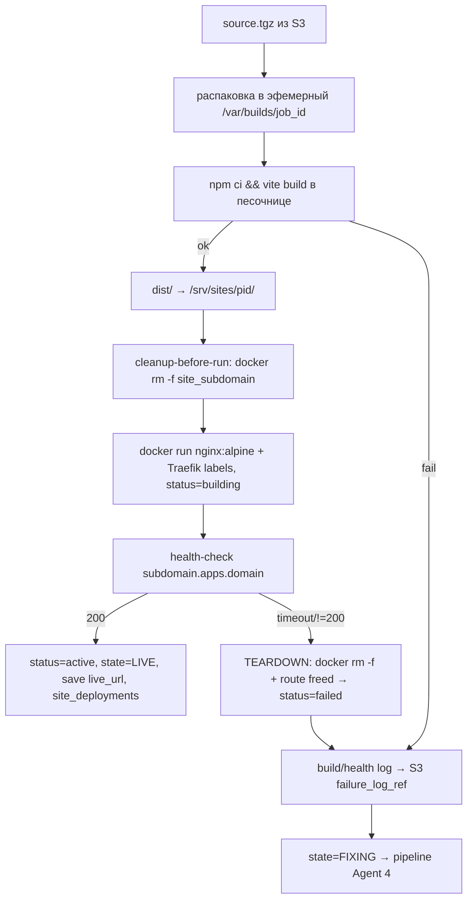
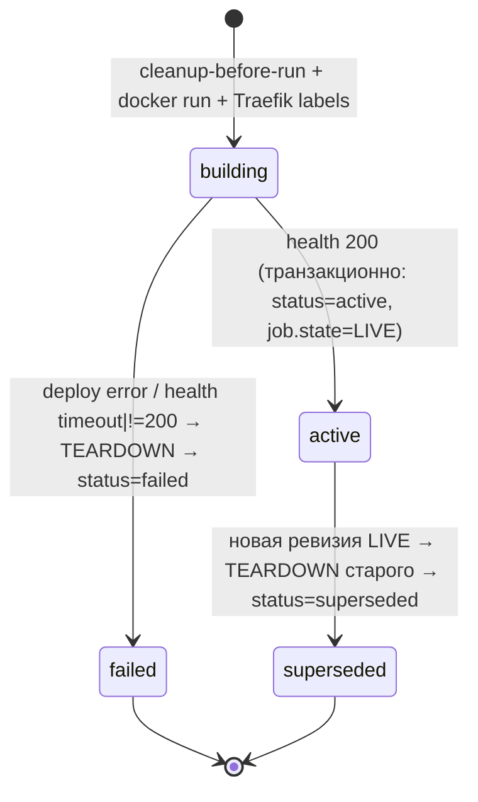

# deploy — Architecture

## Поток (build-воркер, `queue=build`)



## 1. Sandbox (исполнение недоверенного кода)

**Это не отдельный долгоживущий сервис compose**, а throwaway build-контейнер, который `worker` поднимает per-job и уничтожает после сборки (Node 20 LTS внутри). Сила изоляции размечена по спринтам — каноничная таблица в [07-deployment.md → «Модель изоляции сборки по спринтам»](../../07-deployment.md#модель-изоляции-сборки-по-спринтам).

**Sprint 1 (действует):**
- Запуск через смонтированный `docker.sock` (`worker` делает `docker run` build-контейнера).
- Базовая изоляция: `cap-drop ALL`, non-root user, read-only rootfs кроме `/workspace`.
- Лимиты: `--cpus`, `--memory`, `--pids-limit`, wall-clock timeout, дисковая квота workspace.
- **Без gVisor; `docker.sock` смонтирован в воркер** — осознанный компромисс, [TD-001](../../100-known-tech-debt.md#td-001).
- Базовая валидация дерева файлов — [Q-PIPELINE-1](../../99-open-questions.md#q-pipeline-1) (closed-for-S1).
- Очистка `/var/builds/{job_id}` после сборки (успех/фейл).

**Sprint 4 (реализуемый контракт — [ADR-010](../../adr/ADR-010-build-sandbox-rootless-egress.md), закрывает [TD-001](../../100-known-tech-debt.md#td-001)/[Q-INFRA-1](../../99-open-questions.md#q-infra-1)/[Q-DEPLOY-1](../../99-open-questions.md#q-deploy-1)):**

**Что меняется относительно S1:** S1 — `worker` делает `docker run` через смонтированный привилегированный `docker.sock` (эскалация до хоста, [TD-001](../../100-known-tech-debt.md#td-001)). S4 — `worker` обращается к **rootless Docker-демону** (сокет в `$XDG_RUNTIME_DIR`, демон под непривилегированным пользователем, user-namespace remap): компрометация build-контейнера/воркера **не даёт root на хосте**. Плюс build-контейнер сажается в изолированную egress-сеть с allowlist только к npm-registry.

- **Runtime:** rootless Docker на выделенных build-хостах ([07-deployment.md → Прод-топология](../../07-deployment.md#прод-топология)). `BUILD_SANDBOX_RUNTIME=rootless` (зарезервировано `runsc` для опционального gVisor поверх — [ADR-010 Alternatives](../../adr/ADR-010-build-sandbox-rootless-egress.md)).
- **Конфигурация запуска build-контейнера** (`docker run --rm`, нормативная таблица флагов — [ADR-010 §B](../../adr/ADR-010-build-sandbox-rootless-egress.md), повторена в [05-security.md → threat-model](../../05-security.md#threat-model-центр--build-sandbox)): `--cap-drop ALL`, `--security-opt no-new-privileges`, `--read-only` + `--tmpfs /tmp`, `-v {workspace}:/workspace` (единственный writable), `--user {non-root UID}`, `--cpus={BUILD_CPU_LIMIT}`, `--memory={BUILD_MEM_LIMIT}`, `--pids-limit={BUILD_PIDS_LIMIT}`, `--security-opt seccomp={BUILD_SECCOMP_PROFILE}` (**условно**: передаётся только при непустом `BUILD_SECCOMP_PROFILE`; иначе действует встроенный default seccomp Docker — нормативно [ADR-010 §B-1](../../adr/ADR-010-build-sandbox-rootless-egress.md), [05-security.md → seccomp-параметризация](../../05-security.md#конфигурация-запуска-build-контейнера-sprint-4-нормативная)), `--network {BUILD_EGRESS_NETWORK}`, `-e http_proxy={BUILD_EGRESS_PROXY_URL}` + `-e https_proxy={BUILD_EGRESS_PROXY_URL}` (**обязательно при непустом `BUILD_EGRESS_NETWORK`** — транспорт `npm ci` к registry, см. egress-allowlist ниже); wall-clock `BUILD_TIMEOUT_S` (kill `docker rm -f` на стороне воркера). Env-ключи — [07-deployment.md → env-контракт](../../07-deployment.md#канонический-список-ключей).
- **Egress-allowlist** ([ADR-010 §C](../../adr/ADR-010-build-sandbox-rootless-egress.md)): отдельная Docker-сеть (`BUILD_EGRESS_NETWORK`, без выхода в интернет/внутреннюю сеть/metadata — прямого маршрута к registry нет) + egress-proxy, пропускающий **только** хосты из `NPM_REGISTRY_ALLOWLIST` (дефолт `registry.npmjs.org`). **Две стороны механизма** ([ADR-010 §C-1](../../adr/ADR-010-build-sandbox-rootless-egress.md)): registry-allowlist `NPM_REGISTRY_ALLOWLIST` на egress-proxy + **транспорт** — воркер инжектит `BUILD_EGRESS_PROXY_URL` в build-контейнер как env `http_proxy`/`https_proxy` (`_build_argv`, нормативно обязательно при непустом `BUILD_EGRESS_NETWORK`; без него `npm ci` без маршрута → fail). `npm_config_registry`/`.npmrc` (хост registry) инжектирует **воркер** (не из LLM-дерева — запрещённый dotfile [Q-PIPELINE-1](../../99-open-questions.md#q-pipeline-1)); proxy задаётся env, не в `.npmrc`. Запрет private CIDR + cloud-metadata (`169.254.169.254`).
- **Граница egress:** lockdown — **только** на build-песочнице; app-процессы (api/worker/beat: Anthropic, Adapty `getProfile`, Apple JWKS) НЕ блокируются ([05-security.md → «Граница egress-политики»](../../05-security.md#граница-egress-политики-build-sandbox-vs-application-процессы-требование-к-sprint-4), single normative source).
- Полная threat-model — [05-security.md](../../05-security.md).

## 2. Identity: subdomain (хост сайта)

**Единая модель хоста.** Сайт адресуется по `{subdomain}.apps.domain`, где `subdomain` — **независимый opaque-идентификатор деплоя**, а не `project_id`.

- `subdomain` генерируется при первом деплое сайта и сохраняется в `site_deployments.subdomain` (UNIQUE). Формат: случайная url-safe строка (например `[a-z0-9]{16}`, без префикса `p_`), коллизия → regenerate.
- **Почему не `pid`:** opaque subdomain (а) устойчив к смене проекта/ревизии, (б) не раскрывает `project_id`, (в) снижает риск **subdomain-takeover** при пересоздании/удалении (старый хост не угадывается). GC освобождённых subdomain — [Q-DEPLOY-3](../../99-open-questions.md#q-deploy-3).
- Хост един для **Traefik router rule, `live_url` и health-check** — все три используют `{subdomain}.apps.domain`.

> **Режим адресации зависит от `SITE_ROUTING_MODE`** ([07-deployment.md env](../../07-deployment.md#канонический-список-ключей), [ADR-017](../../adr/ADR-017-path-based-site-routing.md)). Эта §2 описывает режим **`subdomain`** (dev по умолчанию). Режим **`path`** (prod, `corelysite.shop/s/{site_id}`) — §2A ниже. Идентификатор один и тот же — opaque `[a-z0-9]{16}` в `site_deployments.subdomain` (single normative source колонки; в path-режиме то же значение в routing-семантике называется `site_id`).

## 2A. Path-based routing (`/s/{site_id}`, prod — `SITE_ROUTING_MODE=path`, [ADR-017](../../adr/ADR-017-path-based-site-routing.md))

Нормативный источник path-модели routing'а и требования к build base-path. Активен при `SITE_ROUTING_MODE=path` (prod, [ADR-018](../../adr/ADR-018-prod-deployment-shared-traefik-cicd.md)); dev может оставаться `subdomain` (§2) или перейти на `path` (dev≈prod).

- **`site_id`** = значение `site_deployments.subdomain` (opaque `[a-z0-9]{16}`, не переименовывается в БД — single normative source колонки, [03-data-model.md → site_deployments](../../03-data-model.md#site_deployments)). Уникальность, opaque-свойство и **запрет реюза** (защита от takeover, §6) — без изменений.
- **Routing (Traefik-labels на сайт-контейнере, path-режим):**
  - `traefik.enable=true`
  - `traefik.http.routers.{site_id}.rule=PathPrefix("/s/{site_id}")`
  - `traefik.http.routers.{site_id}.entrypoints=websecure`
  - `traefik.http.middlewares.{site_id}-strip.stripprefix.prefixes=/s/{site_id}` + `traefik.http.routers.{site_id}.middlewares={site_id}-strip` — **StripPrefix обязателен**: nginx внутри контейнера получает `/`, а не `/s/{site_id}` (контейнер остаётся generic `nginx:alpine` + mount, [ADR-002](../../adr/ADR-002-nginx-mount-vs-baked.md)).
  - `traefik.http.services.{site_id}.loadbalancer.server.port=80`
  - Сеть контейнера — `{TRAEFIK_NETWORK}` (= `web` в prod, [ADR-018](../../adr/ADR-018-prod-deployment-shared-traefik-cicd.md)).
- **Site build base-path (НОРМАТИВНО, критично).** Сгенерированный Vite-сайт **ОБЯЗАН** собираться с `base=/s/{site_id}/`, иначе за StripPrefix ассеты (`/assets/*`, картинки) резолвятся в корень `corelysite.shop/assets/...` и отдают 404. `site_id` генерируется при создании строки `site_deployments` **до** фазы build (см. поток выше), поэтому известен на момент сборки.
  - **Механизм:** build-воркер передаёт `vite build --base=/s/{site_id}/` (CLI-флаг при сборке в build-контейнере). CLI-флаг, а не правка `vite.config` в LLM-дереве — base не зависит от недоверенного кода и инжектится воркером (как `.npmrc`/proxy, [05-security threat-model](../../05-security.md#threat-model-центр--build-sandbox)). В режиме `subdomain` base не задаётся (сайт в корне хоста, дефолт `/`).
  - Это единственный нормативный источник требования base-path; pipeline (Agent 3 output) собственного base не задаёт — base — забота фазы build (deploy), не генерации дерева.
- **`live_url`:** `https://{APPS_DOMAIN}/s/{site_id}/` (со слешем — корректный резолвинг относительных ассетов). В режиме `subdomain` — `https://{subdomain}.apps.domain/` (§4).
- **Health-check:** цель — `https://{APPS_DOMAIN}/s/{site_id}/` (prod, через общий Traefik) либо внутренний http к контейнеру (dev / TLS-verify off). Функция `health.wait_until_live` без изменений семантики — меняется только целевой URL (§4).
- **Teardown / route-снятие:** route выражен Docker-labels (PathPrefix-router + StripPrefix-middleware) → `docker rm -f site_{site_id}` снимает router/middleware/service из Traefik автоматически (Docker-провайдер), как в §5. Новых статусов/переходов нет.

## 3. Deploy (generic nginx + mount)

> **Именованные фазы deploy (нормативный источник для классификации фейла).** Эта секция — единственный нормативный источник имён deploy-фаз и функций; pipeline §F ([pipeline/03-architecture.md → F](../pipeline/03-architecture.md#f-failure_log-в-s3)) ссылается на эти идентификаторы для границы `deploy_error` vs `health_timeout`. Фаза `deploy` состоит из двух функций (`app/deploy/docker_deploy.py`):
> - **`publish_dist`** — публикация собранного `dist/` в хостовый каталог сайта (`/srv/sites/{pid}/`), который монтируется в nginx (ro).
> - **`run_nginx_container`** — старт контейнера сайта (`docker run nginx:alpine` + Traefik-лейблы), включая cleanup-before-run.
>
> **Класс `deploy_error` (pipeline §F) = фейл любой из этих двух фаз** (`publish_dist` или `run_nginx_container`) — т.е. сайт не дошёл до фазы health-check. В отличие от `health_timeout`, который относится к фазе health (§4, функция `health.wait_until_live`).

- **Фаза `publish_dist`** (`app/deploy/docker_deploy.py → publish_dist`): `dist/` → `/srv/sites/{pid}/` (или S3-mount). Каталог именуется по `pid` (внутренний путь хоста), а внешний хост — по `subdomain`.
- **Cleanup-before-run (обязательно перед `docker run`):** `docker rm -f site_{subdomain}` — снос возможного остатка контейнера с тем же именем (идемпотентно). Делает шаг деплоя crash-resumable, см. §5 «Идемпотентный повторный деплой».
- **Фаза `run_nginx_container`** (`app/deploy/docker_deploy.py → run_nginx_container`): `docker run -d --name site_{subdomain} nginx:alpine` с флагами:
  - `--restart unless-stopped` — **источник** restart-политики контейнера сайта. Этот же флаг — то, что снимает teardown (`docker rm -f`, см. §5 «Teardown» и threat-model в [05-security.md](../../05-security.md)): без него orphan nginx, не прошедший health-gate, не переживал бы рестарт хоста, но и инвариант «teardown снимает restart-политику» терял бы смысл. Соответствует `app/deploy/docker_deploy.py → run_nginx_container`.
  - `--network {traefik_network}` — Docker-сеть, в которой Traefik видит контейнер.
  - `-v {site_dir}:/usr/share/nginx/html:ro` — volume `dist/` (read-only).
  - Traefik-лейблы (**режим `SITE_ROUTING_MODE=subdomain`**):
    - `traefik.enable=true`
    - `traefik.http.routers.{subdomain}.rule=Host("{subdomain}.apps.domain")`
    - `traefik.http.services.{subdomain}.loadbalancer.server.port=80`
  - В режиме **`path`** (prod) лейблы — PathPrefix(`/s/{site_id}`) + StripPrefix вместо Host-router; нормативно — §2A ([ADR-017](../../adr/ADR-017-path-based-site-routing.md)). Имя контейнера — `site_{site_id}` (= `site_{subdomain}`, то же значение).
- Traefik Docker-провайдер подхватывает route без рестарта.
- `container_id` сохраняется в `site_deployments` (для GC — [Q-DEPLOY-3](../../99-open-questions.md#q-deploy-3)).
- Запекание per-site образа — задокументированный fallback ([ADR-002](../../adr/ADR-002-nginx-mount-vs-baked.md)).

## 4. Health-check

> **Именованная фаза health (нормативный источник).** Функция ожидания — **`health.wait_until_live`** (`app/deploy/health.py → wait_until_live`, async): опрашивает хост сайта до HTTP `200` либо до истечения `health_check_timeout_s`. Это единственный нормативный идентификатор фазы health; pipeline §F ссылается на него. **Класс `health_timeout` (pipeline §F) = таймаут `health.wait_until_live` на уже стартовавшем контейнере** (контейнер поднялся фазами `publish_dist` + `run_nginx_container`, но не отдал `200` в отведённое окно) — в отличие от `deploy_error`, который относится к фазам deploy (§3).

- Цель — единый хост `{subdomain}.apps.domain` (тот же, что router rule и `live_url`). **В режиме `path`** цель — `https://{APPS_DOMAIN}/s/{site_id}/` (тот же путь, что router rule и `live_url`); нормативно — §2A ([ADR-017](../../adr/ADR-017-path-based-site-routing.md)).
- **Dev:** проверка по внутреннему `http` к контейнеру (имя/порт в compose-сети) либо с **отключённой TLS-верификацией** — wildcard-сертификат `*.apps.domain` в dev может быть self-signed/отсутствовать. Связано с [Q-DEPLOY-2](../../99-open-questions.md#q-deploy-2).
- **Prod:** `health.wait_until_live` делает `GET https://{subdomain}.apps.domain/` (httpx) с валидным wildcard `*.apps.domain` (полная TLS-верификация) до `200` или timeout.
- `200` → транзакционно: `site_deployments.status=active`, `live_url=https://{subdomain}.apps.domain/`, `generation_jobs.state=LIVE`, событие в Redis.
- Фейл (timeout/`!=200`/ошибка `docker run`) → **сначала teardown текущего контейнера** (`docker rm -f` + освобождение route, `status=failed`), **затем** build log/health log → S3 (`build_log_ref`/`failure_log_ref`) → `state=FIXING` (модуль `pipeline`). Порядок обязателен: см. §5 «Инвариант фейла».

## 5. Lifecycle сайт-деплоя (state machine `site_deployments.status`)

Деплой сайта — самостоятельная машина состояний строки `site_deployments`, **ортогональная** машине `generation_jobs.state` (модуль `pipeline`). `generation_jobs.state` отражает прогресс джобы (`DEPLOYING`/`LIVE`/`FIXING`/`FAILED`); `site_deployments.status` отражает реальный lifecycle контейнера+route. Подсистема `deploy` обязана держать эти две машины согласованными: фейл деплоя/health не переводит джобу в `FIXING`/`FAILED` **до** того, как контейнер текущей попытки реально снесён.

### Статусы

| Статус | Значение | Контейнер существует? | Route активен? | subdomain занят? |
|---|---|---|---|---|
| `building` | строка создана, идёт `docker run` + health-check; ещё не подтверждён 200 | да (запущен, но не подтверждён) | да (Traefik подхватил лейблы) | да |
| `active` | health 200, деплой обслуживает трафик | да | да | да |
| `superseded` | вытеснен новой успешной ревизией; ресурсы этого деплоя снесены | нет (снесён) | нет | освобождён |
| `failed` | деплой/health не прошли health-gate; контейнер этой попытки снесён teardown'ом | нет (снесён) | нет | освобождён¹ |

> ¹ `subdomain` строки сохраняется в БД (UNIQUE, audit), но **хост-ресурс** (контейнер + Traefik-route) освобождён — сайт, не прошедший gate, недоступен. Реюз самого значения `subdomain` для нового деплоя проекта и GC освобождённых имён — [Q-DEPLOY-3](../../99-open-questions.md#q-deploy-3).

**Устранение прежнего расхождения:** ранее в этом документе фигурировал лишь `active`/`superseded`, а код выставлял `torn_down`. Канон: статус `torn_down` **переименован в `failed`** (семантика «деплой не прошёл и снесён»); «снесён при вытеснении» — это `superseded`. Других терминальных статусов нет. Поле БД — [03-data-model.md → site_deployments](../../03-data-model.md#site_deployments).

### Диаграмма переходов



Легальные переходы — только перечисленные. `active`/`superseded`/`failed` — терминальны для данной строки (новый деплой = новая строка). Прямой переход `building → active` без снятия предыдущего деплоя той же ревизии запрещён (см. cleanup-before-run).

### Teardown — обязательное действие на каждом фейловом/вытесняющем переходе

**Teardown** строки деплоя — атомарная (best-effort, идемпотентная) последовательность:
1. `docker rm -f {container_name}` — принудительный снос контейнера (даже при `--restart unless-stopped`: `rm -f` останавливает и удаляет, политика рестарта более не действует). Идемпотентно: отсутствие контейнера — не ошибка.
2. Снятие Traefik-route: т.к. route выражен Docker-лейблами, удаление контейнера автоматически убирает router/service из Traefik (Docker-провайдер). Дополнительных действий не требуется; верификация — route более не резолвится.
3. Освобождение хоста `{subdomain}.apps.domain`: после (1)+(2) субдомен перестаёт отдавать сайт. Значение `subdomain` остаётся в строке БД для аудита.
4. Транзакционно: `site_deployments.status = failed|superseded`.

**Инвариант фейла (happy-path failure, НЕ удаление проекта):** при ошибке `docker run` или health-check подсистема `deploy` **ОБЯЗАНА** выполнить teardown уже запущенного контейнера текущей попытки **до** перевода джобы в `FIXING`/`FAILED`. Это штатный путь фейла, а не «удаление проекта»: иначе orphan nginx-контейнер с `--restart unless-stopped` + висячий Traefik-route продолжат отдавать на `{subdomain}.apps.domain` сайт, **не прошедший health-gate**. Последовательность фейла:

```
docker run (status=building) → health fail
   → TEARDOWN (docker rm -f + route освобождён)   ← ОБЯЗАТЕЛЬНО, до смены состояния джобы
   → site_deployments.status=failed
   → build/health log → S3 (failure_log_ref)
   → generation_jobs.state=FIXING (или FAILED при исчерпании гардов) — модуль pipeline
```

Граница ответственности: teardown **текущего** деплоя при фейле/вытеснении — часть deploy-подсистемы и **обязателен в Sprint 1**. Полноценный GC orphaned-ресурсов при **удалении проекта** (висячие строки прошлых проектов, реюз/защита от takeover освобождённых субдоменов, volume/DNS) — отдельная задача [Q-DEPLOY-3](../../99-open-questions.md#q-deploy-3) (Sprint 4). Дельта между «teardown-on-fail» (S1) и «GC-on-project-delete» (S4) зафиксирована как [TD-003](../../100-known-tech-debt.md#td-003).

### Идемпотентный повторный деплой (cleanup-before-run)

Имя контейнера сайта **детерминировано** (например `site_{subdomain}`), поэтому повторный прогон деплоя того же субдомена натыкается на name-collision (`Conflict. The container name is already in use`). Чтобы повтор не падал:

- **Перед каждым `docker run` подсистема ОБЯЗАНА выполнить `docker rm -f {container_name}`** (cleanup-before-run) — снести возможный остаток контейнера с тем же именем. Идемпотентно: отсутствие контейнера — не ошибка.
- Это покрывает: **crash-resume** (воркер упал между `docker run` и записью `container_id`), **Celery `acks_late`** (повторная доставка task после краша → переисполнение деплоя), цикл починки **FIXING→BUILDING→DEPLOYING** (Sprint 2: фикс → пересборка нового source.tgz → передеплой той же ревизии на тот же субдомен).
- Прямое следствие NFR **Crash-resumable** ([00-vision.md NFR](../../00-vision.md), [ADR-001](../../adr/ADR-001-state-machine-dispatcher.md)): любой шаг деплоя обязан быть безопасно повторяемым. `docker run` сам по себе не идемпотентен → cleanup-before-run делает шаг идемпотентным.

> Связь teardown ↔ cleanup-before-run: teardown гарантирует, что фейл/вытеснение **не оставляет** живого контейнера; cleanup-before-run гарантирует, что повтор **переживёт** возможный остаток. Оба используют одну идемпотентную операцию `docker rm -f`.

## 6. GC при удалении проекта (Sprint 4 — `DELETE /projects/{id}`, [ADR-011](../../adr/ADR-011-project-delete-gc.md), закрывает [TD-003](../../100-known-tech-debt.md#td-003)/[Q-DEPLOY-3](../../99-open-questions.md#q-deploy-3))

> **Разграничение с §5.** §5 «teardown-on-fail» — снос **текущего** деплоя при фейле health/deploy или вытеснении новой ревизией (штатный happy-path-fail, обязателен с S1). **§6 GC-on-project-delete** — снос **всех** ресурсов проекта при явном удалении пользователем (S4). Оба переиспользуют одну идемпотентную teardown-операцию `docker rm -f` + снятие route; §6 добавляет volume/S3/БД-каскад и отмену in-flight джоб. Контракт endpoint — [modules/api/02-api-contracts.md → DELETE /projects/{pid}](../api/02-api-contracts.md#delete-projectspid-sprint-4).

**Триггер:** `DELETE /v1/projects/{pid}` → soft-delete (`projects.deleted_at = now()`) + Celery-job `project.gc` (`queue=build`). Ответ `202`. Нормативный контракт асинхронности/идемпотентности/in-flight — [ADR-011](../../adr/ADR-011-project-delete-gc.md).

**Шаги `project.gc` (идемпотентны, best-effort по ресурсу; порядок обязателен):**
1. **Отмена in-flight джоб:** все не-терминальные `generation_jobs` проекта → `FAILED(project_deleted)` (новый reason-код). Снимает их из `active_jobs(user)` (concurrency-cap [auth §6](../auth/03-architecture.md)) и диспетчеризации. Диспетчер/таски проверяют `projects.deleted_at IS NULL` перед продвижением — новые витки не ставятся.
2. **Teardown всех site-контейнеров проекта:** по всем `site_deployments` проекта (любой `status`) — `docker rm -f site_{subdomain}` (**та же операция, что §5 teardown**) + снятие Traefik-route (через удаление контейнера, Docker-провайдер). Идемпотентно.
3. **Освобождение volume:** удаление хостового каталога `{sites_host_root}/{pid}` (примонтированный `dist/`).
4. **Удаление S3-артефактов** всех ревизий/деплоев проекта: префиксы `sources/{job_id}/*`, `dist/{job_id}/*`, `logs/{job_id}/*`, `specs/{job_id}/*` по всем `job_id` проекта (batch-delete, [07-deployment.md → модель хранения](../../07-deployment.md#модель-хранения-один-бакет--key-префиксы)).
5. **БД-каскад (hard-delete):** в FK-порядке `site_deployments` → `revisions` → дочерние джоб (`job_events`/`questions`/`answers`/`llm_usage`) → `generation_jobs` → `projects`-строка. `usage_counters`/`subscriptions`/`billing_events` (агрегаты пользователя) не трогаются.

**subdomain не реюзается:** строки удаляются вместе с проектом, новое значение генерируется случайно при будущих деплоях — старый opaque-хост не угадывается (защита от subdomain-takeover, [05-security.md → threat-model](../../05-security.md#threat-model-центр--build-sandbox)).

**Идемпотентность / crash-resume:** `project.gc` безопасно переисполняется (Celery `acks_late`): каждый шаг идемпотентен (отсутствие контейнера/объекта S3/строки — не ошибка). Повторный `DELETE` уже удаляемого проекта — `202` no-op (или `404`, если строки физически уже нет).

**State-machine согласованность:** `project.gc` **не** вводит новых state-значений `generation_jobs.state` (терминал `FAILED` + reason `project_deleted`) и новых статусов `site_deployments` (строки hard-delete'ятся, lifecycle §5 неизменен). `projects.deleted_at` — единственное новое поле (soft-delete-маркер). Нормативный источник машин состояний остаётся §5 (deploy) и [pipeline §B](../pipeline/03-architecture.md#b-state-machine--расширение-sprint-2) (job); §6 только переиспользует их терминалы.

## 7. Rollback ревизии (Sprint 5) — re-deploy good-ревизии ([ADR-014](../../adr/ADR-014-edit-limit-revision-rollback.md))

> **Разграничение с §5 и §6.** §5 «teardown-on-fail» — снос текущего деплоя при фейле/вытеснении. §6 «GC-on-project-delete» — снос всех ресурсов проекта при удалении. **§7 rollback** — **передеплой ранее задеплоенной good-ревизии** по запросу пользователя (`POST /projects/{pid}/revisions/{revision_no}/rollback`, [api-contracts](../api/02-api-contracts.md#post-projectspidrevisionsrevision_norollback-sprint-5)) **или** автоматически при неудачной правке ([pipeline post-delivery edit](../pipeline/03-architecture.md#post-delivery-edit-live--fixing--live--контракт-зафиксирован-реализация-в-sprint-5), [ADR-014 §C](../../adr/ADR-014-edit-limit-revision-rollback.md)). Rollback **не** создаёт новой ревизии — меняет, какая существующая good-ревизия активна (`projects.current_revision_id`).

**Источник `dist`:** rollback переиспускает deploy выбранной ревизии без новой генерации:
- если `dist`-артефакт ревизии доступен в S3 (`dist/{job_id}/dist.tgz` соответствующего деплоя) — **передеплой готового `dist`** (нет `npm ci`/`vite build`);
- если `dist` отсутствует/протух — **пересборка из `revisions.source_artifact_ref`** (штатный путь `BUILDING → DEPLOYING`). Выбор детерминирован наличием S3-объекта.

**Взаимодействие с deploy-lifecycle (переиспользует §5, новых статусов не вводит):**
1. новая строка `site_deployments` целевой ревизии, новый opaque `subdomain` (**субдомены не реюзаются**, §2), `status=building`;
2. cleanup-before-run + `docker run` nginx + Traefik-route + `health.wait_until_live` (§3–§4);
3. **health `200`** → новый деплой `status=active`, `projects.current_revision_id` ← целевая ревизия, **прежний `active`-деплой → teardown → `status=superseded`** (тот же вытесняющий переход `active → superseded`, что happy-path смена ревизии, §5). Порядок обязателен: **прежний деплой сносится только после подтверждения нового** (нет downtime);
4. **health-fail нового** → teardown нового (`status=failed`), **прежний `active`-деплой нетронут**, `current_revision_id` не меняется → сайт продолжает обслуживать прежнюю ревизию; rollback → ошибка (`409`/`5xx` на endpoint, либо для авто-rollback фиксируется в `job_events`).

**`kind` rollback-джобы и reason при провале:** ручной rollback — отдельная джоба **`generation_jobs.kind='rollback'`** (третье значение `kind` помимо `generation`/`edit`, [03-data-model.md → generation_jobs.kind](../../03-data-model.md#generation_jobs)). Эта джоба идёт **прямым re-deploy** good-ревизии `BUILDING/DEPLOYING → LIVE` и **не** проходит через `FIXING` (нет Agent 4 / fix-loop — пересборка/передеплой уже существующей ревизии, не генерация нового дерева). Провал её re-deploy (health-fail/инфра) финализируется существующим **`FAILED(infra_error)`** — новый reason-код **не** вводится (нормативно — [03-data-model.md → failure_reason](../../03-data-model.md#generation_jobs), [pipeline post-delivery edit → kind='rollback'](../pipeline/03-architecture.md#post-delivery-edit-live--fixing--live--контракт-зафиксирован-реализация-в-sprint-5)).

**State-machine согласованность:** rollback не вводит новых статусов `site_deployments` (`building`/`active`/`superseded`/`failed` из §5) и не меняет машину `generation_jobs.state` (ручной rollback `kind='rollback'` — отдельная re-deploy-джоба, проходящая `BUILDING/DEPLOYING → LIVE`, **минуя `FIXING`**; авто-rollback — финализация упавшей edit-джобы в `FAILED(edit_failed_rolled_back)` с сайтом на прежней ревизии). Инвариант «новый деплой подтверждён health 200 до teardown прежнего» — единственное отличие от §5 (где teardown текущего предшествует фейлу); здесь прежний сносится только при успехе нового.
