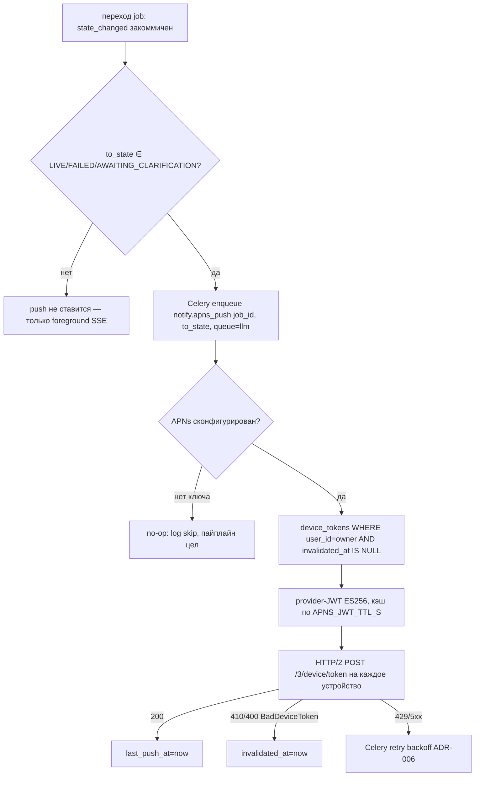

# notify — Architecture (исполняемый контракт Sprint 5)

Push-доставка статуса джобы на iOS через APNs ([ADR-013](../../adr/ADR-013-apns-push-from-job-events.md)). Best-effort, не источник истины (источник — `job_events`/`GET /jobs/{jid}`).

## Поток

## 1. Регистрация устройств (`api`-роуты, таблица `device_tokens`)

- `POST /v1/devices` (Bearer): `{ "apns_token", "platform": "ios", "environment": "sandbox|production" }` → upsert по `(user_id, apns_token)`; повтор сбрасывает `invalidated_at` (повторно активирует). `201` → `{ "id": "dev_..." }`.
- `DELETE /v1/devices/{apns_token}` (Bearer): `invalidated_at=now()` по `(user_id, apns_token)`. `204`; чужой/нет → `404` (cross-tenant: выборка по `user_id`).
- Контракт endpoint'ов — [modules/api/02-api-contracts.md → /devices](../api/02-api-contracts.md#post-devices--delete-devicesapns_token-sprint-5-apns). Поля — [03-data-model → device_tokens](../../03-data-model.md#device_tokens-sprint-5).

## 2. Триггер (из обработчика переходов job_events)

- Точка постановки — **единый обработчик публикации перехода** (тот же транзакционный шаг, что пишет `job_events` + публикует в Redis `job:{id}`, [pipeline §диспетчер](../pipeline/03-architecture.md#диспетчер-task-на-состояние)).
- **После коммита** перехода (не в той же БД-транзакции — внешний side-effect; потеря push при краше допустима, best-effort): если `to_state ∈ {LIVE, FAILED, AWAITING_CLARIFICATION}` → `notify.apns_push.delay(job_id, to_state)` (`queue=llm` — лёгкая I/O-задача).
- **Нормативный перечень push-состояний** — [ADR-013 §3](../../adr/ADR-013-apns-push-from-job-events.md) (единственный источник). Промежуточные состояния push не генерируют.

## 3. Celery `notify.apns_push(job_id, to_state)`

1. Если APNs не сконфигурирован (нет `APNS_AUTH_KEY`/`APNS_AUTH_KEY_PATH`) → **no-op** (log skip). Фича неактивна без пользовательских credentials, пайплайн не ломается.
2. Определить владельца джобы (`generation_jobs.user_id`) → выбрать `device_tokens WHERE user_id=owner AND invalidated_at IS NULL`. **Cross-tenant:** push только на устройства владельца.
3. Сформировать APNs-payload: `aps.alert` (локализуемый ключ под `to_state`) + custom `{ job_id, state, live_url? }` (deep-link). Заголовки: `apns-topic=APNS_BUNDLE_ID`, `apns-push-type=alert`, `apns-priority=10`.
4. **Provider-JWT** (ES256, claims `iss=APNS_TEAM_ID`, `kid=APNS_KEY_ID`, `iat`), подпись `.p8`-ключом. **Кэш JWT**, переподпись не чаще `APNS_JWT_TTL_S` (Apple отвергает частую генерацию как too-many-token-updates).
5. HTTP/2 `POST https://{apns_host}/3/device/{apns_token}` на каждое устройство. `apns_host`: `api.push.apple.com` (production) / `api.sandbox.push.apple.com` (sandbox) — по `device_tokens.environment` (override-дефолт `APNS_ENV`).
6. Обработка ответа APNs:
   - `200` → `device_tokens.last_push_at = now()`;
   - `410 Unregistered` / `400 BadDeviceToken` → `device_tokens.invalidated_at = now()` (чистка мёртвых токенов);
   - `429` / `5xx` → транзиентно → Celery retry с backoff (классификация как инфра-сбой, [ADR-006](../../adr/ADR-006-celery-retry-vs-domain-fixing.md)); исчерпание retries → best-effort drop (не блокирует пайплайн).

## 4. APNs-клиент (`app/notify/apns_client`)
- `httpx[http2]` async HTTP/2 (APNs работает **только** по HTTP/2). Переиспользует пул соединений к APNs (один клиент на процесс воркера — как auth/rate-limit паттерн; cross-ref [TD-007](../../100-known-tech-debt.md#td-007)).
- Подпись JWT — `PyJWT[crypto]` (ES256), уже в стеке для Apple-логина (RS256); `cryptography` покрывает обе кривые. Новой библиотеки не вводит ([02-tech-stack → Push-нотификации](../../02-tech-stack.md#push-нотификации-sprint-5-apns)).

## 5. Безопасность
- APNs `.p8`-ключ — секрет/конфиг-артефакт (env `APNS_AUTH_KEY` `SecretStr` или файл `APNS_AUTH_KEY_PATH`, провизия — devops/secret-manager, не в git/`docs`). [05-security → APNs](../../05-security.md#apns-push-sprint-5-adr-013), [07-deployment → env-контракт](../../07-deployment.md#канонический-список-ключей).
- Cross-tenant: выборка устройств строго по `user_id` владельца джобы. В логах — `apns_token` маскируется (last 6), `job_id` — для correlation.
