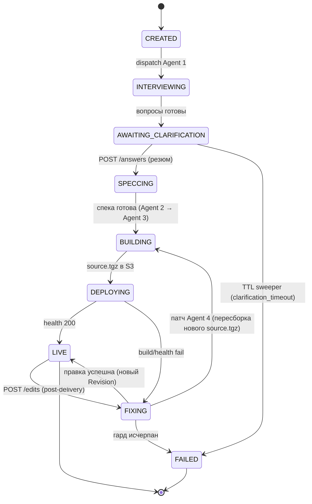
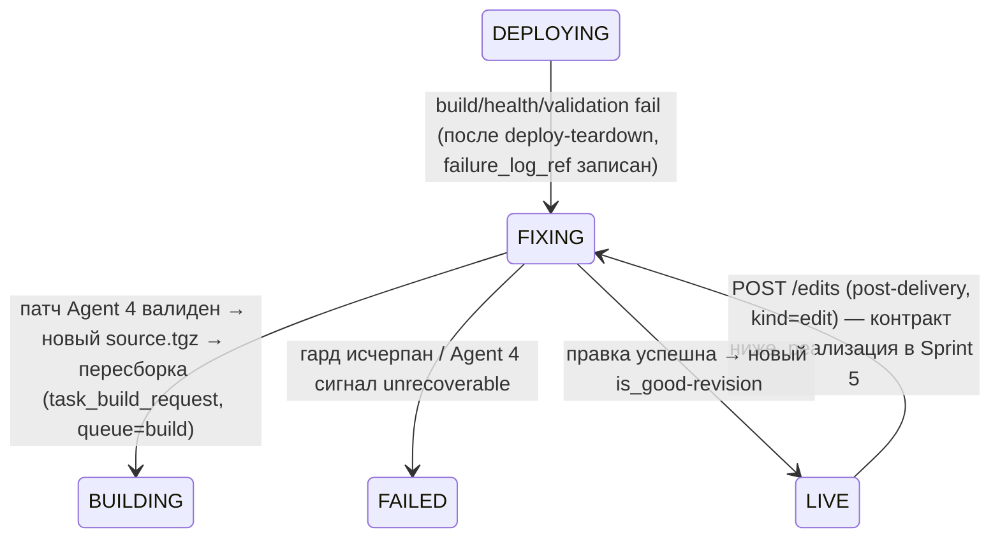

# pipeline — Architecture

## State machine



## Диспетчер (task-на-состояние)

- Не один длинный task, а **по Celery-task на состояние** (`task_interview`, `task_spec`, `task_build_request`, `task_fix`, ...). Решение — [ADR-001](../../adr/ADR-001-state-machine-dispatcher.md).
- Диспетчер по текущему `state` ставит следующий task (`queue=llm` для агентов, `queue=build` для сборки).
- Каждый переход: транзакционно обновить `state` + вставить `job_events` + опубликовать в Redis `job:{id}`.
- **Crash-resumable:** после рестарта sweeper/диспетчер подхватывает джобы в нетерминальных активных состояниях.

## Пауза human-in-the-loop

- На `AWAITING_CLARIFICATION` **ни одной задачи в очереди** — ноль компьюта.
- Резюм событийный: `POST /answers` (модуль `api`) ставит task `SPECCING`.
- Beat-sweeper экспайрит зависшие `AWAITING_CLARIFICATION` по TTL → `FAILED(clarification_timeout)`.

## Агенты (Anthropic SDK)

| Агент | Вход | Выход | Очередь |
|---|---|---|---|
| **Agent 1 (Interviewer)** | промт | список уточняющих вопросов → `questions` | llm |
| **Agent 2 (Spec writer)** | промт + ответы | финальная спека (`spec_tz`/`spec_ref`) | llm |
| **Agent 3 (Builder)** | спека | дерево файлов проекта → `source.tgz` в S3 (контракт ниже) | llm |
| **Agent 4 (Fixer)** | спека + дерево исходников (последняя ревизия **текущей джобы**, §A) + `failure_log` из S3 | патч дерева → новый `source.tgz`, **либо** сигнал «неисправимо» | llm |

- **Tiering моделей — ЕДИНЫЙ НОРМАТИВНЫЙ МАППИНГ агент→роль→модель (single source of truth).** Продуктовое решение — [08 §6-2](../../08-product-decisions.md#sprint-6--observability-cost-scale) («Opus для Spec/Builder, Sonnet для Interviewer/Fixer»); конкретные model ID — [02-tech-stack.md → Модели](../../02-tech-stack.md#фреймворки--библиотеки). Маппинг живёт в конфиге (`app/core/config`), не в коде агентов; переопределяется env-ключами `AGENT1..4_MODEL` ([07-deployment.md → env-контракт](../../07-deployment.md#контракт-переменных-окружения-environment-reference)). Все прочие документы ссылаются на эту таблицу, не дублируют значения.

  | # (env) | Роль | Модель | Model ID | env-ключ |
  |---|---|---|---|---|
  | AGENT1 | Interviewer | **Sonnet** | `claude-sonnet-4-6` | `AGENT1_MODEL` |
  | AGENT2 | Spec writer | **Opus** | `claude-opus-4-8` | `AGENT2_MODEL` |
  | AGENT3 | Builder | **Opus** | `claude-opus-4-8` | `AGENT3_MODEL` |
  | AGENT4 | Fixer | **Sonnet** | `claude-sonnet-4-6` | `AGENT4_MODEL` |

  Нумерация `AGENTn` ↔ роль фиксирована таблицей §Агенты выше (Agent 1=Interviewer … Agent 4=Fixer) и не меняется. env-дефолты `config.py`/`07-deployment` приводятся к этим значениям в S6-калибровке model-tiering (требование к backend; если текущий дефолт отличается — это калибровочная правка, не новое решение).
- **Prompt caching:** стабильные system-промты кэшируются между агентами и fix-итерациями (Anthropic SDK; реализовать через skill `claude-api`).
- **Cost-ledger:** каждый вызов → запись `llm_usage` (токены, cache hit/write, `cost_usd`); агрегат в `generation_jobs.spend_usd` (**Postgres — источник истины бюджета**, гард читает `spend_usd` из БД). Быстрый Redis-счётчик бюджета для снижения латентности гейта при масштабе — **опциональная оптимизация, целевой Sprint 6** (см. [TD-006](../../100-known-tech-debt.md#td-006), исполняемый контракт оптимизации — [observability §5.2](../observability/03-architecture.md#52-redis-budget-счётчик-td-006--опциональная-оптимизация-латентности-гейта)), в Sprint 2 не требуется. **Sprint 6 (observability):** `llm_usage` инструментируется метриками `lovable_job_cost_usd`/`lovable_llm_call_cost_usd_total`/`lovable_llm_tokens_total`/`lovable_llm_cache_hit_ratio`/`lovable_llm_call_latency_seconds` (нормативная таблица — [observability §2.2](../observability/03-architecture.md#22-cost--llm-cost-ledger-llm_usage)) — питают дашборд Cost и калибровку [TD-005](../../100-known-tech-debt.md#td-005)/[TD-006](../../100-known-tech-debt.md#td-006).

## Контракт output Agent 3 (полная валидируемая схема)

Строгая схема дерева файлов проверяется **до** упаковки/сборки (фейлить рано, до песочницы). Невалидный output → `FAILED(invalid_agent_output)` (или, при наличии fix-budget, → `FIXING` с лог-сигнатурой `agent_output_invalid`). Решение зафиксировано — [Q-PIPELINE-1](../../99-open-questions.md#q-pipeline-1) (closed-for-S1).

### JSON-форма
```json
{
  "files": [
    { "path": "index.html", "encoding": "utf8", "content": "<!doctype html>..." },
    { "path": "package.json", "encoding": "utf8", "content": "{...}" },
    { "path": "src/main.ts", "encoding": "utf8", "content": "..." },
    { "path": "public/logo.png", "encoding": "base64", "content": "iVBORw0KGgo..." }
  ],
  "entry": "index.html",
  "build": { "tool": "vite", "command": "npm ci && vite build", "output_dir": "dist" }
}
```

### Правила валидации (все обязательны, проверяются перед `source.tgz`)

**Пути (`path`):**
- Только относительные, POSIX-сепаратор `/`. Запрещены: абсолютные пути (ведущий `/`, Windows-диск `C:\`, UNC `\\`), любой сегмент `..` (path traversal), пустые сегменты, ведущий `~`, NUL и управляющие байты.
- После нормализации путь обязан оставаться внутри корня дерева (canonicalize → check prefix). Дубли путей (case-insensitive) запрещены.
- Длина пути ≤ 255 байт; глубина вложенности ≤ 12 сегментов; сегмент ≤ 100 байт.
- **Симлинки запрещены** — формат не несёт типа «symlink»/«hardlink»; при распаковке `source.tgz` любой не-regular-file (symlink, hardlink, device, FIFO) отвергается распаковщиком (tar-extract с `--no-same-owner`, отказ на entry-type ≠ file/dir).

**Бинарность (`encoding`):**
- `encoding` ∈ {`utf8`, `base64`}. `utf8` — текстовые файлы (валидный UTF-8, иначе reject). `base64` — бинарные ассеты (валидный base64, декодируется до сохранения).
- Бинарные расширения (`png|jpg|jpeg|gif|webp|ico|woff|woff2|ttf|otf`) обязаны быть `base64`; исходники (`html|css|js|ts|tsx|jsx|json|svg|txt|md`) — `utf8`.

**Лимиты размера и числа (hard caps, S1-дефолты в `app/core/config`):**
- Число файлов ≤ `MAX_FILES` (default **300**).
- Размер одного файла (декодированный) ≤ `MAX_FILE_BYTES` (default **2 MiB**).
- Суммарный распакованный размер дерева ≤ `MAX_TREE_BYTES` (default **20 MiB**) — защита от tar-bomb/декомпрессии.

**Обязательные файлы:**
- `package.json` в корне обязателен; валидный JSON; обязан содержать `scripts.build` (или совместим с `build.command`) и быть Vite-проектом (зависимость `vite` в `dependencies`/`devDependencies`).
- `entry` обязателен, указывает на существующий в `files` путь (для Vite-статики — `index.html` в корне).
- `build.output_dir` непустой, относительный, проходит те же path-правила; default `dist`.

**Расширения (allowlist):** разрешены только перечисленные текстовые/бинарные расширения выше плюс `package.json`/`package-lock.json`/`tsconfig*.json`/`vite.config.*`/`.gitignore`. Файлы вне allowlist → reject (защита от внесения скриптов сборки/`.npmrc`/dotfiles с egress-хуками).

> `.npmrc`, `.env`, post-install хуки и произвольные dotfiles **запрещены** на уровне allowlist — это первая линия supply-chain защиты до песочницы.

### Граница с supply-chain (Q-DEPLOY-1)
Эта схема фиксирует **форму и безопасность дерева** до сборки (S1). Контроль содержимого `package.json` / зависимостей (`npm ci`-allowlist registry, vendored baseline, egress-lockdown при установке) — отдельный слой защиты в песочнице, решается в [Q-DEPLOY-1](../../99-open-questions.md#q-deploy-1) на Sprint 4.

### Переиспользование Agent 4
Та же схема и валидация применяются к output Agent 4 (вход = текущее дерево + лог фейла, выход = пропатченное дерево). Невалидный патч Agent 4 — это **fix-неудача, которая НЕ инкрементирует `retry_count`**: `retry_count++` происходит только при *применённом* патче (переход `FIXING → BUILDING`, единственный нормативный источник правила — §C(a)). Бесконечный цикл невалидных патчей обрывается не `retry_count`, а гардами no-progress §C(d) / budget §C(b) / wall-clock §C(c). Класс фейла такого витка — `agent_output_invalid` (см. §A «Выход», §C(d), ADR-005).

---

# Sprint 2 — Fixer loop + resilience (исполняемый контракт)

> Этот раздел фиксирует **полный исполняемый контракт** восстановительного цикла `build-fail → Fixer`. Решения Sprint 0/1 (enum `FIXING`, поля `generation_jobs`, teardown-on-fail/cleanup-before-run в deploy) **не пересматриваются** — раздел опирается на них. Значимые решения вынесены в [ADR-005](../../adr/ADR-005-no-progress-failure-signature.md) (no-progress через сигнатуру) и [ADR-006](../../adr/ADR-006-celery-retry-vs-domain-fixing.md) (Celery-retry vs FIXING).

## A. Контракт Agent 4 (Fixer)

| | |
|---|---|
| **Очередь** | `llm` |
| **Модель** | из конфига, env `AGENT4_MODEL` — целевое значение **Sonnet** (`claude-sonnet-4-6`) по единому нормативному маппингу (§Агенты → Tiering моделей) |
| **Prompt caching** | стабильный system-промт Fixer кэшируется между fix-итерациями (Anthropic SDK, skill `claude-api`) |
| **Cost-ledger** | каждый вызов → строка `llm_usage` (`agent='agent4'`, токены, cache read/write, `cost_usd`) → агрегат в `generation_jobs.spend_usd` (**источник истины — Postgres**; budget-гард §C(b) читает `spend_usd` из БД). Быстрый Redis-счётчик — опциональная оптимизация латентности, **Sprint 6** ([TD-006](../../100-known-tech-debt.md#td-006)), не требуется в S2 |

### Вход (что подаётся в Agent 4)

1. **Финальная спека** — `generation_jobs.spec_tz` (inline) или загруженная из S3 по `spec_ref` (output Agent 2). Неизменна между fix-итерациями.
2. **Текущее дерево исходников** — распаковка `source.tgz` **последней ревизии текущей джобы** (`revisions.source_artifact_ref` той ревизии, у которой `created_from_job_id = job_id` И `revision_no = max` среди ревизий этой джобы), т.е. то дерево, что упало в данном витке. **Не** глобальный `max(revision_no)` по проекту: в edit-цикле S5 верхняя ревизия проекта может быть прежней good-ревизией от другой джобы — вход Fixer всегда привязан к ревизии-кандидату текущей джобы. Передаётся как набор `{path, content}` (текстовые файлы; бинарные ассеты — только список путей+размеров, без содержимого, чтобы не жечь токены).
3. **`failure_log`** — лог последнего фейла из S3 по `generation_jobs.failure_log_ref` (формат — §F). Передаётся целиком, если ≤ лимита, иначе хвост (последние N KB stderr — там диагностическое ядро) + извлечённые error-строки.

### Выход (строго валидируемый)

Agent 4 возвращает **тот же формат, что output Agent 3** — переиспользуется схема `agent_output` целиком (см. «Контракт output Agent 3» выше): `files[]`, `entry`, `build`, все path/encoding-правила, лимиты `MAX_FILES`/`MAX_FILE_BYTES`/`MAX_TREE_BYTES`, allowlist расширений, запрет dotfiles/симлинков. Дополнительно для Fixer:

- **Reserved-файл `.build.json`** (если присутствует в выходе) трактуется как метаданные сборки и **не** идёт в дерево сайта; он проходит те же лимиты, но исключается из распаковываемого `source.tgz` дерева (зарезервированное имя, запрещено как обычный ассет). Это единый канал, по которому Fixer/Builder может зафиксировать build-параметры; обычные файлы с таким именем reject как коллизия reserved-имени.
- **Сигнал «неисправимо»** — Agent 4 может вместо дерева вернуть явный объект `{ "unrecoverable": true, "reason": "<machine_code>", "explanation": "<текст пользователю>" }`. Тогда pipeline **не** делает передеплой, а сразу `FIXING → FAILED(fixer_gave_up)` с `explanation` в `failure_reason`/`job_events`. Это легальный выход агента, а не ошибка валидации.

**Невалидный выход** Agent 4 (нарушение схемы дерева) трактуется как **fix-неудача** с сигнатурой класса `agent_output_invalid` — а не как падение таски. Такой виток **не инкрементирует `retry_count`** (инкремент только при применённом патче, переход `FIXING → BUILDING`, см. §C(a)); зацикливание на невалидных патчах обрывают гарды no-progress §C(d) / budget §C(b) / wall-clock §C(c). При срабатывании любого из них → `FAILED(reason)` соответствующего гарда (для повторной той же сигнатуры — `FAILED(no_progress)`; `FAILED(invalid_agent_output)` — когда невалидный output совпадает с исчерпанием fix-budget, см. таблицу reason-кодов §C).

## B. State machine — расширение Sprint 2

Базовая машина (см. диаграмму вверху файла) уже несёт `FIXING`. Sprint 2 уточняет **семантику переходов вокруг `FIXING`**:



### Восстановительный цикл (фокус Sprint 2): `FIXING → BUILDING → DEPLOYING → LIVE | FIXING`

> Топология цикла: после валидного патча Agent 4 джоба идёт в **`BUILDING`** (а не сразу в `DEPLOYING`), т.к. новый `source.tgz` обязан пройти пересборку `npm ci && vite build` → `dist` до деплоя. Лейбл перехода = целевой `state` = `state`, по которому dispatcher/reconciler ставят следующую task: из `FIXING` ставится `task_build_request` (`queue=build`), и эту же task dispatcher/reconciler ставят по `state=BUILDING`. Если бы целевым state был `DEPLOYING`, reconciler по `state=DEPLOYING` поставил бы deploy-таску при отсутствующем `dist` → сломал бы crash-resume.

1. **`DEPLOYING → FIXING`** — триггер: доменный фейл (build-fail / health-fail / invalid agent output). Предусловия перехода (инвариант, [deploy §5](../deploy/03-architecture.md#5-lifecycle-сайт-деплоя-state-machine-site_deploymentsstatus)):
   - deploy уже выполнил **teardown** контейнера+route текущей попытки (`site_deployments.status=failed`) — pipeline не переводит джобу, пока `{subdomain}`-хост не освобождён;
   - `failure_log` записан в S3, `generation_jobs.failure_log_ref` обновлён;
   - вычислена `failure_signature` текущего фейла (ADR-005).
   - Транзакционно: `state=FIXING`, `job_events(state_changed, build_failed)`, publish `job:{id}`.
2. **В `FIXING`** диспетчер ставит `task_fix` (`queue=llm`). Перед вызовом Agent 4 проверяются **4 гарда** (§C). Если любой исчерпан → `FIXING → FAILED(reason)`, цикл не продолжается.
3. **`FIXING → BUILDING`** — Agent 4 вернул валидный патч → новый `source.tgz` (новая запись `revisions` той же джобы), `retry_count++`. Диспетчер ставит `task_build_request` (`queue=build`) — джоба переходит в `BUILDING`, где новый source.tgz пересобирается в `dist`. Дальше штатный путь `BUILDING → DEPLOYING`; передеплой того же субдомена идемпотентен через cleanup-before-run (`docker rm -f site_{subdomain}`). *(`last_failure_signature` здесь **не** трогается — единственная точка записи сигнатуры — гард no-progress на входе в `FIXING`, см. §C(d).)*
4. Повтор со шага 1 при новом фейле (`DEPLOYING → FIXING`) — до успеха (`LIVE`) или исчерпания гарда (`FAILED`).

> **Инкремент `retry_count` — на переходе `FIXING → BUILDING`** (один применённый Agent-4-патч = одна попытка). Нормативная формулировка правила (что инкрементируется, что — нет) — единственный источник §C(a); здесь — лишь привязка к точке перехода.

### Post-delivery edit (`LIVE → FIXING → LIVE`) — контракт зафиксирован, реализация в Sprint 5

Размежевание S2 ↔ S5 (явно):

- **В Sprint 2 реализуется только восстановительный цикл** `build-fail → Fixer` (джоба `kind=generation`, вход в `FIXING` из `DEPLOYING`). Это содержание DoD Sprint 2.
- **Post-delivery правки** (`POST /edits` → джоба `kind=edit`, вход в `FIXING` из `LIVE`) — **контракт описан здесь** и **реализуется в Sprint 5** (Realtime & edits; исполняемый endpoint-контракт `/edits`, лимит правок и rollback — [ADR-014](../../adr/ADR-014-edit-limit-revision-rollback.md), [modules/api/02-api-contracts.md](../api/02-api-contracts.md), [README roadmap](../../README.md#спринты-roadmap)). В Sprint 2 переход `LIVE → FIXING` **не активировался** (не было `/edits`).

Контракт edit-цикла (зафиксирован в S2, активируется в S5 — [ADR-014](../../adr/ADR-014-edit-limit-revision-rollback.md)):
- **Вход:** `POST /edits` (`kind=edit`, quota-gate отдельным [лимитом правок](../billing/03-architecture.md#7-граница-s5-edits)). Стартует из `LIVE`. **Хранение `instruction`:** текст правки сохраняется в append-only `job_events` как `payload.instruction` события `event_type='edit_requested'` — **отдельной колонки `generation_jobs.instruction` нет** (единственный нормативный источник хранения — [03-data-model.md → generation_jobs/примечание instruction](../../03-data-model.md#generation_jobs)). **Agent 4 как editor:** вход = спека + **текущая (current) good-ревизия проекта** + `instruction` пользователя (читается из `job_events.payload` события `edit_requested`); выход = новое дерево (та же схема `agent_output`). Дальше — `BUILDING → DEPLOYING → LIVE` с новой ревизией. Та же `FIXING`-машинерия и те же 4 гарда §C (на случай build-fail новой правки).
- Успех → новый `revision` (`revision_no++`, `is_good=true`, `created_from_job_id` = edit-job), `projects.current_revision_id` обновляется на новую ревизию, `state=LIVE`. Инкремент `edit_usage_counters.edits_used` — на успешном старте edit-джобы ([billing §7](../billing/03-architecture.md#7-граница-s5-edits)).
- Неудача (гард исчерпан) → **авто-rollback** на предыдущую `is_good=true`-ревизию (передеплой прежней good-ревизии — та же re-deploy-механика, что ручной rollback, [ADR-014 §B/§C](../../adr/ADR-014-edit-limit-revision-rollback.md), [deploy §7](../deploy/03-architecture.md#7-rollback-ревизии-sprint-5--re-deploy-good-ревизии-adr-014)), проект остаётся `LIVE` на прежней ревизии; джоба-edit → `FAILED(edit_failed_rolled_back)`. Сайт **не** уходит в `FAILED` — падает только edit-джоба.

> **`kind='rollback'` — ручной rollback-джоба не идёт через `FIXING`.** Ручной rollback (`POST .../rollback`, [ADR-014 §B](../../adr/ADR-014-edit-limit-revision-rollback.md)) — это отдельная джоба `kind='rollback'` (третье значение `kind` помимо `generation`/`edit`, [03-data-model.md → generation_jobs.kind](../../03-data-model.md#generation_jobs)): **прямой re-deploy уже существующей `is_good`-ревизии** (`BUILDING/DEPLOYING → LIVE`), без Agent 4 и без fix-loop. В отличие от edit-джобы, она **не** проходит `LIVE → FIXING` и не вызывает LLM (нет генерации нового дерева). Провал её re-deploy (health-fail нового деплоя) **не** уводит сайт в `FAILED`: прежняя good-ревизия остаётся `active` (deploy §7 п.4), джоба rollback при инфра/health-провале финализируется `FAILED(infra_error)` — отдельный reason-код **не** вводится ([03-data-model.md → failure_reason](../../03-data-model.md#generation_jobs), [deploy §7](../deploy/03-architecture.md#7-rollback-ревизии-sprint-5--re-deploy-good-ревизии-adr-014)). `kind='rollback'`-джоба не инкрементирует ни `usage_counters`, ни `edit_usage_counters` ([ADR-014 §A](../../adr/ADR-014-edit-limit-revision-rollback.md)). Авто-rollback при неудачной правке — **не** отдельная `kind='rollback'`-джоба, а финализация упавшей edit-джобы (см. выше).

## C. Четыре гарда от бесконечного цикла и runaway-затрат

Состояние гардов несёт `generation_jobs` (поля заведены в Sprint 1). Проверка — **перед каждым витком** (на входе в `FIXING`, до вызова Agent 4). Дефолты — из env-контракта; закрытие [Q-COST-1](../../99-open-questions.md#q-cost-1).

> **Скоуп гардов S2 — ровно эти 4 (джоба-уровень).** Env-ключ `USER_MONTHLY_BUDGET_USD` (поле `users.monthly_budget_usd`, [07-deployment.md → env-контракт](../../07-deployment.md#контракт-переменных-окружения-environment-reference)) — потолок Claude-затрат уровня **юзера/мес**, а НЕ джоба-гард. Он применяется на отдельном quota/budget-гейте (модуль `billing`, Sprint 3/3.5) и в восстановительный цикл Sprint 2 не входит — здесь он перечислен лишь чтобы ключ не выглядел висящим в pipeline-контракте.

| # | Гард | Поле БД | Источник дефолта (env) | Default | Reason при исчерпании |
|---|---|---|---|---|---|
| (a) | Hard cap попыток | `retry_count` vs `max_fix_attempts` | `MAX_FIX_ATTEMPTS` | **3** | `build_unrecoverable` |
| (b) | Cost cap | `spend_usd` vs `budget_usd` | `JOB_BUDGET_USD` | **$5.0000** | `budget_exhausted` |
| (c) | Wall-clock cap | `now()` vs `wall_clock_deadline` | `JOB_WALL_CLOCK_BUDGET_S` | **3600 s** | `wall_clock_exceeded` |
| (d) | No-progress | `failure_event_pending=true` И `failure_signature` == `last_failure_signature` | — (ADR-005) | — | `no_progress` |

### (a) Hard cap `max_fix_attempts` — единственный нормативный источник правила инкремента `retry_count`
- **`retry_count` инкрементируется РОВНО на каждом применённом патче** — переход `FIXING → BUILDING` (один валидный патч Agent 4 = одна попытка). Не на входе в `FIXING`, не на невалидном патче (см. §A «Переиспользование Agent 4»), не на инфра-ретраях Celery (ADR-006). Это **единственное** место, где формулируется правило инкремента; остальные разделы ссылаются сюда. Перед постановкой `task_fix`: если `retry_count >= max_fix_attempts` → `FAILED(build_unrecoverable)`. При default 3 — не более 3 применённых патчей Agent 4 на джобу.
- `max_fix_attempts` берётся из `MAX_FIX_ATTEMPTS` при создании джобы (в Sprint 3.5 может переопределяться per-plan, но дефолт всегда env).

### (b) Cost cap `budget_usd`
- `budget_usd` инициализируется из `JOB_BUDGET_USD` при создании джобы. `spend_usd` = агрегат `llm_usage.cost_usd`, поддерживаемый cost-ledger в **Postgres — это источник истины бюджета**.
- **Нормативная модель гейта (S2):** budget-гард читает `generation_jobs.spend_usd` **из Postgres**. Проверка **перед** каждым LLM-вызовом Agent 4 (и в принципе любого агента): если `spend_usd >= budget_usd` → прерывание текущего витка → `FAILED(budget_exhausted)`. Этого достаточно и авторитетно для DoD Sprint 2; быстрый Redis-счётчик бюджета — **опциональная оптимизация латентности гейта при масштабе, целевой Sprint 6** ([TD-006](../../100-known-tech-debt.md#td-006); исполняемый контракт оптимизации — [observability §5.2](../observability/03-architecture.md#52-redis-budget-счётчик-td-006--опциональная-оптимизация-латентности-гейта): `INCRBYFLOAT budget:{job_id}` после записи `llm_usage`, read-through-гейт с fallback на Postgres при cache-miss; **Postgres остаётся source-of-truth**), и **не** является обязательной частью контракта S2. Поведение kill-by-budget: текущая таска не делает нового Claude-вызова, deploy-ресурсы уже снесены teardown'ом (фейл произошёл до входа в FIXING), пользователю отдаётся последний `failure_log` + `failure_reason=budget_exhausted`. См. [Q-COST-1](../../99-open-questions.md#q-cost-1).

### (c) Wall-clock cap `wall_clock_deadline`
- `wall_clock_deadline = created_at + JOB_WALL_CLOCK_BUDGET_S` (default 3600 s = 1 ч), сохраняется при создании джобы (NULL ⇒ гард выключен, но в S2 всегда проставляется).
- Проверка перед каждым витком: если `now() >= wall_clock_deadline` → `FAILED(wall_clock_exceeded)`. Защищает от джоб, которые формально не исчерпали attempts/budget, но висят слишком долго (медленные сборки/health-таймауты накапливаются).

### (d) No-progress detection
- Алгоритм сигнатуры — [ADR-005](../../adr/ADR-005-no-progress-failure-signature.md): `failure_signature = sha256(failure_class + normalized_core)`, где `normalized_core` — диагностическое ядро лога с вырезанными нестабильными токенами (пути/таймстампы/PID/hex/`{job_id}`).
- **Единственная точка записи `last_failure_signature`** — этот гард на входе в `FIXING`, до постановки `task_fix`. Больше нигде в машине сигнатура не пишется (в частности, на переходе `FIXING → BUILDING` — §B п.3 — она не трогается).
- **Guard-state `failure_event_pending`** (Boolean, `generation_jobs`) различает **новый distinct failure-event** от **crash-resume reprocessing** того же лога reconciler'ом. Без него reconciler (§E2), переставивший таску по `state=FIXING` после краша, переобработал бы **тот же** уже-учтённый failure-event и ложно дал бы совпадение сигнатуры → ложный `no_progress`.
  - Флаг **выставляется в `true` при рождении нового failure-event**: на входе в `FIXING` из `DEPLOYING` (`enter_fixing`, новый доменный фейл с записанным `failure_log_ref`) и при обработке невалидного патча Agent 4 (новый виток класса `agent_output_invalid`, §A).
  - Флаг **сбрасывается в `false` гардом no-progress** при обработке failure-event (см. алгоритм ниже). Reconciler-перепостановка таски **не** выставляет флаг → переобработка того же лога идёт по ветке «не новый event» и не считается no-progress.
- Алгоритм на входе в `FIXING` (до вызова Agent 4): вычислить `failure_signature` текущего фейла; затем:
  1. если `failure_event_pending = true` **И** `last_failure_signature` **равна** `failure_signature` → это **второй distinct failure-event с той же сигнатурой** (Agent 4 пропатчил, но передеплой дал ровно ту же причину), а не тот же лог, переобрабатываемый reconciler'ом после краша → Agent 4 не сдвинул причину → `FAILED(no_progress)`, виток не продолжается;
  2. иначе (несовпадение сигнатур, `last_failure_signature IS NULL`, **или** `failure_event_pending = false` — т.е. это crash-resume reprocessing, не новый event) — **перезаписать** `last_failure_signature ← failure_signature`, **сбросить** `failure_event_pending ← false` в этой же точке и продолжить к `task_fix`.
- Первый фейл (попытка 0, `last_failure_signature IS NULL`) проходит ветку 2 (несовпадение с NULL): гард пропускает, сигнатура записывается впервые, флаг сбрасывается. Сравнение-на-равенство срабатывает со **второго distinct failure-event** («та же failing-сигнатура дважды»), причём именно когда `failure_event_pending=true` гарантирует, что это новый event, а не reprocessing.

### Машинные reason-коды `failure_reason` (полный перечень Sprint 2)

| Код | Когда |
|---|---|
| `build_unrecoverable` | исчерпан hard cap `max_fix_attempts` (a) |
| `budget_exhausted` | превышен `budget_usd` (b) |
| `wall_clock_exceeded` | превышен `wall_clock_deadline` (c) |
| `no_progress` | повтор `failure_signature` (d) |
| `fixer_gave_up` | Agent 4 явно вернул `unrecoverable:true` |
| `invalid_agent_output` | output Agent 3/4 невалиден и fix-budget исчерпан |
| `infra_error` | исчерпан Celery `max_retries` на транзиентном **не-LLM** инфра-сбое — Docker/S3/БД (ADR-006) |
| `agent_unavailable` | **[ADR-019]** LLM недоступен: исчерпан Celery `max_retries` на транзиентном сбое Claude (`429`/`5xx`/timeout) **или** не-транзиентный сбой (`401`/`403`/`400` — ключ отсутствует/невалиден) → graceful-fail шага агента (§G), а не зависание. Отличается от `infra_error` (не-LLM инфра) |
| `stuck_timeout` | **[ADR-019]** reconciler (§E2 ветвь 2) терминализировал джобу, провисевшую в активном LLM-фазном state (`CREATED`/`INTERVIEWING`/`SPECCING`) дольше `STUCK_THRESHOLD_S` без живой таски — страховочный предохранитель concurrency-leak |
| `clarification_timeout` | sweeper экспайрил `AWAITING_CLARIFICATION` по TTL (§E) |
| `project_deleted` | джоба отменена удалением проекта (S4, [ADR-011](../../adr/ADR-011-project-delete-gc.md)) |
| `edit_failed_rolled_back` | **S5:** edit-джоба (`kind=edit`) исчерпала гард → авто-rollback на прежнюю good-ревизию; падает только edit-джоба, сайт остаётся `LIVE` ([ADR-014 §C](../../adr/ADR-014-edit-limit-revision-rollback.md)) |

При любом `FAILED` пользователю отдаётся последний `failure_log` (по `failure_log_ref`) + машинный `failure_reason` (через `GET /jobs/{id}`, модуль `api`).

## D. Celery retries/backoff — только для инфраструктурных сбоев

Разграничение инфра-фейл vs доменный build-fail — [ADR-006](../../adr/ADR-006-celery-retry-vs-domain-fixing.md). Классификация исключения — единственная точка решения (`app/workers/retry_policy.py`).

- **Ретраятся (Celery autoretry, exponential backoff):** транзиентные инфра-исключения — ошибки Docker daemon/CLI-транспорта, сетевые timeout/`ConnectionError` к S3/Anthropic/Docker, `anthropic.RateLimitError`/`APIStatusError(5xx)`/`429`, временные ошибки БД/Redis-брокера. Конфиг: `autoretry_for=(<transient set>)`, `retry_backoff=True`, `retry_backoff_max` (cap, например 600 s), `retry_jitter=True`, `max_retries=5`, `acks_late=True`, `reject_on_worker_lost=True`.
- **НЕ ретраятся Celery:** доменный build-fail / health-fail / invalid-agent-output — они идут в **`FIXING`** (доменный цикл с гардами), не в `task.retry()`. Это критично: иначе `acks_late`-повтор детерминированно-падающего кода сожжёт `max_retries`, а `retry_count`/no-progress не посчитаются.
- **Исчерпание Celery `max_retries`** на **не-LLM** инфра-сбое (Docker/S3/БД/брокер) → `FAILED(infra_error)` (вина окружения, не кода сайта). Исчерпание на сбое **Claude/Anthropic** (`429`/`5xx`/timeout) → `FAILED(agent_unavailable)` (graceful-fail шага агента, §G / [ADR-019](../../adr/ADR-019-reconciler-all-active-states-agent-graceful-fail.md)) — это единственное отличие LLM-ветви; не-транзиентные сбои Claude (`401`/`403`/`400`) вообще не ретраятся, сразу `agent_unavailable` (§G). Нормативное разграничение reason-кодов LLM-недоступности — §G, не дублируется здесь.
- `acks_late` + cleanup-before-run (deploy §5) делают повторную доставку таски безопасной (идемпотентный передеплой) — согласовано с NFR crash-resumable / ADR-001.

## E. Beat-периодика: sweeper + reconciler

Оба job'а — в Celery beat (единственный экземпляр, [07-deployment.md](../../07-deployment.md)). Идемпотентны (повторный запуск/двойная доставка beat-tick безопасны — операции по предикату `state` + транзакционная смена).

### E1. Sweeper `AWAITING_CLARIFICATION` (TTL)
- **Назначение:** экспайрить джобы, на которые пользователь не ответил.
- **TTL:** `CLARIFICATION_TTL_S` (default **7 дней** = 604800 s). Согласовано — [Q-COST-1](../../99-open-questions.md#q-cost-1) (resilience-дефолты).
- **Частота:** beat каждые **600 s** (`CLARIFICATION_SWEEP_INTERVAL_S`). Точность TTL ± интервал — приемлема для 7-дневного окна.
- **Логика:** `SELECT … WHERE state='AWAITING_CLARIFICATION' AND updated_at < now() - TTL` → транзакционно `state=FAILED`, `failure_reason='clarification_timeout'`, `job_events`, publish. Идемпотентно: повтор не трогает уже-`FAILED`.

### E2. Reconciler застрявших активных состояний (crash-resume + concurrency-leak guard, [ADR-019](../../adr/ADR-019-reconciler-all-active-states-agent-graceful-fail.md))
- **Назначение:** подхватить джобы, зависшие в активных нетерминальных состояниях после краша воркера/beat между переходами (NFR crash-resumable) **и не дать зависшей джобе бессрочно держать concurrency-слот** (`max_concurrent_jobs`, [billing §4](../billing/03-architecture.md#4-entitlements--quota-gate)). Дополняет `acks_late` (acks_late покрывает потерю **таски**; reconciler покрывает джобы, у которых **нет** живой таски в очереди — краш между транзакцией смены state и постановкой следующей таски, **либо** таска, которая «висит» из-за недоступности внешней зависимости и так и не сделала graceful-переход).
- **Скоуп — ВСЕ активные нетерминальные состояния (нормативно, [ADR-019](../../adr/ADR-019-reconciler-all-active-states-agent-graceful-fail.md)).** Reconciler ОБЯЗАН покрывать **полный набор non-terminal states**, удерживающих concurrency-слот:
  `CREATED, INTERVIEWING, SPECCING, BUILDING, DEPLOYING, FIXING`.
  - **`AWAITING_CLARIFICATION` исключён** — у него отдельный TTL-механизм (§E1, `CLARIFICATION_TTL_S` = 7 дней): это не «зависание», а штатная пауза human-in-the-loop с собственным sweeper'ом. Reconciler его **не** трогает.
  - **Терминалы (`LIVE`, `FAILED`)** не входят — слот уже освобождён.
  - Прежний скоуп `{BUILDING, DEPLOYING, FIXING}` был **неполон**: джоба, застрявшая в `INTERVIEWING`/`SPECCING`/`CREATED` (например, LLM-агент не может выполниться — `ANTHROPIC_API_KEY` отсутствует/невалиден, или Claude отвечает `5xx`/`429`/timeout, а таска зависла/потерялась), оставалась активной, **не** уходила в `FAILED` и продолжала занимать слот → следующий `POST /projects` получал `402 concurrency_limit`. ADR-019 закрывает эту concurrency-leak.
- **Stuck-критерий:** `state ∈ {CREATED, INTERVIEWING, SPECCING, BUILDING, DEPLOYING, FIXING}` И `last_transition_at < now() - STUCK_THRESHOLD_S` (default **900 s** = 15 мин — заведомо больше нормального витка). `last_transition_at` — момент последнего входа в текущий state (heartbeat прогресса). Поле — `generation_jobs.last_transition_at` ([03-data-model.md → generation_jobs](../../03-data-model.md#generation_jobs)); обновляется транзакционно при каждой смене `state` (та же транзакция `state`+`job_events`+publish). **До ADR-019** stuck-критерий читал `updated_at`; канон — выделенный `last_transition_at`, чтобы прочие апдейты строки (cost-ledger `spend_usd` и т.п.) не сбрасывали ложно heartbeat. Порог не должен быть меньше суммарного wall-clock одного витка, иначе ложно «оживим» нормально работающую джобу.
- **Действие (две ветви):**
  1. **Ре-диспетчеризация (resumable-состояния `BUILDING`/`DEPLOYING`/`FIXING`):** диспетчер **переставляет таску по текущему `state`** (механизм подхвата после рестарта, ADR-001) — не меняет `state`. Идемпотентно благодаря cleanup-before-run в deploy. Гарды §C проверяются на обычном пути (истёк `wall_clock_deadline` → штатный `FAILED(wall_clock_exceeded)`).
  2. **Fail-stuck (LLM-фаза `CREATED`/`INTERVIEWING`/`SPECCING`, нет живой таски):** если джоба провисела в этих состояниях дольше `STUCK_THRESHOLD_S` и таска не активна (нет Redis-lock `dispatch:{job_id}`, нет in-flight записи), reconciler **транзакционно переводит её в `FAILED(stuck_timeout)`** (новый reason-код, §C reason-таблица), пишет `job_events`, publish, **освобождая concurrency-слот**. Это предохранитель от навсегда-зависшей джобы: даже если graceful-переход агента (см. §G) не сработал (воркер умер, таска потеряна), reconciler гарантирует терминализацию по TTL.
     - Для `BUILDING`/`DEPLOYING`/`FIXING` приоритетна ветвь (1) (ре-диспетчеризация безопасна и идемпотентна); fail-stuck для них не нужен — повторная постановка таски + гарды §C сами доведут до терминала. Ветвь (2) применяется к LLM-фазным состояниям, где «повторная постановка» при систематически недоступном LLM лишь бесконечно крутила бы Celery-retry без терминализации.
  > Wall-clock-гард §C(c) — джоба-уровневый предохранитель: если у джобы проставлен `wall_clock_deadline` и он истёк, reconciler в любой ветви приводит к `FAILED(wall_clock_exceeded)`. `stuck_timeout` отличается от `wall_clock_exceeded` тем, что срабатывает по простою в **одном** state (`STUCK_THRESHOLD_S`), а не по суммарному времени джобы.
- **Частота:** beat каждые **120 s** (`RECONCILE_INTERVAL_S`).
- **Защита от дабл-постановки / двойной терминализации:** под `SELECT … FOR UPDATE SKIP LOCKED` + проверка, что таска для `(job_id, state)` ещё не активна (короткоживущий Redis-lock `dispatch:{job_id}`), чтобы reconciler и `acks_late`-повтор не поставили две таски и не терминализировали джобу, по которой ещё бежит таска.

> Reconciler уместен с Sprint 2 (длинные многовитковые джобы — выше шанс зависнуть). Расширение скоупа на все активные состояния + fail-stuck-ветвь — [ADR-019](../../adr/ADR-019-reconciler-all-active-states-agent-graceful-fail.md) (прод-фикс concurrency-leak).

## G. Graceful-fail шага агента при недоступности LLM ([ADR-019](../../adr/ADR-019-reconciler-all-active-states-agent-graceful-fail.md))

Нормативное разграничение «транзиентный инфра-сбой LLM» (ретраится Celery, §D / [ADR-006](../../adr/ADR-006-celery-retry-vs-domain-fixing.md)) vs «недоступность LLM, исчерпавшая ретраи / неустранимая» (graceful-переход в `FAILED`, не висеть):

- **Транзиентные сбои Claude** (`anthropic.RateLimitError`/`429`, `APIStatusError(5xx)`, сетевой timeout/`ConnectionError` к Anthropic) — **ретраятся Celery** (`autoretry_for`, exponential backoff, `max_retries=5`, §D). Это уже зафиксировано [ADR-006](../../adr/ADR-006-celery-retry-vs-domain-fixing.md) и распространяется на **все** агент-таски (`task_interview`/`task_spec`/`task_build_request`/`task_fix`), не только Fixer.
- **Исчерпание Celery `max_retries`** на таком сбое → **таска ОБЯЗАНА сделать graceful-переход** текущей джобы в `FAILED(agent_unavailable)` (новый reason-код, §C), а **не** оставить джобу в активном state. То есть: терминальный обработчик исчерпания ретраев (`on_failure`/`max_retries`-ветка таски) транзакционно ставит `state=FAILED`, `failure_reason='agent_unavailable'`, `job_events`, publish — **освобождая слот**. (Прежде §D предписывал для инфра-исчерпания `FAILED(infra_error)`; для **LLM-недоступности** канон — отдельный `agent_unavailable`, чтобы отличать «Claude недоступен» от прочих инфра-сбоев. `infra_error` остаётся для не-LLM транзиентных сбоев — Docker/S3/БД.)
- **Не-транзиентные сбои Claude** (`anthropic.AuthenticationError`/`401` — ключ отсутствует/невалиден; `PermissionDeniedError`/`403`; `BadRequestError`/`400`, не зависящий от входных данных пользователя) — **НЕ ретраятся** (ретрай детерминированно-падающего вызова бессмыслен): таска **немедленно** делает graceful-переход в `FAILED(agent_unavailable)` без сжигания `max_retries`. Классификация исключений — та же единственная точка, что §D (`app/workers/retry_policy.py`): transient-set → autoretry; auth/permission/bad-request LLM-set → no-retry + graceful-fail.
- **Инвариант:** **ни одна агент-таска не имеет «пути в никуда»** — любой исход (успех / транзиентный ретрай / исчерпание ретраев / неустранимый сбой) ведёт либо к продвижению state, либо к терминальному `FAILED`. Reconciler §E2 ветвь (2) — лишь страховка на случай смерти воркера до записи этого перехода, не основной путь.
- **`FAILED(agent_unavailable)`** отдаётся пользователю через `GET /jobs/{jid}` (`failure_reason`) и в SSE/push (терминал) как и прочие `FAILED`-коды; `failure_log` для этого класса — короткая машинная запись причины (нет build-лога, фейл произошёл в LLM-фазе до сборки).

## H. `publish_event` — best-effort нотификация, не валит переход state ([ADR-019](../../adr/ADR-019-reconciler-all-active-states-agent-graceful-fail.md))

> **Прод-фикс (раунд 2).** `publish_event()` (`app/pipeline/events.py`), вызываемый из `transition()` **после commit** перехода state, падал `RuntimeError: Event loop is closed` / `Future attached to a different loop` (loop-affinity Redis-клиента в Celery — **корневая причина**, фикс [observability §7](../observability/03-architecture.md#7-async-выполнение-async-кода-из-синхронной-celery-задачи-нормативный-паттерн-loop-affinity-всех-loop-bound-async-ресурсов) / [ADR-019 §Fix](../../adr/ADR-019-reconciler-all-active-states-agent-graceful-fail.md#fix-2026-06-04--loop-affinity-redis-клиента-в-celery-прод-инцидент)). `publish_event` ловил только `(RedisError, OSError)` → `RuntimeError` пробрасывался и убивал таску **до** вызова Claude → джоба зависала в `INTERVIEWING`, лочила concurrency-слот.

**Нормативный контракт (второй слой защиты — НЕ маскировка корня).** Публикация в Redis pub/sub `job:{id}` — **best-effort нотификация** для SSE-realtime; источник истины статуса — `generation_jobs.state` + append-only `job_events` (publish лишь ускоряет доставку, SSE имеет replay из `job_events` по `Last-Event-ID`, [ADR-012](../../adr/ADR-012-sse-realtime-transport.md)). Поэтому:

- **`publish_event` обязан быть best-effort:** сбой публикации **не** должен валить транзакцию/таску перехода state. Переход уже закоммичен в Postgres (`state` + `job_events`) **до** publish — потеря publish означает лишь, что SSE-клиент получит событие позже (через heartbeat-catchup / reconnect-replay из `job_events`, [TD-011](../../100-known-tech-debt.md#td-011)), а не потерю самого события.
- **Расширенный catch:** `publish_event` ловит **`(RedisError, OSError, RuntimeError)`** — добавлен **`RuntimeError`** (покрывает `Event loop is closed` / `Future attached to a different loop` на случай остаточной loop-affinity-аномалии), логирует (WARN, без стектрейса как фатального) и **не пробрасывает**. Любой сбой нотификации не должен помешать переходу state и graceful-fail дойти до терминала.
- **Подчёркнуто (приоритет фиксов):** это **второй слой**. **Корневой фикс — loop-binding Redis per-task** ([observability §7.1 п.3](../observability/03-architecture.md#71-нормативный-паттерн-обязателен-для-синхронных-celery-задач-с-async-кодом)): после него `RuntimeError` в publish **не** возникает в штатной работе. Расширенный catch — предохранитель, гарантирующий, что переход state и graceful-fail (§G) доходят **даже** при сбое нотификации; он **не** заменяет loop-fix и **не** маскирует его (loop-fix обязателен).
- **Согласованность с §G/§E2:** благодаря best-effort publish граceful-fail шага агента (§G, переход в `FAILED(agent_unavailable)` при пустом/невалидном `ANTHROPIC_API_KEY`) и reconciler-fail-stuck (§E2 ветвь 2, `FAILED(stuck_timeout)`) **надёжно терминализируют джобу и освобождают concurrency-слот** — сбой publish их больше не срывает.

**Критерий приёмки (qa):** unit — `publish_event` при инъекции `RuntimeError`/`RedisError`/`OSError` из Redis-клиента не пробрасывает и не откатывает уже-закоммиченный переход; integration — агент-таска при недоступном/сбойном publish всё равно доводит state до терминала (`FAILED(agent_unavailable)` при невалидном `ANTHROPIC_API_KEY`) и освобождает слот ([06-testing-strategy.md](../../06-testing-strategy.md)).

## F. `failure_log` в S3

- **Ключ:** `logs/{job_id}/build.log` — префикс `logs/{job_id}/` (см. [07-deployment.md → модель хранения](../../07-deployment.md#модель-хранения-один-бакет--key-префиксы), функция `build_log_key()`). Один и тот же объект адресуется двумя `*_ref`: `site_deployments.build_log_ref` (deploy-аудит) и `generation_jobs.failure_log_ref` (вход Agent 4). При нескольких витках лог **перезаписывается** последним фейлом (Agent 4 нужен лог *последней* попытки); историю несёт `job_events`. *(Версионирование логов по витку — [TD-005](../../100-known-tech-debt.md#td-005), Sprint 6: опциональный `logs/{job_id}/attempt-{retry_count}.log` для пост-мортемов, **не** меняя того, что Agent 4 читает лог последней попытки; донастройка нормализаторов сигнатуры по метрике `lovable_no_progress_trips_total` — [observability §5.1](../observability/03-architecture.md#51-нормализаторы-сигнатуры-фейла-td-005). Это **единственный** нормативный источник правила перезаписи лога; версионирование — надстройка-опция.)*
- **Что пишется** (записывает подсистема `deploy` при фейле, до перевода в `FIXING`):
  - `failure_class` (машинный: `build_error` / `deploy_error` / `health_timeout` / `health_5xx` / `health_4xx` / `agent_output_invalid` / `npm_install_error`);
  - **build-fail:** полный stderr/stdout `npm ci && vite build`, exit-code, извлечённые error-строки сборщика;
  - **deploy-fail** (`deploy_error`): фейл фаз deploy — публикации dist или старта контейнера. Идентификаторы фаз — нормативно из [deploy §3](../deploy/03-architecture.md#3-deploy-generic-nginx--mount): **`publish_dist`** и **`run_nginx_container`** (`app/deploy/docker_deploy.py`). Контейнер не поднялся до фазы health-check (в отличие от `health_timeout`, см. ниже). Пишутся: код/сообщение docker run, stderr старта контейнера, фаза (`publish_dist` или `run_nginx_container`);
  - **health-fail** (`health_timeout`): таймаут фазы health — функции **`health.wait_until_live`** (`app/deploy/health.py`), нормативно из [deploy §4](../deploy/03-architecture.md#4-health-check), на уже стартовавшем контейнере (либо connection_refused / HTTP-код); длительность ожидания, первые строки stderr nginx-контейнера (если поднялся);
  - метаданные: `job_id`, `revision_no`, таймстамп, длительность сборки.
- **Формат:** текстовый лог с машинно-парсимой шапкой (первые строки — `key: value`: `failure_class`, `exit_code`, `revision_no`, `ts`), далее сырой stderr. Шапка позволяет pipeline вычислить `failure_class`/`failure_signature` без эвристик по всему телу.
- **Как читает Agent 4:** pipeline в `task_fix` загружает объект по `failure_log_ref` (aioboto3), парсит шапку → `failure_class`, передаёт в Agent 4 диагностическое ядро (error-строки) + хвост лога (последние N KB, лимит `FIXER_LOG_TAIL_BYTES`, default 32 KB) — чтобы не превысить контекст/бюджет токенов. Сигнатуру (ADR-005) pipeline считает из того же лога **до** вызова Agent 4 (для гарда no-progress).

## Дефолты бюджетов и resilience
Значения по умолчанию (`max_fix_attempts`, `job_budget_usd`, wall-clock, TTL уточнений) и поведение kill-by-budget зафиксированы — [Q-COST-1](../../99-open-questions.md#q-cost-1) (closed-for-S2).
