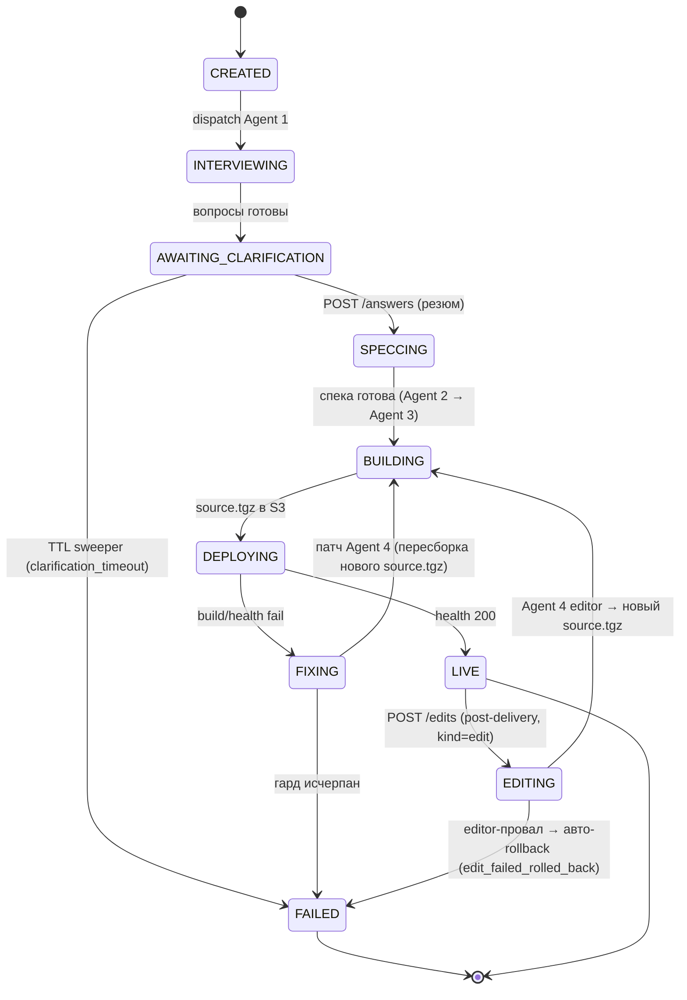
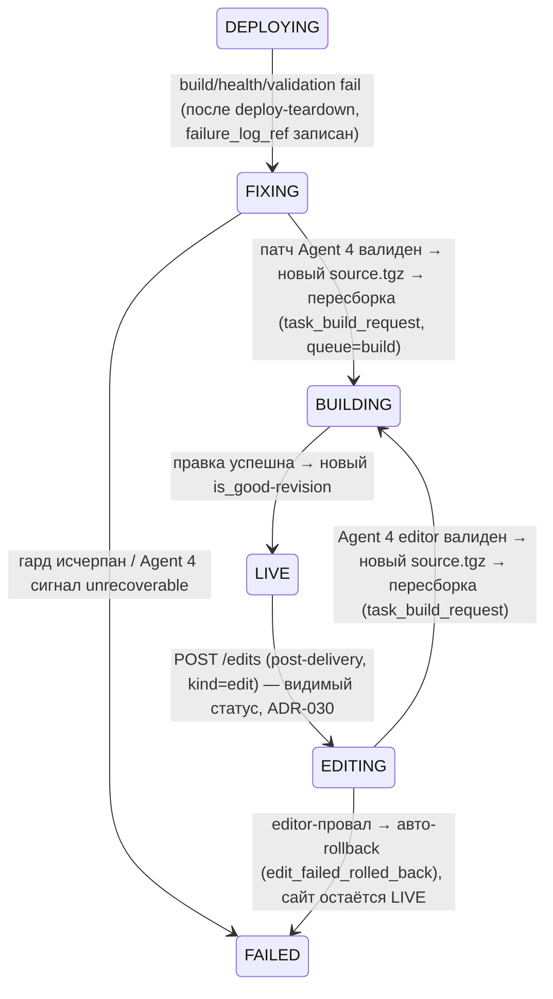

# pipeline — Architecture

## State machine



> **Терминальные состояния — `LIVE` и `FAILED`** (`_TERMINAL_JOB_STATES` в [events.py](../../app/pipeline/events.py)). Диаграмма (текст/таблица переходов ниже / `transition()`) согласованы: **нет ни одного перехода ИЗ `FAILED`**; единственный «выход» из `LIVE` — `LIVE → EDITING` по `POST /edits` (post-delivery правка, `kind=edit`, [ADR-030](../../adr/ADR-030-editing-visible-state-edit-job.md)), и это **новая edit-джоба той же good-ревизии**, а не перезапись терминала исходной джобы (edit-цикл, [ADR-014](../../adr/ADR-014-edit-limit-revision-rollback.md)). Машинно терминал = «`state` не перезаписывается ничем» — см. §Инвариант терминальности ниже.
>
> **`EDITING` ([ADR-030](../../adr/ADR-030-editing-visible-state-edit-job.md)) — видимый промежуточный статус edit-джобы.** Post-delivery правка идёт `LIVE → EDITING → BUILDING → DEPLOYING → LIVE` (а не `LIVE → FIXING`): `EDITING` — отдельное активное нетерминальное LLM-фазное состояние (Agent 4 в роли **editor**), вводится ради **видимого прогресса** (раньше edit держал `state=CREATED` всё время editor'а ~3 мин → клиент читал как «зависло», прод-фикс `j_p81uvafbmykvan4w7izu8pjx`) и движения `last_transition_at` (heartbeat). Диспетчер: `EDITING → task_edit` (не `task_fix`) — снимает коллизию `FIXING → task_fix`. Нормативно — §B (Post-delivery edit) ниже.

### Инвариант терминальности состояния ([ADR-029](../../adr/ADR-029-terminal-state-invariant-no-overwrite-deploy-guard-reconciler-revoke.md))

> **Нормативный single source.** Терминальное состояние (`LIVE`, `FAILED`) **НЕ перезатирается**. Любой переход обязан **атомарно** убедиться, что джоба ещё в ожидаемом НЕ-терминальном исходном состоянии, прежде чем записать новый `state`. Джоба уже терминальна → переход **no-op** (тихо игнорируется), не перезапись. Все три представления state-machine (диаграмма + таблица/текст переходов + `transition()`) согласованы по этому инварианту.

Корень — два конкурирующих писателя `generation_jobs.state`: живая Celery-таска-на-состояние ([ADR-001](../../adr/ADR-001-state-machine-dispatcher.md)) и reconciler из beat ([ADR-019 §E2](../../adr/ADR-019-reconciler-all-active-states-agent-graceful-fail.md)). Прод-инцидент (`j_kthn3fbv5eiwfhx11lrx36zg`): reconciler пометил `FAILED(stuck_timeout)`, живая `task_deploy` затем записала `LIVE` поверх → рассинхрон FAILED↔LIVE (клиент получил FAILED, сайт стал LIVE).

Три согласованных слоя ([ADR-029](../../adr/ADR-029-terminal-state-invariant-no-overwrite-deploy-guard-reconciler-revoke.md), барьер A — корень; B/C — устранение бесполезной работы):

- **(A) CAS-барьер в `transition()` (единый барьер, корень).** `transition()` ([events.py](../../app/pipeline/events.py)) — **единственный писатель `state` БЕЗ предусловия на конкретное исходное состояние** (универсальный путь всех тасок и reconciler): выполняет запись как conditional UPDATE `UPDATE generation_jobs SET state=:to, last_transition_at=now() WHERE id=:id AND state NOT IN ('LIVE','FAILED')` в той же транзакции, что `job_events`+commit. **0 затронутых строк** ⇒ джоба уже терминальна ⇒ переход **no-op**: `job_events` НЕ пишется, publish/push НЕ выполняется, terminal-метрики НЕ дублируются, лог `transition_skip_terminal`. **1 строка** ⇒ переход штатный. CAS атомарен на уровне Postgres (single-row UPDATE с предикатом): ровно один из конкурентных писателей затронет строку.

  > **Нормативное правило для любого писателя `state` (барьер-инвариант, строже «единственной точки»).** `transition()` — не единственная строка кода, физически пишущая `generation_jobs.state`: существуют редкие **легитимные прямые писатели-апдейтеры** вне `transition()` (перечислены ниже). Инвариант терминальности держится не тем, что писатель один, а тем, что **каждый** писатель `state` несёт терминал-исключающий предикат. Поэтому нормативное требование: **любой код, перезаписывающий `state` существующей джобы, ОБЯЗАН либо идти через `transition()` (CAS-барьер A), либо нести собственный non-terminal-предикат, СООТВЕТСТВУЮЩИЙ его семантике, в `WHERE` conditional-UPDATE ИЛИ в отборочном `SELECT`, по которому затем пишется `state`, ЛИБО быть явно вынесенным как санкционированное исключение барьера A с ADR-обоснованием.** Предикат барьера A (`transition()`) исключает **оба** терминала — `state NOT IN ('LIVE','FAILED')` (`_TERMINAL_JOB_STATES` = {LIVE, FAILED}, [events.py](../../app/pipeline/events.py)); это НЕ то же множество, что `TERMINAL_STATES` = {FAILED} ([enums.py](../../app/db/enums.py)), используемое в project_gc — две **разные** константы (см. список писателей ниже). Конкретное множество предиката определяется семантикой писателя: универсальный writer (`transition`) защищает {LIVE,FAILED}; gc-отмена при удалении проекта осознанно поглощает LIVE и исключает только {FAILED}. Прямой писатель без предиката, соответствующего своей семантике (и не вынесенный явно как санкционированное исключение), — нарушение инварианта (race-перезапись терминала), ловится code review/qa. *(Создание новой строки джобы — `INSERT … state=CREATED` в `project_service.py`/`edit_service.py` — НЕ перезапись и под правило не подпадает: барьер защищает от перезатирания **существующего** терминала.)*

  **Известные легитимные прямые писатели `state` вне `transition()` (исчерпывающий список; каждый несёт собственный non-terminal-предикат):**
  - **answers-резюм `AWAITING_CLARIFICATION → SPECCING`** ([answers_service.py](../../app/services/answers_service.py) `submit_answers`): атомарный `UPDATE generation_jobs SET state=SPECCING WHERE id=:id AND state == AWAITING_CLARIFICATION`. Предикат на исходном `AWAITING_CLARIFICATION` (non-terminal) конструктивно исключает перезапись `LIVE`/`FAILED` и служит ещё и гонко-защитой двойного сабмита (`rowcount != 1` → откат, перечитка, 200/409).
  - **project_gc отмена in-flight `* → FAILED(project_deleted)`** ([project_gc.py](../../app/deploy/project_gc.py) `_cancel_inflight_jobs`): отбор `SELECT … WHERE state NOT IN TERMINAL_STATES`, затем ORM `job.state = FAILED` по отобранным строкам. **Внимание — `TERMINAL_STATES` ≠ `_TERMINAL_JOB_STATES`:** предикат отбора использует `TERMINAL_STATES` = **{FAILED}** ([enums.py](../../app/db/enums.py)) — он исключает ТОЛЬКО `FAILED`, но НЕ `LIVE`. Поэтому `LIVE`-джобы **попадают в отбор и НАМЕРЕННО перезаписываются `LIVE → FAILED`** при удалении проекта (санкционировано [ADR-011](../../adr/ADR-011-project-delete-gc.md): удаление проекта с живым сайтом снимает его). То есть project_gc — **НЕ** «терминал-исключающий» в смысле {LIVE,FAILED}, а **санкционированное исключение** из правила «`LIVE` не перезатирается», обоснованное [ADR-011](../../adr/ADR-011-project-delete-gc.md); идемпотентен в части `FAILED` (уже-`FAILED` не трогаются). Работает по soft-deleted проекту (live-таска аборчена предсуществующим `deleted_at` re-read guard в `_deploy`, [ADR-011](../../adr/ADR-011-project-delete-gc.md)); GC далее hard-delete'ит строки.

  > **Follow-up к backend (docstring-выравнивание).** Docstring `transition()` в [events.py](../../app/pipeline/events.py) формулирует «`transition()` — ЕДИНСТВЕННАЯ точка записи state всеми путями»; это требует приведения к уточнённой формулировке выше («единственный писатель БЕЗ предусловия на исходный state; прямые писатели несут собственный non-terminal-предикат, соответствующий их семантике, либо являются санкционированным исключением — project_gc, перезаписывающий `LIVE → FAILED` по [ADR-011](../../adr/ADR-011-project-delete-gc.md)»). Правка docstring — **зона backend** (код), не architect; зафиксировано как требование, см. также [ADR-029 §Consequences](../../adr/ADR-029-terminal-state-invariant-no-overwrite-deploy-guard-reconciler-revoke.md).
- **(B) Re-read state-guard в `_deploy` перед записью LIVE.** `_deploy` перед финальным `transition(..., LIVE)` перечитывает `job.state` из БД (`session.refresh(job, ["state"])`) — по аналогии с уже существующей перечиткой `project.deleted_at` (TOCTOU GC, [ADR-011](../../adr/ADR-011-project-delete-gc.md), [deploy §6](../deploy/03-architecture.md#6-gc-при-удалении-проекта-sprint-4--delete-projectsid-adr-011-закрывает-td-003q-deploy-3)). `state != DEPLOYING` (терминализирован reconciler'ом) → LIVE **не** пишется, деплой-контейнер при необходимости снимается тем же teardown-инвариантом. B — оптимизация (таска раньше узнаёт, что результат не нужен), корректность держит A.
- **(C) Reconciler revoke живой таски при fail-stuck.** `_reconcile_one` (ветвь 2, [§E2](#e2-reconciler-застрявших-активных-состояний-crash-resume--concurrency-leak-guard-adr-019)) при `FAILED(stuck_timeout)` делает best-effort `revoke(task_id, terminate=True)` живой таски джобы (`task_id` — Redis-ключ `job_task:{job_id}`, TTL > `STUCK_THRESHOLD_S`, без миграции). Revoke best-effort — недоступность не валит fail-stuck (барьер A всё равно не даст перезаписать FAILED). C прекращает бесполезный compute/деплой терминализированной джобы.

**Семантика исхода (какой верен).** При гонке «reconciler пометил FAILED ↔ живая таска готова писать LIVE» **верен `FAILED`**: джоба провисела > `STUCK_THRESHOLD_S` без смены state и без живого heartbeat-прогресса — reconciler сработал корректно; барьер A фиксирует «кто записал терминал первым — победил, второй no-op». См. §E2 (heartbeat на distinct failure-event) — почему живая прогрессирующая джоба больше не получает ложный fail-stuck.

## Диспетчер (task-на-состояние)

- Не один длинный task, а **по Celery-task на состояние** (`task_interview`, `task_spec`, `task_build_request`, `task_fix`, ...). Решение — [ADR-001](../../adr/ADR-001-state-machine-dispatcher.md).
- Диспетчер по текущему `state` ставит следующий task (`queue=llm` для агентов, `queue=build` для сборки).
- Каждый переход: транзакционно обновить `state` + вставить `job_events` + опубликовать в Redis `job:{id}`.
- **Crash-resumable:** после рестарта sweeper/диспетчер подхватывает джобы в нетерминальных активных состояниях.

#### Нормативная таблица `dispatch_for_state` (state → task)

> Единственный нормативный источник маршрутизации `dispatch_for_state` ([dispatcher.py](../../app/pipeline/dispatcher.py)). Согласована со state-machine: task в строке = task, которую dispatcher/reconciler ставят по этому `state` (= state, в котором окажется джоба после перехода в него).

| `state` | `kind` | Ставится task | Очередь |
|---|---|---|---|
| `CREATED` | `generation` | `task_interview` (Agent 1) | `llm` |
| `CREATED` | `edit` | `task_edit` (Agent 4 editor; первым делом `→ EDITING`) | `llm` |
| `CREATED` | `rollback` | `task_build_request` / прямой re-deploy good-ревизии ([ADR-014 §B](../../adr/ADR-014-edit-limit-revision-rollback.md)) | `build` |
| `EDITING` | (любой; только `edit` сюда попадает) | **`task_edit`** ([ADR-030](../../adr/ADR-030-editing-visible-state-edit-job.md) — crash-resume editor'а; НЕ `task_fix`) | `llm` |
| `SPECCING` | — | `task_spec` (Agent 2) | `llm` |
| `BUILDING` | — | `task_build_request` | `build` |
| `DEPLOYING` | — | `task_deploy` | `build` |
| `FIXING` | — (kind-независимо) | `task_fix` (Agent 4 fixer) | `llm` |
| `INTERVIEWING` / `AWAITING_CLARIFICATION` / `LIVE` / `FAILED` | — | no-op (задач нет) | — |

> **Коллизия `FIXING`, которую снимает `EDITING` ([ADR-030](../../adr/ADR-030-editing-visible-state-edit-job.md)).** `FIXING → task_fix` маршрутизируется **kind-независимо**. Если бы edit-обработка использовала `FIXING` для видимого статуса, crash-resume edit-джобы по `state=FIXING` отправил бы её в `task_fix` (fix-виток с `failure_log`), а не в `task_edit` (editor с `instruction`) → сломал бы edit. Отдельное `EDITING` с маршрутом `EDITING → task_edit` устраняет коллизию: edit-обработка и fix-виток не делят маршрут.

## Пауза human-in-the-loop

- На `AWAITING_CLARIFICATION` **ни одной задачи в очереди** — ноль компьюта.
- Резюм событийный: `POST /answers` (модуль `api`) ставит task `SPECCING`.
- Beat-sweeper экспайрит зависшие `AWAITING_CLARIFICATION` по TTL → `FAILED(clarification_timeout)`.

## Агенты (Anthropic SDK)

| Агент | Вход | Выход | Очередь |
|---|---|---|---|
| **Agent 1 (Interviewer)** | промт + **серверная language-директива** (язык из `content_language`, §Язык/локализация) **+ vision: приложенные изображения** ([ADR-034](../../adr/ADR-034-user-image-attachments-vision-site-assets.md), §Vision-вход) | список уточняющих вопросов → `questions`, на языке директивы | llm |
| **Agent 2 (Spec writer)** | промт + ответы + **серверная language-директива** (§Язык/локализация) **+ vision: приложенные изображения** + серверный манифест ассетов ([ADR-034](../../adr/ADR-034-user-image-attachments-vision-site-assets.md)) | финальная спека (`spec_tz`/`spec_ref`); `spec_markdown` **обязан** начинаться маркером `**Content language:**`; несёт текстовый манифест ассетов (относительные пути `uploads/...`, §Vision-вход) | llm |
| **Agent 3 (Builder)** | спека (включая манифест ассетов) — **vision НЕ получает** ([ADR-034 §D3](../../adr/ADR-034-user-image-attachments-vision-site-assets.md): `thinking=disabled`, cap под file-tree) | дерево файлов проекта → `source.tgz` в S3 (контракт ниже); ссылается на ассеты по манифесту | llm |
| **Agent 4 (Fixer)** | спека + дерево исходников (последняя ревизия **текущей джобы**, §A) + `failure_log` из S3 **+ vision: приложенные изображения** (editor-режим, [ADR-034](../../adr/ADR-034-user-image-attachments-vision-site-assets.md)) | патч дерева → новый `source.tgz`, **либо** сигнал «неисправимо» | llm |

- **Tiering моделей — ЕДИНЫЙ НОРМАТИВНЫЙ МАППИНГ агент→роль→модель (single source of truth).** Продуктовое решение — [08 §6-2](../../08-product-decisions.md#sprint-6--observability-cost-scale) (Opus для Spec; Sonnet для Interviewer/Builder/Fixer — после ревизии R1 [ADR-023](../../adr/ADR-023-agent3-token-budget-thinking-room.md), Builder переведён Opus→Sonnet ради стоимости); конкретные model ID — [02-tech-stack.md → Модели](../../02-tech-stack.md#фреймворки--библиотеки). Маппинг живёт в конфиге (`app/core/config`), не в коде агентов; переопределяется env-ключами `AGENT1..4_MODEL` ([07-deployment.md → env-контракт](../../07-deployment.md#контракт-переменных-окружения-environment-reference)). Все прочие документы ссылаются на эту таблицу, не дублируют значения.

  | # (env) | Роль | Модель | Model ID | env-ключ |
  |---|---|---|---|---|
  | AGENT1 | Interviewer | **Sonnet** | `claude-sonnet-4-6` | `AGENT1_MODEL` |
  | AGENT2 | Spec writer | **Opus** | `claude-opus-4-8` | `AGENT2_MODEL` |
  | AGENT3 | Builder | **Sonnet** | `claude-sonnet-4-6` | `AGENT3_MODEL` |
  | AGENT4 | Fixer | **Sonnet** | `claude-sonnet-4-6` | `AGENT4_MODEL` |

  > **Ревизия R1 ([ADR-023 §Decision (3)](../../adr/ADR-023-agent3-token-budget-thinking-room.md#3-модель-agent-3-builder-claude-sonnet-4-6-ревизия-r1)):** Agent 3 (Builder) — `claude-opus-4-8` → `claude-sonnet-4-6` (стоимость −40% input/output). Builder — структурная генерация по готовой спеке Agent 2 (thinking **disabled**, §Token-бюджет ниже), extended-thinking Opus не задействуется; качество приемлемо, риск build-ошибок покрыт fix-loop §C; откат на Opus = смена `AGENT3_MODEL` без релиза. Opus сохранён **только** у Agent 2 (Spec writer — проектное мышление критично).

  Нумерация `AGENTn` ↔ роль фиксирована таблицей §Агенты выше (Agent 1=Interviewer … Agent 4=Fixer) и не меняется. env-дефолты `config.py`/`07-deployment` приводятся к этим значениям в S6-калибровке model-tiering (требование к backend; если текущий дефолт отличается — это калибровочная правка, не новое решение).

#### Token-бюджет агентов (ADR-023)

> **Нормативный single source of truth по `max_tokens` и `thinking`-mode каждого агента ([ADR-023](../../adr/ADR-023-agent3-token-budget-thinking-room.md)).** И `claude_client` (сборка kwargs), и env-контракт [07](../../07-deployment.md#канонический-список-ключей) ссылаются сюда, не дублируют значения. Маппинг живёт в конфиге (`app/core/config.py`), не в коде агентов (как model-tiering); переопределяется env-ключами `AGENTn_MAX_TOKENS`.

**Прод-инцидент (контекст):** Agent 3 (Builder) на сложных сайтах **детерминированно** падал `invalid_agent_output` — все 3 попытки `stop_reason=max_tokens` при едином `AGENT_MAX_TOKENS=16000`: вывод усекался посреди JSON-дерева (полный file-tree > доступного), либо adaptive-thinking съедал **весь** cap, оставляя пустой текст. Корень — общий `max_tokens` на thinking+вывод при adaptive thinking.

**Нормативный факт API:** ограничить thinking фиксированным бюджетом нельзя — `thinking={"type":"enabled","budget_tokens":N}` даёт **HTTP 400** на Opus 4.8/4.7 (удалён) и deprecated на Sonnet 4.6. Единственный on-режим — `adaptive`; off — `disabled`. `max_tokens` — CAP (платим за факт), у adaptive thinking thinking+вывод делят общий cap. Ceiling: Opus 4.8 — **128K**, Sonnet 4.6 — **64K** (skill `claude-api`).

| Агент (роль) | Модель | `max_tokens` cap | env-ключ | thinking-mode |
|---|---|---|---|---|
| Agent 1 (Interviewer) | sonnet-4-6 (≤64K) | **16000** | `AGENT1_MAX_TOKENS` | `adaptive` |
| Agent 2 (Spec writer) | opus-4-8 (≤128K) | **32000** | `AGENT2_MAX_TOKENS` | `adaptive` |
| **Agent 3 (Builder)** | **sonnet-4-6 (≤64K)** | **56000** | `AGENT3_MAX_TOKENS` | **`disabled`** |
| **Agent 4 (Fixer/Editor)** | sonnet-4-6 (≤64K) | **56000** | `AGENT4_MAX_TOKENS` | **`disabled`** (R2) |

- **Agent 3 (Builder) — `thinking=disabled` + cap 56000 (Sonnet):** весь cap **детерминированно** под вывод полного JSON-дерева; пустой-вывод-кейс конструктивно невозможен; запас от усечения (доказанно >28763 симв. вывода нужно). Cap **56000 = 87.5% ceiling Sonnet 64K, с ~8000-токенным запасом до потолка** (НЕ упираемся в ceiling). Builder — структурная генерация по готовой спеке Agent 2, глубокий thinking менее критичен. Ревизия R1: модель Opus→Sonnet, cap 64000→56000 (прежний 64000 был = ровно ceiling Sonnet, без запаса). См. [ADR-023 §Decision](../../adr/ADR-023-agent3-token-budget-thinking-room.md#decision).
- **Agent 4 (Fixer/Editor) — `thinking=disabled` + cap 56000 (Sonnet), ревизия R2 ([ADR-023 §Decision (4)](../../adr/ADR-023-agent3-token-budget-thinking-room.md#4-agent-4-fixereditor--thinking-disabled-ревизия-r2-2026-06-12)):** Agent 4 возвращает **полное дерево файлов** (переиспускает схему `agent_output` Builder, §A → Выход) в **обоих** режимах — fixer **и** editor. При прежнем `adaptive` reasoning-токены делили cap 56000 с выводом → усечение крупного дерева → `agent_output_invalid` → retry-виток (прод-инцидент 31-минутной правки `j_kthn3fbv5eiwfhx11lrx36zg`). `disabled` отдаёт весь cap под вывод, как у Builder. **Disabled для обоих режимов** (fixer получает `failure_log` в контексте — extended-thinking-комната на выходном дереве не нужна; приоритет надёжности).
- **Агенты 1/2 — `thinking=adaptive`** сохранён (ценен для качества); их cap (16000–32000) вмещает adaptive thinking + вывод. *(Agent 4 переведён в `disabled` ревизией R2 — исходный R1-текст «1/2/4 adaptive» уточнён до «1/2 adaptive».)*
- **Ни один cap не превышает ceiling модели** (Agent 2 — Opus 128K; Agent 1/3/4 — Sonnet 64K; Builder/Fixer держат запас 56000 < 64000) — qa contract-тест.
- Прежний единый `AGENT_MAX_TOKENS` / `agent_max_tokens` **удалён** (заменён четырьмя пер-агентными). `effort` (`AGENT_EFFORT`) применяется к thinking-агентам (1/2); на Agent 3 **и** Agent 4 (thinking disabled) не действует.

- **Structured-output всех 4 агентов — ЕДИНЫЙ НОРМАТИВНЫЙ МЕХАНИЗМ ([ADR-020](../../adr/ADR-020-agent-structured-output-tool-use-tolerant-parse-retry.md), общий слой `app/pipeline/agents/structured.py`, не дублировать в каждом агенте).** Каждый агент вызывается в **текстовом режиме** (`output_config={effort}`, **без** `tools`/форс-`tool_choice`; thinking-mode — пер-агентный, §Token-бюджет агентов / [ADR-023](../../adr/ADR-023-agent3-token-budget-thinking-room.md)); формат форсируется **строгим системным промтом** («raw JSON, без markdown-фенсов и прозы»); структура извлекается из `block.text` хелпером `extract_json` (снятие ` ```json…``` `-фенсов + первый сбалансированный JSON). **bounded retry** (`AGENT_OUTPUT_MAX_RETRIES`) на parse/schema-фейл перед терминалом. Полный исполняемый контракт — **§I** ниже. **Прод-триггеры:** (1) ~40% ответов модели приходили в markdown-фенсах → строгий `json.loads(call.text)` бросал `ValueError` → немедленный `FAILED` без ретрая; (2) **revision:** форсированный `tool_choice` несовместим с thinking (HTTP 400) → отозван; (3) **[ADR-023]** единый `AGENT_MAX_TOKENS=16000` детерминированно усекал/обнулял вывод Builder на сложных сайтах → пер-агентный cap + thinking-disabled у Agent 3. Доменная валидация дерева (§Контракт output Agent 3) **остаётся** поверх извлечённой структуры.
- **LLM-провайдер ([ADR-032](../../adr/ADR-032-llm-provider-abstraction-openai.md)):** слой агентов **провайдер-агностичен** — вызывают `client.run_agent(agent=, model=, system_prompt=, user_content=) → AgentCall` через **фабрику** выбора провайдера по env `LLM_PROVIDER` (`anthropic` дефолт / `openai`). Anthropic — существующий `ClaudeAgentClient`; OpenAI — `OpenAIAgentClient` (Responses API, GPT-5-class; `thinking`/`effort`→`reasoning.effort`, `max_tokens`→`max_output_tokens`). Structured-output (текстовый `extract_json`, §I), per-agent token-бюджет/effort-маппинг (§Token-бюджет агентов, [ADR-023](../../adr/ADR-023-agent3-token-budget-thinking-room.md): Agent 3/4 → OpenAI `none` reasoning как аналог thinking-disabled), cost-ledger, retry-классификация — **общие для обоих провайдеров**. Нормативный single source провайдер-слоя — [ADR-032](../../adr/ADR-032-llm-provider-abstraction-openai.md); здесь — ссылка, не переформулирование.
- **Prompt caching:** стабильные system-промты кэшируются между агентами и fix-итерациями. Anthropic — явный `cache_control:ephemeral` (skill `claude-api`); OpenAI — **автоматический** по идентичному префиксу (без `cache_control`-блоков, [ADR-032 §6](../../adr/ADR-032-llm-provider-abstraction-openai.md)). Cache-hit в `AgentCall.cache_read_tokens` для обоих; `cache_write_tokens` для OpenAI = `0`.
- **Cost-ledger:** каждый вызов → запись `llm_usage` (токены, cache hit/write, `cost_usd`); агрегат в `generation_jobs.spend_usd` (**Postgres — источник истины бюджета**, гард читает `spend_usd` из БД). Быстрый Redis-счётчик бюджета для снижения латентности гейта при масштабе — **опциональная оптимизация, целевой Sprint 6** (см. [TD-006](../../100-known-tech-debt.md#td-006), исполняемый контракт оптимизации — [observability §5.2](../observability/03-architecture.md#52-redis-budget-счётчик-td-006--опциональная-оптимизация-латентности-гейта)), в Sprint 2 не требуется. **Sprint 6 (observability):** `llm_usage` инструментируется метриками `lovable_job_cost_usd`/`lovable_llm_call_cost_usd_total`/`lovable_llm_tokens_total`/`lovable_llm_cache_hit_ratio`/`lovable_llm_call_latency_seconds` (нормативная таблица — [observability §2.2](../observability/03-architecture.md#22-cost--llm-cost-ledger-llm_usage)) — питают дашборд Cost и калибровку [TD-005](../../100-known-tech-debt.md#td-005)/[TD-006](../../100-known-tech-debt.md#td-006).

### Vision-вход: приложенные изображения (ADR-034)

> Нормативный single source — [ADR-034](../../adr/ADR-034-user-image-attachments-vision-site-assets.md). Здесь — как это ложится на слой агентов и фазу build.

Пользователь прикрепляет изображения при генерации (`POST /projects`) и правке (`/edits`); один файл служит **двумя независимыми путями** ([ADR-034 §D1](../../adr/ADR-034-user-image-attachments-vision-site-assets.md)): vision-вход агентам **и** реальный ассет сайта (детерминированный инжект в обход LLM).

- **Контракт `run_agent`** ([app/pipeline/agents/base.py](../../app/pipeline/agents/base.py)) расширяется параметром `images: list[ImageInput] | None = None` (`ImageInput={data: bytes, media_type}`). **Дефолт `None` → прежний текстовый путь обоих провайдеров байт-в-байт** (инвариант обратной совместимости, как дефолт `anthropic` [ADR-032](../../adr/ADR-032-llm-provider-abstraction-openai.md)). Непустой `images`: Anthropic — image content-блоки (base64) + text-блок в `messages[0].content`; OpenAI — `input_image` (data-URL) + `input_text` в `input`. Единый текстовый `extract_json`-выход (§I) сохраняется (vision только во входе). `structured.run_structured_agent` пробрасывает `images` в **каждый** retry-вызов.
- **Какие агенты получают vision:** Agent 1 (Interviewer) — да; Agent 2 (Spec writer) — да; **Agent 3 (Builder) — НЕТ** (`thinking=disabled` + весь cap под file-tree, [ADR-023](../../adr/ADR-023-agent3-token-budget-thinking-room.md); ссылается на ассеты по манифесту, не по картинке); Agent 4 (Fixer/Editor) — да (editor-режим; в fixer-режиме по умолчанию да). Перечень нормативен — [ADR-034 §D3](../../adr/ADR-034-user-image-attachments-vision-site-assets.md).
- **Инжект ассета (фаза build, в обход LLM):** воркер берёт **ВСЕ** изображения проекта (`attachments WHERE project_id`) и материализует каждое как `public/uploads/{att_id}.{ext}` поверх дерева Agent 3 — **после** валидации `agent_output`, **до** `pack_source_tgz` ([app/deploy/workspace.py](../../app/deploy/workspace.py)). Скоуп `project_id` (не джобы) — чтобы фото не терялись между ревизиями ([ADR-034 §D4](../../adr/ADR-034-user-image-attachments-vision-site-assets.md)).
- **Манифест ассетов в спеке (Agent 2):** сервер кладёт в `spec_markdown` текстовый манифест — для каждого фото детерминированный **ОТНОСИТЕЛЬНЫЙ** путь (`uploads/{att_id}.{ext}`) + «что на фото». Манифест формирует сервер детерминированно (как language-директива [ADR-028](../../adr/ADR-028-deterministic-source-prompt-language-detection.md)), Agent 2 переносит дословно. Agent 3/4 ссылаются на ассеты **относительными** путями — абсолютные `/uploads/...` запрещены (сломали бы path-routing `--base=/s/{site_id}/`, [ADR-017](../../adr/ADR-017-path-based-site-routing.md)). Vite копирует `public/uploads/*` → `dist/uploads/*` → `{APPS_DOMAIN}/s/{site_id}/uploads/...`.
- **Cost:** image-токены входят в `usage.input_tokens` обоих провайдеров — отдельная image-ставка в `_MODEL_PRICING` не нужна, бюджет-гард (`spend_usd`) учтёт автоматически ([ADR-034 §D10](../../adr/ADR-034-user-image-attachments-vision-site-assets.md)).
- **Главный риск (Anthropic): vision × thinking.** Image-блоки совместимы с extended thinking (в отличие от forced `tool_choice` [ADR-020 §Ограничение API](../../adr/ADR-020-agent-structured-output-tool-use-tolerant-parse-retry.md)). Требует **интеграционной проверки на стейджинге ДО раскатки** ([Q-IMG-1](../../99-open-questions.md#q-img-1)); развязка при несовместимости — per-agent `thinking=disabled` **только** для vision-вызовов Agent 1/2 (механизм `settings.agent_thinking(agent)` уже есть, [ADR-023](../../adr/ADR-023-agent3-token-budget-thinking-room.md)). OpenAI-путь риска не несёт.

## Контракт output Agent 3 (полная валидируемая схема)

Строгая схема дерева файлов проверяется **до** упаковки/сборки (фейлить рано, до песочницы). Невалидный output → `FAILED(invalid_agent_output)` (или, при наличии fix-budget, → `FIXING` с лог-сигнатурой `agent_output_invalid`). Решение зафиксировано — [Q-PIPELINE-1](../../99-open-questions.md#q-pipeline-1) (closed-for-S1).

### JSON-форма
```json
{
  "files": [
    { "path": "index.html", "encoding": "utf8", "content": "<!doctype html>..." },
    { "path": "package.json", "encoding": "utf8", "content": "{...}" },
    { "path": "src/main.ts", "encoding": "utf8", "content": "..." },
    { "path": "public/logo.png", "encoding": "base64", "content": "iVBORw0KGgo..." }
  ],
  "entry": "index.html",
  "build": { "tool": "vite", "command": "npm install && npx vite build", "output_dir": "dist" }
}
```

> **Эталонный `build.command` — `npm install && npx vite build` (НОРМАТИВНО).** Agent 3 (и Agent 4) **обязаны** отдавать команду сборки в форме `npm install && npx vite build`. **Запрещены** голый `vite build` (vite в `node_modules/.bin`, не в `PATH` → `sh: vite: not found`) и `npm run build` (ломает инжект `--base` воркером — npm не прокидывает флаг во vite без `--`-разделителя). Воркер всё равно нормализует любую из этих форм к `npx vite build` ([deploy §2A → Site build base-path](../deploy/03-architecture.md#2a-path-based-routing-s-site_id-prod--site_routing_modepath-adr-017)), но эталон в выводе агента обязан быть каноническим, чтобы не плодить лишние fix-loop'ы. **Base path задаёт ВОРКЕР**, не агент: в path-режиме воркер инжектит `--base=/s/{site_id}/` в токен `npx vite build`; Agent 3/4 собственного `--base` НЕ задают (база — забота фазы build, [ADR-017 §Fix (2026-06-08)](../../adr/ADR-017-path-based-site-routing.md#fix-2026-06-08--vite-not-found--потеря---base-через-npm-run-build-прод-инцидент)).

### Правила валидации (все обязательны, проверяются перед `source.tgz`)

**Пути (`path`):**
- Только относительные, POSIX-сепаратор `/`. Запрещены: абсолютные пути (ведущий `/`, Windows-диск `C:\`, UNC `\\`), любой сегмент `..` (path traversal), пустые сегменты, ведущий `~`, NUL и управляющие байты.
- После нормализации путь обязан оставаться внутри корня дерева (canonicalize → check prefix). Дубли путей (case-insensitive) запрещены.
- Длина пути ≤ 255 байт; глубина вложенности ≤ 12 сегментов; сегмент ≤ 100 байт.
- **Симлинки запрещены** — формат не несёт типа «symlink»/«hardlink»; при распаковке `source.tgz` любой не-regular-file (symlink, hardlink, device, FIFO) отвергается распаковщиком (tar-extract с `--no-same-owner`, отказ на entry-type ≠ file/dir).

**Бинарность (`encoding`):**
- `encoding` ∈ {`utf8`, `base64`}. `utf8` — текстовые файлы (валидный UTF-8, иначе reject). `base64` — бинарные ассеты (валидный base64, декодируется до сохранения).
- Бинарные расширения (`png|jpg|jpeg|gif|webp|ico|woff|woff2|ttf|otf`) обязаны быть `base64`; исходники (`html|css|js|ts|tsx|jsx|json|svg|txt|md`) — `utf8`.

**Лимиты размера и числа (hard caps, S1-дефолты в `app/core/config`):**
- Число файлов ≤ `MAX_FILES` (default **300**).
- Размер одного файла (декодированный) ≤ `MAX_FILE_BYTES` (default **2 MiB**).
- Суммарный распакованный размер дерева ≤ `MAX_TREE_BYTES` (default **20 MiB**) — защита от tar-bomb/декомпрессии.

**Обязательные файлы:**
- `package.json` в корне обязателен; валидный JSON; обязан содержать `scripts.build` (или совместим с `build.command`) и быть Vite-проектом (зависимость `vite` в `dependencies`/`devDependencies`).
- `entry` обязателен, указывает на существующий в `files` путь (для Vite-статики — `index.html` в корне).
- `build.output_dir` непустой, относительный, проходит те же path-правила; default `dist`.

**Расширения (allowlist):** разрешены только перечисленные текстовые/бинарные расширения выше плюс `package.json`/`package-lock.json`/`tsconfig*.json`/`vite.config.*`/`.gitignore`. Файлы вне allowlist → reject (защита от внесения скриптов сборки/`.npmrc`/dotfiles с egress-хуками).

> `.npmrc`, `.env`, post-install хуки и произвольные dotfiles **запрещены** на уровне allowlist — это первая линия supply-chain защиты до песочницы.

### Граница с supply-chain (Q-DEPLOY-1)
Эта схема фиксирует **форму и безопасность дерева** до сборки (S1). Контроль содержимого `package.json` / зависимостей (`npm ci`-allowlist registry, vendored baseline, egress-lockdown при установке) — отдельный слой защиты в песочнице, решается в [Q-DEPLOY-1](../../99-open-questions.md#q-deploy-1) на Sprint 4.

### Переиспользование Agent 4
Та же схема и валидация применяются к output Agent 4 (вход = текущее дерево + лог фейла, выход = пропатченное дерево). Невалидный патч Agent 4 — это **fix-неудача, которая НЕ инкрементирует `retry_count`**: `retry_count++` происходит только при *применённом* патче (переход `FIXING → BUILDING`, единственный нормативный источник правила — §C(a)). Бесконечный цикл невалидных патчей обрывается не `retry_count`, а гардами no-progress §C(d) / budget §C(b) / wall-clock §C(c). Класс фейла такого витка — `agent_output_invalid` (см. §A «Выход», §C(d), ADR-005).

---

## Язык/локализация контента сайта — детерминированный детект ([ADR-028](../../adr/ADR-028-deterministic-source-prompt-language-detection.md) ревизует [ADR-025](../../adr/ADR-025-content-language-autodetect-spec-marker.md))

> **Нормативный single source of truth** механики определения и прокидывания языка user-facing контента сгенерированного сайта. Продуктовое решение — [08 §Локализация](../../08-product-decisions.md#локализация--язык-сгенерированного-сайта--язык-пользователя-авто-детект-adr-025-ревизия-adr-028). Прод-баг (две волны): (1) сайт выходил на русском при английском вводе — корень кириллица/локаль-термины в эталонных примерах промтов; (2) **недетерминизм** — один и тот же русский промпт давал то русские, то английские вопросы (Agent 1), каскадом отравляя язык всего сайта. ADR-028 устраняет (2): язык детектится **детерминированно на сервере из исходного промпта**, а не LLM-само-детектом.

**Принцип:** язык контента сайта = **язык ИСХОДНОГО промпта пользователя** (`project.prompt`, тело `POST /projects`), определённый **детерминированно на сервере один раз** и **жёстко инжектируемый** во весь пайплайн серверной директивой. Агенты язык **не детектят** — получают готовый.

**Механизм (нормативно):**

1. **Детект — серверный, детерминированный, из исходного промпта (единая точка истины приоритета и точки детекта).** На старте фазы interview (Celery `task_interview` → `_interview`, `app/workers/tasks.py`), **до** вызова Agent 1, серверная функция детектит язык по доминирующему **Unicode-script** текста `project.prompt`:
   - доля буквенных символов по script-группам (Cyrillic / Latin / …), исключая цифры, пробелы, пунктуацию, emoji;
   - доминирующий script → язык по фиксированной таблице: **Cyrillic → `Russian (ru)`**, **Latin → `English (en)`** (MVP: ru/en);
   - результат — пара `(<язык>, <bcp-47>)`. Детект **детерминирован**: один и тот же промпт → один и тот же язык **на каждом прогоне** (не зависит от модели/её недетерминизма).
   - Механизм выбран как **собственная script-эвристика без новой зависимости** (не `langdetect`): детект влияет лишь на **директиву**, финальную лингвистическую точность даёт LLM ([ADR-028 §1](../../adr/ADR-028-deterministic-source-prompt-language-detection.md)).

2. **Приоритет — ИСХОДНЫЙ промпт (единственный нормативный источник правила приоритета).** Язык берётся из `project.prompt`. **Язык ответов пользователя на уточняющие вопросы НЕ переопределяет язык промпта** (приоритет «ответы > промпт» из исходного ADR-025 **отозван** [ADR-028 §4](../../adr/ADR-028-deterministic-source-prompt-language-detection.md) — он порождал каскад прод-бага). Все прочие документы (ADR-025, [08-L-2/L-3](../../08-product-decisions.md#локализация--язык-сгенерированного-сайта--язык-пользователя-авто-детект-adr-025-ревизия-adr-028), таблица агентов §Агенты) **ссылаются** на это правило, не переформулируют.

3. **Хранение — поле `generation_jobs.content_language` (BCP-47).** Результат детекта сохраняется в новом поле ([03-data-model → generation_jobs](../../03-data-model.md#generation_jobs); миграция revises head `20260608_0001`). Crash-устойчивый якорь: после рестарта воркер восстанавливает язык **без передетекта**; единый источник для Agent 1 (стартует до появления спеки) и Agent 2.

4. **Прокидка — серверная инжекция директивы.** Сервер инжектирует язык из `content_language` в системный ввод агентов как явную директиву (не самодетект):
   - **Agent 1 (Interviewer):** директива `Generate all questions in <язык> (<bcp-47>).` → вопросы детерминированно на языке промпта.
   - **Agent 2 (Spec writer):** директива `Generate all user-facing content in <язык> (<bcp-47>).` Agent 2 **обязан** начать `spec_markdown` маркером со **значением из директивы**:
     ```
     **Content language:** <язык> (<bcp-47>)
     ```
     Пример: `**Content language:** English (en)`. Это первые символы **значения** строкового поля `spec_markdown` (top-level ключ не меняется — `spec_markdown`, §I.1a). Значение маркера приходит из серверного детекта, **не** из решения модели.

5. **Маркер `**Content language:**` (единственный нормативный источник формата/происхождения).** Формат — `**Content language:** <язык> (<bcp-47>)`; **происхождение значения — серверный детерминированный детект** (`content_language`), инжектированный в директиву Agent 2. Маркер живёт в `spec_markdown` (inline `spec_tz` / `spec_ref` в S3), который и так подаётся downstream — это канал для Agent 3/4. ADR-025, §I.1a, 08-L-2 ссылаются на этот формат/происхождение, не переформулируют.

6. **Agent 3 (Builder):** генерит **весь** видимый контент сайта на языке маркера `**Content language:**` из спеки и выставляет корневой `<html lang="<bcp-47>">` (BCP-47 извлекается из маркера). Без изменений относительно ADR-025.

7. **Agent 4 (Fixer/Editor):** **сохраняет** язык контента (не переключает, не переводит) — маркер в неизменной спеке остаётся источником языка для fix- и edit-витка. Без изменений относительно ADR-025.

8. **Fallback (детерминированное правило).** Если доминирующий script не определяется уверенно (нет буквенных символов; либо ни один script не набирает строгого большинства > 50 % буквенных) → **дефолт `English (en)`** ([ADR-028 §5](../../adr/ADR-028-deterministic-source-prompt-language-detection.md)). Правило строгое и воспроизводимое — без обращения к модели, без недетерминизма в граничных случаях.

9. **Дефолт «русский» убран полностью.** Эталонные примеры в системных промтах всех агентов **НЕ должны содержать кириллицы / локаль-специфичных строк** (русских примеров output, термина `ТЗ`) — few-shot на русском смещает язык генерации. Примеры — нейтральные/англоязычные плейсхолдеры. *(Правка `.txt`-промтов — зона backend; здесь — нормативное требование к содержимому. 5 файлов: `agent1_interviewer.txt`, `agent2_spec_writer.txt`, `agent3_builder.txt`, `agent4_fixer.txt`, `agent4_editor.txt`.)*

**Контракт output Agent 2 (обновлён):** `spec_markdown` обязан **начинаться** маркером `**Content language:** <язык> (<bcp-47>)` (значение — из серверной директивы). Top-level ключ (`spec_markdown`, §I.1a) и сигнатура валидатора `_validate_spec` не меняются; добавляется лишь проверка наличия маркера в начале `spec_markdown` (в рамках существующего валидатора, зона backend).

**Override явным locale от iOS-клиента** — **вне MVP**, [Q-LOCALE-1](../../99-open-questions.md#q-locale-1) (`blocks_sprint: none`; API/схема не меняются в MVP).

**Критерии приёмки (qa, [ADR-028](../../adr/ADR-028-deterministic-source-prompt-language-detection.md) ревизует [ADR-025](../../adr/ADR-025-content-language-autodetect-spec-marker.md)):**
- **unit (детект детерминирован, обязателен — закрывает корень прод-бага недетерминизма):** серверная функция детекта — чистая, без LLM/IO: на русском (кириллица) промпте возвращает `ru` **на каждом вызове** (≥N повторов идентичны, не флапает); на английском (латиница) — `en`; результат стабилен побайтово при повторе. Воспроизводит и закрывает «один промпт → разный язык».
- **unit (fallback, обязателен):** промпт без буквенных символов (только цифры/emoji/пунктуация) **или** смешанный script без строгого большинства → детект возвращает дефолт `en` детерминированно ([ADR-028 §5](../../adr/ADR-028-deterministic-source-prompt-language-detection.md)).
- **unit (script-маппинг):** доминирующая кириллица (с латинскими вкраплениями ниже порога) → `ru`; доминирующая латиница (с кириллическими вкраплениями ниже порога) → `en`.
- **contract (директива инжектируется сервером, не самодетект):** при старте фазы interview язык из `content_language` инжектируется в ввод Agent 1; при фазе spec — в ввод Agent 2; маркер `**Content language:**` в `spec_markdown` несёт **значение `content_language`** (а не результат собственного детекта модели). Проверяется на собранном вводе агента (а не слепом моке).
- **contract (нет кириллицы/локаль-строк в промтах):** ни один из 5 промт-файлов **не содержит** кириллических символов и термина `ТЗ` в эталонных примерах.
- **contract (language-директива присутствует):** системные промты содержат инструкцию писать на языке **серверной директивы** — Agent 1 вопросы, Agent 2 контент+маркер, Agent 3 контент+`<html lang>`, Agent 4 сохранение.
- **contract (spec-маркер):** промт Agent 2 требует начинать `spec_markdown` маркером `**Content language:**`; валидатор Agent 2 проверяет наличие маркера в начале.
- **integration / live двуязычная E2E с акцентом на ДЕТЕРМИНИЗМ:** прогон с **русским** промптом → вопросы Agent 1 **на русском** (детерминированно: повтор того же промпта даёт русские вопросы **каждый** раз, не флапает), `spec_markdown` начинается `**Content language:** Russian (ru)`, сайт несёт `<html lang="ru">` + русский контент; прогон с **английским** промптом → английские вопросы детерминированно, `**Content language:** English (en)` + `<html lang="en">` + английский контент; прогон со **смешанным/неуверенным** script → fallback-правило (`en`) детерминированно. (Real-stack — при `ANTHROPIC_API_KEY`; иначе мок с двуязычными фикстурами; **серверный детект тестируется без мока** — он детерминирован и не зависит от LLM.)
- Cross-ref [06-testing-strategy.md](../../06-testing-strategy.md).

---

# Sprint 2 — Fixer loop + resilience (исполняемый контракт)

> Этот раздел фиксирует **полный исполняемый контракт** восстановительного цикла `build-fail → Fixer`. Решения Sprint 0/1 (enum `FIXING`, поля `generation_jobs`, teardown-on-fail/cleanup-before-run в deploy) **не пересматриваются** — раздел опирается на них. Значимые решения вынесены в [ADR-005](../../adr/ADR-005-no-progress-failure-signature.md) (no-progress через сигнатуру) и [ADR-006](../../adr/ADR-006-celery-retry-vs-domain-fixing.md) (Celery-retry vs FIXING).

## A. Контракт Agent 4 (Fixer)

| | |
|---|---|
| **Очередь** | `llm` |
| **Модель** | из конфига, env `AGENT4_MODEL` — целевое значение **Sonnet** (`claude-sonnet-4-6`) по единому нормативному маппингу (§Агенты → Tiering моделей) |
| **Prompt caching** | стабильный system-промт Fixer кэшируется между fix-итерациями (Anthropic SDK, skill `claude-api`) |
| **Cost-ledger** | каждый вызов → строка `llm_usage` (`agent='agent4'`, токены, cache read/write, `cost_usd`) → агрегат в `generation_jobs.spend_usd` (**источник истины — Postgres**; budget-гард §C(b) читает `spend_usd` из БД). Быстрый Redis-счётчик — опциональная оптимизация латентности, **Sprint 6** ([TD-006](../../100-known-tech-debt.md#td-006)), не требуется в S2 |

### Вход (что подаётся в Agent 4)

1. **Финальная спека** — `generation_jobs.spec_tz` (inline) или загруженная из S3 по `spec_ref` (output Agent 2). Неизменна между fix-итерациями.
2. **Текущее дерево исходников** — распаковка `source.tgz` **последней ревизии текущей джобы** (`revisions.source_artifact_ref` той ревизии, у которой `created_from_job_id = job_id` И `revision_no = max` среди ревизий этой джобы), т.е. то дерево, что упало в данном витке. **Не** глобальный `max(revision_no)` по проекту: в edit-цикле S5 верхняя ревизия проекта может быть прежней good-ревизией от другой джобы — вход Fixer всегда привязан к ревизии-кандидату текущей джобы. Передаётся как набор `{path, content}` (текстовые файлы; бинарные ассеты — только список путей+размеров, без содержимого, чтобы не жечь токены).
3. **`failure_log`** — лог последнего фейла из S3 по `generation_jobs.failure_log_ref` (формат — §F). Передаётся целиком, если ≤ лимита, иначе хвост (последние N KB stderr — там диагностическое ядро) + извлечённые error-строки.

### Выход (строго валидируемый)

Agent 4 возвращает **тот же формат, что output Agent 3** — переиспользуется схема `agent_output` целиком (см. «Контракт output Agent 3» выше): `files[]`, `entry`, `build`, все path/encoding-правила, лимиты `MAX_FILES`/`MAX_FILE_BYTES`/`MAX_TREE_BYTES`, allowlist расширений, запрет dotfiles/симлинков. Дополнительно для Fixer:

- **Reserved-файл `.build.json`** (если присутствует в выходе) трактуется как метаданные сборки и **не** идёт в дерево сайта; он проходит те же лимиты, но исключается из распаковываемого `source.tgz` дерева (зарезервированное имя, запрещено как обычный ассет). Это единый канал, по которому Fixer/Builder может зафиксировать build-параметры; обычные файлы с таким именем reject как коллизия reserved-имени.
- **Сигнал «неисправимо»** — Agent 4 может вместо дерева вернуть явный объект `{ "unrecoverable": true, "reason": "<machine_code>", "explanation": "<текст пользователю>" }`. Тогда pipeline **не** делает передеплой, а сразу `FIXING → FAILED(fixer_gave_up)` с `explanation` в `failure_reason`/`job_events`. Это легальный выход агента, а не ошибка валидации.

**Невалидный выход** Agent 4 (нарушение схемы дерева) трактуется как **fix-неудача** с сигнатурой класса `agent_output_invalid` — а не как падение таски. Такой виток **не инкрементирует `retry_count`** (инкремент только при применённом патче, переход `FIXING → BUILDING`, см. §C(a)); зацикливание на невалидных патчах обрывают гарды no-progress §C(d) / budget §C(b) / wall-clock §C(c). При срабатывании любого из них → `FAILED(reason)` соответствующего гарда (для повторной той же сигнатуры — `FAILED(no_progress)`; `FAILED(invalid_agent_output)` — когда невалидный output совпадает с исчерпанием fix-budget, см. таблицу reason-кодов §C).

## B. State machine — расширение Sprint 2

Базовая машина (см. диаграмму вверху файла) уже несёт `FIXING`. Sprint 2 уточняет **семантику переходов вокруг `FIXING`**:



> **Edit-flow vs fix-цикл (различие маршрутов, [ADR-030](../../adr/ADR-030-editing-visible-state-edit-job.md)).** Post-delivery правка идёт `LIVE → EDITING → BUILDING → DEPLOYING → LIVE`, **минуя `FIXING` на старте**. `EDITING` — отдельное активное нетерминальное состояние (Agent 4 как **editor**, не fixer), по которому диспетчер ставит `task_edit` (а не `task_fix`). Лейбл/целевой state каждого перехода = state, в котором окажется джоба = state, по которому dispatcher/reconciler ставит следующую task: из `EDITING` ставится `task_edit` (`queue=llm`), и эту же task dispatcher/reconciler ставят по `state=EDITING` (crash-resume). После успеха editor'а — `EDITING → BUILDING` (новый `source.tgz` обязан пройти пересборку `npm install && npx vite build` → `dist` до деплоя, как fix-цикл). Если build новой правки упадёт — джоба штатно уходит `BUILDING/DEPLOYING → FIXING → task_fix` (это уже build-fix новой ревизии, корректно). Подробности маршрута, миграции enum и crash-resume инварианта — [ADR-030](../../adr/ADR-030-editing-visible-state-edit-job.md), контракт ниже (Post-delivery edit).

### Восстановительный цикл (фокус Sprint 2): `FIXING → BUILDING → DEPLOYING → LIVE | FIXING`

> Топология цикла: после валидного патча Agent 4 джоба идёт в **`BUILDING`** (а не сразу в `DEPLOYING`), т.к. новый `source.tgz` обязан пройти пересборку `npm ci && vite build` → `dist` до деплоя. Лейбл перехода = целевой `state` = `state`, по которому dispatcher/reconciler ставят следующую task: из `FIXING` ставится `task_build_request` (`queue=build`), и эту же task dispatcher/reconciler ставят по `state=BUILDING`. Если бы целевым state был `DEPLOYING`, reconciler по `state=DEPLOYING` поставил бы deploy-таску при отсутствующем `dist` → сломал бы crash-resume.

1. **`DEPLOYING → FIXING`** — триггер: доменный фейл (build-fail / health-fail / invalid agent output). Предусловия перехода (инвариант, [deploy §5](../deploy/03-architecture.md#5-lifecycle-сайт-деплоя-state-machine-site_deploymentsstatus)):
   - deploy уже выполнил **teardown** контейнера+route текущей попытки (`site_deployments.status=failed`) — pipeline не переводит джобу, пока `{subdomain}`-хост не освобождён;
   - `failure_log` записан в S3, `generation_jobs.failure_log_ref` обновлён;
   - вычислена `failure_signature` текущего фейла (ADR-005).
   - Транзакционно: `state=FIXING`, `job_events(state_changed, build_failed)`, publish `job:{id}`.
2. **В `FIXING`** диспетчер ставит `task_fix` (`queue=llm`). Перед вызовом Agent 4 проверяются **4 гарда** (§C). Если любой исчерпан → `FIXING → FAILED(reason)`, цикл не продолжается.
3. **`FIXING → BUILDING`** — Agent 4 вернул валидный патч → новый `source.tgz` (новая запись `revisions` той же джобы), `retry_count++`. Диспетчер ставит `task_build_request` (`queue=build`) — джоба переходит в `BUILDING`, где новый source.tgz пересобирается в `dist`. Дальше штатный путь `BUILDING → DEPLOYING`; передеплой того же субдомена идемпотентен через cleanup-before-run (`docker rm -f site_{subdomain}`). *(`last_failure_signature` здесь **не** трогается — единственная точка записи сигнатуры — гард no-progress на входе в `FIXING`, см. §C(d).)*
4. Повтор со шага 1 при новом фейле (`DEPLOYING → FIXING`) — до успеха (`LIVE`) или исчерпания гарда (`FAILED`).

> **Инкремент `retry_count` — на переходе `FIXING → BUILDING`** (один применённый Agent-4-патч = одна попытка). Нормативная формулировка правила (что инкрементируется, что — нет) — единственный источник §C(a); здесь — лишь привязка к точке перехода.

### Post-delivery edit (`LIVE → EDITING → BUILDING → DEPLOYING → LIVE`) — контракт зафиксирован, реализация в Sprint 5 ([ADR-030](../../adr/ADR-030-editing-visible-state-edit-job.md))

Размежевание S2 ↔ S5 (явно):

- **В Sprint 2 реализуется только восстановительный цикл** `build-fail → Fixer` (джоба `kind=generation`, вход в `FIXING` из `DEPLOYING`). Это содержание DoD Sprint 2.
- **Post-delivery правки** (`POST /edits` → джоба `kind=edit`, **старт `LIVE → EDITING`**, Agent 4 как editor) — **контракт описан здесь** и **реализуется в Sprint 5** (Realtime & edits; исполняемый endpoint-контракт `/edits`, лимит правок и rollback — [ADR-014](../../adr/ADR-014-edit-limit-revision-rollback.md), [ADR-030](../../adr/ADR-030-editing-visible-state-edit-job.md), [modules/api/02-api-contracts.md](../api/02-api-contracts.md), [README roadmap](../../README.md#спринты-roadmap)). В Sprint 2 переход `LIVE → EDITING` **не активировался** (не было `/edits`).

Контракт edit-цикла (зафиксирован в S2; маршрут через `EDITING` уточнён [ADR-030](../../adr/ADR-030-editing-visible-state-edit-job.md), активируется в S5 — [ADR-014](../../adr/ADR-014-edit-limit-revision-rollback.md)):
- **Вход:** `POST /edits` (`kind=edit`, quota-gate отдельным [лимитом правок](../billing/03-architecture.md#7-граница-s5-edits)). Джоба создаётся в `CREATED` (как любая джоба), диспетчер по `CREATED + kind=edit` ставит `task_edit`. **Старт `task_edit` (`_edit`): первым делом, ДО долгого Agent 4 editor, переход `CREATED → EDITING`** ([ADR-030](../../adr/ADR-030-editing-visible-state-edit-job.md)) — видимый промежуточный статус «обработка правки» (раньше джоба держала `CREATED` всё время editor'а ~3 мин → читалась как «зависло»). **Хранение `instruction`:** текст правки сохраняется в append-only `job_events` как `payload.instruction` события `event_type='edit_requested'` — **отдельной колонки `generation_jobs.instruction` нет** (единственный нормативный источник хранения — [03-data-model.md → generation_jobs/примечание instruction](../../03-data-model.md#generation_jobs)). **Agent 4 как editor:** вход = спека + **текущая (current) good-ревизия проекта** + `instruction` пользователя (читается из `job_events.payload` события `edit_requested`); выход = новое дерево (та же схема `agent_output`). После успеха editor'а — `EDITING → BUILDING → DEPLOYING → LIVE` с новой ревизией (build-fail новой правки штатно уводит в `FIXING` — те же 4 гарда §C).
- **Guard `_edit` + crash-resume ([ADR-030](../../adr/ADR-030-editing-visible-state-edit-job.md)):** вход-guard `_edit` принимает джобу при `state ∈ {CREATED, EDITING}` (И `kind=='edit'`). Первый вход (`CREATED`) делает `transition(EDITING)` и идёт к editor'у; повторный вход после crash-resume (`acks_late`/retry/reconciler-ре-диспетчеризация по `state=EDITING`) **идемпотентно переобрабатывает** Agent 4 editor (тот же `job_id`: перезапись кандидат-ревизии, `count_edit_start` идемпотентен по `job_id`). **Crash-resume инвариант:** диспетчер по `state=EDITING` ставит `task_edit` (НЕ `task_fix`) — `EDITING → task_edit` снимает коллизию `FIXING → task_fix` (см. §Диспетчер-таблица).
- Успех → новый `revision` (`revision_no++`, `is_good=true`, `created_from_job_id` = edit-job), `projects.current_revision_id` обновляется на новую ревизию, `state=LIVE`. Инкремент `edit_usage_counters.edits_used` — на успешном старте edit-джобы ([billing §7](../billing/03-architecture.md#7-граница-s5-edits)).
- Неудача (гард исчерпан) → **авто-rollback** на предыдущую `is_good=true`-ревизию (передеплой прежней good-ревизии — та же re-deploy-механика, что ручной rollback, [ADR-014 §B/§C](../../adr/ADR-014-edit-limit-revision-rollback.md), [deploy §7](../deploy/03-architecture.md#7-rollback-ревизии-sprint-5--re-deploy-good-ревизии-adr-014)), проект остаётся `LIVE` на прежней ревизии; джоба-edit → `FAILED(edit_failed_rolled_back)`. Сайт **не** уходит в `FAILED` — падает только edit-джоба.

> **`kind='rollback'` — ручной rollback-джоба не идёт через `FIXING`.** Ручной rollback (`POST .../rollback`, [ADR-014 §B](../../adr/ADR-014-edit-limit-revision-rollback.md)) — это отдельная джоба `kind='rollback'` (третье значение `kind` помимо `generation`/`edit`, [03-data-model.md → generation_jobs.kind](../../03-data-model.md#generation_jobs)): **прямой re-deploy уже существующей `is_good`-ревизии** (`BUILDING/DEPLOYING → LIVE`), без Agent 4 и без fix-loop. В отличие от edit-джобы, она **не** проходит ни `EDITING` (нет Agent 4 editor), ни `FIXING`, и не вызывает LLM (нет генерации нового дерева). Провал её re-deploy (health-fail нового деплоя) **не** уводит сайт в `FAILED`: прежняя good-ревизия остаётся `active` (deploy §7 п.4), джоба rollback при инфра/health-провале финализируется `FAILED(infra_error)` — отдельный reason-код **не** вводится ([03-data-model.md → failure_reason](../../03-data-model.md#generation_jobs), [deploy §7](../deploy/03-architecture.md#7-rollback-ревизии-sprint-5--re-deploy-good-ревизии-adr-014)). `kind='rollback'`-джоба не инкрементирует ни `usage_counters`, ни `edit_usage_counters` ([ADR-014 §A](../../adr/ADR-014-edit-limit-revision-rollback.md)). Авто-rollback при неудачной правке — **не** отдельная `kind='rollback'`-джоба, а финализация упавшей edit-джобы (см. выше).

## C. Четыре гарда от бесконечного цикла и runaway-затрат

Состояние гардов несёт `generation_jobs` (поля заведены в Sprint 1). Проверка — **перед каждым витком** (на входе в `FIXING`, до вызова Agent 4). Дефолты — из env-контракта; закрытие [Q-COST-1](../../99-open-questions.md#q-cost-1).

> **Скоуп гардов S2 — ровно эти 4 (джоба-уровень).** Env-ключ `USER_MONTHLY_BUDGET_USD` (поле `users.monthly_budget_usd`, [07-deployment.md → env-контракт](../../07-deployment.md#контракт-переменных-окружения-environment-reference)) — потолок Claude-затрат уровня **юзера/мес**, а НЕ джоба-гард. Он применяется на отдельном quota/budget-гейте (модуль `billing`, Sprint 3/3.5) и в восстановительный цикл Sprint 2 не входит — здесь он перечислен лишь чтобы ключ не выглядел висящим в pipeline-контракте.

| # | Гард | Поле БД | Источник дефолта (env) | Default | Reason при исчерпании |
|---|---|---|---|---|---|
| (a) | Hard cap попыток | `retry_count` vs `max_fix_attempts` | `MAX_FIX_ATTEMPTS` | **3** | `build_unrecoverable` |
| (b) | Cost cap | `spend_usd` vs `budget_usd` | `JOB_BUDGET_USD` | **$5.0000** | `budget_exhausted` |
| (c) | Wall-clock cap | `now()` vs `wall_clock_deadline` | `JOB_WALL_CLOCK_BUDGET_S` | **3600 s** | `wall_clock_exceeded` |
| (d) | No-progress | `failure_event_pending=true` И `failure_signature` == `last_failure_signature` | — (ADR-005) | — | `no_progress` |

### (a) Hard cap `max_fix_attempts` — единственный нормативный источник правила инкремента `retry_count`
- **`retry_count` инкрементируется РОВНО на каждом применённом патче** — переход `FIXING → BUILDING` (один валидный патч Agent 4 = одна попытка). Не на входе в `FIXING`, не на невалидном патче (см. §A «Переиспользование Agent 4»), не на инфра-ретраях Celery (ADR-006). Это **единственное** место, где формулируется правило инкремента; остальные разделы ссылаются сюда. Перед постановкой `task_fix`: если `retry_count >= max_fix_attempts` → `FAILED(build_unrecoverable)`. При default 3 — не более 3 применённых патчей Agent 4 на джобу.
- `max_fix_attempts` берётся из `MAX_FIX_ATTEMPTS` при создании джобы (в Sprint 3.5 может переопределяться per-plan, но дефолт всегда env).

### (b) Cost cap `budget_usd`
- `budget_usd` инициализируется из `JOB_BUDGET_USD` при создании джобы. `spend_usd` = агрегат `llm_usage.cost_usd`, поддерживаемый cost-ledger в **Postgres — это источник истины бюджета**.
- **Нормативная модель гейта (S2):** budget-гард читает `generation_jobs.spend_usd` **из Postgres**. Проверка **перед** каждым LLM-вызовом Agent 4 (и в принципе любого агента): если `spend_usd >= budget_usd` → прерывание текущего витка → `FAILED(budget_exhausted)`. Этого достаточно и авторитетно для DoD Sprint 2; быстрый Redis-счётчик бюджета — **опциональная оптимизация латентности гейта при масштабе, целевой Sprint 6** ([TD-006](../../100-known-tech-debt.md#td-006); исполняемый контракт оптимизации — [observability §5.2](../observability/03-architecture.md#52-redis-budget-счётчик-td-006--опциональная-оптимизация-латентности-гейта): `INCRBYFLOAT budget:{job_id}` после записи `llm_usage`, read-through-гейт с fallback на Postgres при cache-miss; **Postgres остаётся source-of-truth**), и **не** является обязательной частью контракта S2. Поведение kill-by-budget: текущая таска не делает нового Claude-вызова, deploy-ресурсы уже снесены teardown'ом (фейл произошёл до входа в FIXING), пользователю отдаётся последний `failure_log` + `failure_reason=budget_exhausted`. См. [Q-COST-1](../../99-open-questions.md#q-cost-1).

### (c) Wall-clock cap `wall_clock_deadline`
- `wall_clock_deadline = created_at + JOB_WALL_CLOCK_BUDGET_S` (default 3600 s = 1 ч), сохраняется при создании джобы (NULL ⇒ гард выключен, но в S2 всегда проставляется).
- Проверка перед каждым витком: если `now() >= wall_clock_deadline` → `FAILED(wall_clock_exceeded)`. Защищает от джоб, которые формально не исчерпали attempts/budget, но висят слишком долго (медленные сборки/health-таймауты накапливаются).

### (d) No-progress detection
- Алгоритм сигнатуры — [ADR-005](../../adr/ADR-005-no-progress-failure-signature.md): `failure_signature = sha256(failure_class + normalized_core)`, где `normalized_core` — диагностическое ядро лога с вырезанными нестабильными токенами (пути/таймстампы/PID/hex/`{job_id}`).
- **Единственная точка записи `last_failure_signature`** — этот гард на входе в `FIXING`, до постановки `task_fix`. Больше нигде в машине сигнатура не пишется (в частности, на переходе `FIXING → BUILDING` — §B п.3 — она не трогается).
- **Guard-state `failure_event_pending`** (Boolean, `generation_jobs`) различает **новый distinct failure-event** от **crash-resume reprocessing** того же лога reconciler'ом. Без него reconciler (§E2), переставивший таску по `state=FIXING` после краша, переобработал бы **тот же** уже-учтённый failure-event и ложно дал бы совпадение сигнатуры → ложный `no_progress`.
  - Флаг **выставляется в `true` при рождении нового failure-event**: на входе в `FIXING` из `DEPLOYING` (`enter_fixing`, новый доменный фейл с записанным `failure_log_ref`) и при обработке невалидного патча Agent 4 (новый виток класса `agent_output_invalid`, §A).
  - Флаг **сбрасывается в `false` гардом no-progress** при обработке failure-event (см. алгоритм ниже). Reconciler-перепостановка таски **не** выставляет флаг → переобработка того же лога идёт по ветке «не новый event» и не считается no-progress.
- Алгоритм на входе в `FIXING` (до вызова Agent 4): вычислить `failure_signature` текущего фейла; затем:
  1. если `failure_event_pending = true` **И** `last_failure_signature` **равна** `failure_signature` → это **второй distinct failure-event с той же сигнатурой** (Agent 4 пропатчил, но передеплой дал ровно ту же причину), а не тот же лог, переобрабатываемый reconciler'ом после краша → Agent 4 не сдвинул причину → `FAILED(no_progress)`, виток не продолжается;
  2. иначе (несовпадение сигнатур, `last_failure_signature IS NULL`, **или** `failure_event_pending = false` — т.е. это crash-resume reprocessing, не новый event) — **перезаписать** `last_failure_signature ← failure_signature`, **сбросить** `failure_event_pending ← false` в этой же точке и продолжить к `task_fix`.
- Первый фейл (попытка 0, `last_failure_signature IS NULL`) проходит ветку 2 (несовпадение с NULL): гард пропускает, сигнатура записывается впервые, флаг сбрасывается. Сравнение-на-равенство срабатывает со **второго distinct failure-event** («та же failing-сигнатура дважды»), причём именно когда `failure_event_pending=true` гарантирует, что это новый event, а не reprocessing.

### Машинные reason-коды `failure_reason` (полный перечень Sprint 2)

| Код | Когда |
|---|---|
| `build_unrecoverable` | исчерпан hard cap `max_fix_attempts` (a) |
| `budget_exhausted` | превышен `budget_usd` (b) |
| `wall_clock_exceeded` | превышен `wall_clock_deadline` (c) |
| `no_progress` | повтор `failure_signature` (d) |
| `fixer_gave_up` | Agent 4 явно вернул `unrecoverable:true` |
| `invalid_agent_output` | output Agent 3/4 невалиден и fix-budget исчерпан |
| `infra_error` | исчерпан Celery `max_retries` на транзиентном **не-LLM** инфра-сбое — Docker/S3/БД (ADR-006) |
| `agent_unavailable` | **[ADR-019]** LLM недоступен: **(preflight, основной путь)** пустой/отсутствующий `ANTHROPIC_API_KEY` — fail-fast до SDK-вызова; **или** исчерпан Celery `max_retries` на транзиентном сбое Claude (`429`/`5xx`/timeout); **или** не-транзиентный сбой (`401`/`403`/`400` — ключ невалиден, либо client-side auth-resolution `TypeError` SDK) → graceful-fail шага агента (§G), а не зависание. Отличается от `infra_error` (не-LLM инфра) и от `stuck_timeout`/`wall_clock_exceeded` (reconciler-backstop через TTL) |
| `stuck_timeout` | **[ADR-019]** reconciler (§E2 ветвь 2) терминализировал джобу, провисевшую в активном LLM-фазном state (`CREATED`/`INTERVIEWING`/`SPECCING`/`EDITING` — последнее [ADR-030](../../adr/ADR-030-editing-visible-state-edit-job.md)) дольше `STUCK_THRESHOLD_S` без живой таски — страховочный предохранитель concurrency-leak |
| `clarification_timeout` | sweeper экспайрил `AWAITING_CLARIFICATION` по TTL (§E) |
| `project_deleted` | джоба отменена удалением проекта (S4, [ADR-011](../../adr/ADR-011-project-delete-gc.md)) |
| `edit_failed_rolled_back` | **S5:** edit-джоба (`kind=edit`) исчерпала гард → авто-rollback на прежнюю good-ревизию; падает только edit-джоба, сайт остаётся `LIVE` ([ADR-014 §C](../../adr/ADR-014-edit-limit-revision-rollback.md)) |

При любом `FAILED` пользователю отдаётся последний `failure_log` (по `failure_log_ref`) + машинный `failure_reason` (через `GET /jobs/{id}`, модуль `api`).

## D. Celery retries/backoff — только для инфраструктурных сбоев

Разграничение инфра-фейл vs доменный build-fail — [ADR-006](../../adr/ADR-006-celery-retry-vs-domain-fixing.md). Классификация исключения — единственная точка решения (`app/workers/retry_policy.py`).

- **Ретраятся (Celery autoretry, exponential backoff):** транзиентные инфра-исключения — ошибки Docker daemon/CLI-транспорта, сетевые timeout/`ConnectionError` к S3/Anthropic/Docker, `anthropic.RateLimitError`/`APIStatusError(5xx)`/`429`, временные ошибки БД/Redis-брокера. Конфиг: `autoretry_for=(<transient set>)`, `retry_backoff=True`, `retry_backoff_max` (cap, например 600 s), `retry_jitter=True`, `max_retries=5`, `acks_late=True`, `reject_on_worker_lost=True`.
- **НЕ ретраятся Celery:** доменный build-fail / health-fail / invalid-agent-output — они идут в **`FIXING`** (доменный цикл с гардами), не в `task.retry()`. Это критично: иначе `acks_late`-повтор детерминированно-падающего кода сожжёт `max_retries`, а `retry_count`/no-progress не посчитаются.
- **Исчерпание Celery `max_retries`** на **не-LLM** инфра-сбое (Docker/S3/БД/брокер) → `FAILED(infra_error)` (вина окружения, не кода сайта). Исчерпание на сбое **Claude/Anthropic** (`429`/`5xx`/timeout) → `FAILED(agent_unavailable)` (graceful-fail шага агента, §G / [ADR-019](../../adr/ADR-019-reconciler-all-active-states-agent-graceful-fail.md)) — это единственное отличие LLM-ветви; не-транзиентные сбои Claude (`401`/`403`/`400`, а также client-side auth-resolution `TypeError` SDK) вообще не ретраятся, сразу `agent_unavailable` (§G). **Пустой `ANTHROPIC_API_KEY` отсекается preflight'ом §G ДО входа в SDK/классификатор** (fail-fast, version-agnostic), не доходя до этой классификации. Нормативное разграничение reason-кодов LLM-недоступности и preflight — §G, не дублируется здесь.
- `acks_late` + cleanup-before-run (deploy §5) делают повторную доставку таски безопасной (идемпотентный передеплой) — согласовано с NFR crash-resumable / ADR-001.

## E. Beat-периодика: sweeper + reconciler

Оба job'а — в Celery beat (единственный экземпляр, [07-deployment.md](../../07-deployment.md)). Идемпотентны (повторный запуск/двойная доставка beat-tick безопасны — операции по предикату `state` + транзакционная смена).

### E1. Sweeper `AWAITING_CLARIFICATION` (TTL)
- **Назначение:** экспайрить джобы, на которые пользователь не ответил.
- **TTL:** `CLARIFICATION_TTL_S` (default **7 дней** = 604800 s). Согласовано — [Q-COST-1](../../99-open-questions.md#q-cost-1) (resilience-дефолты).
- **Частота:** beat каждые **600 s** (`CLARIFICATION_SWEEP_INTERVAL_S`). Точность TTL ± интервал — приемлема для 7-дневного окна.
- **Логика:** `SELECT … WHERE state='AWAITING_CLARIFICATION' AND updated_at < now() - TTL` → транзакционно `state=FAILED`, `failure_reason='clarification_timeout'`, `job_events`, publish. Идемпотентно: повтор не трогает уже-`FAILED`.

### E2. Reconciler застрявших активных состояний (crash-resume + concurrency-leak guard, [ADR-019](../../adr/ADR-019-reconciler-all-active-states-agent-graceful-fail.md))
- **Назначение:** подхватить джобы, зависшие в активных нетерминальных состояниях после краша воркера/beat между переходами (NFR crash-resumable) **и не дать зависшей джобе бессрочно держать concurrency-слот** (`max_concurrent_jobs`, [billing §4](../billing/03-architecture.md#4-entitlements--quota-gate)). Дополняет `acks_late` (acks_late покрывает потерю **таски**; reconciler покрывает джобы, у которых **нет** живой таски в очереди — краш между транзакцией смены state и постановкой следующей таски, **либо** таска, которая «висит» из-за недоступности внешней зависимости и так и не сделала graceful-переход).
- **Скоуп — ВСЕ активные нетерминальные состояния (нормативно, [ADR-019](../../adr/ADR-019-reconciler-all-active-states-agent-graceful-fail.md); +`EDITING` [ADR-030](../../adr/ADR-030-editing-visible-state-edit-job.md)).** Reconciler ОБЯЗАН покрывать **полный набор non-terminal states**, удерживающих concurrency-слот:
  `CREATED, INTERVIEWING, SPECCING, EDITING, BUILDING, DEPLOYING, FIXING`.
  - **`AWAITING_CLARIFICATION` исключён** — у него отдельный TTL-механизм (§E1, `CLARIFICATION_TTL_S` = 7 дней): это не «зависание», а штатная пауза human-in-the-loop с собственным sweeper'ом. Reconciler его **не** трогает.
  - **Терминалы (`LIVE`, `FAILED`)** не входят — слот уже освобождён.
  - Прежний скоуп `{BUILDING, DEPLOYING, FIXING}` был **неполон**: джоба, застрявшая в `INTERVIEWING`/`SPECCING`/`CREATED` (например, Claude отвечает `5xx`/`429`/timeout, а таска зависла/потерялась, либо воркер умер до записи graceful-перехода), оставалась активной, **не** уходила в `FAILED` и продолжала занимать слот → следующий `POST /projects` получал `402 concurrency_limit`. ADR-019 закрывает эту concurrency-leak.
  > **Пустой/невалидный `ANTHROPIC_API_KEY` — НЕ основной кейс fail-stuck.** Этот класс терминализируется **fail-fast preflight'ом §G** на старте шага агента (`FAILED(agent_unavailable)` за секунды), а **не** reconciler-страховкой через `STUCK_THRESHOLD_S` ([ADR-019 §Fix round 3](../../adr/ADR-019-reconciler-all-active-states-agent-graceful-fail.md#fix-2026-06-04-round-3--fail-fast-preflight-llm-credential-до-sdk-вызова-прод-инцидент)). Ветвь (2) fail-stuck остаётся backstop'ом лишь на случай смерти воркера/потери таски до записи graceful-перехода.
- **Stuck-критерий:** `state ∈ {CREATED, INTERVIEWING, SPECCING, EDITING, BUILDING, DEPLOYING, FIXING}` И `last_transition_at < now() - STUCK_THRESHOLD_S` (default **900 s** = 15 мин — заведомо больше нормального витка). `last_transition_at` — момент последнего входа в текущий state (heartbeat прогресса). Поле — `generation_jobs.last_transition_at` ([03-data-model.md → generation_jobs](../../03-data-model.md#generation_jobs)); обновляется транзакционно при каждой смене `state` (та же транзакция `state`+`job_events`+publish). **До ADR-019** stuck-критерий читал `updated_at`; канон — выделенный `last_transition_at`, чтобы прочие апдейты строки (cost-ledger `spend_usd` и т.п.) не сбрасывали ложно heartbeat. Порог не должен быть меньше суммарного wall-clock одного витка, иначе ложно «оживим» нормально работающую джобу.
- **Действие (две ветви):**
  1. **Ре-диспетчеризация (resumable-состояния `BUILDING`/`DEPLOYING`/`FIXING`):** диспетчер **переставляет таску по текущему `state`** (механизм подхвата после рестарта, ADR-001) — не меняет `state`. Идемпотентно благодаря cleanup-before-run в deploy. Гарды §C проверяются на обычном пути (истёк `wall_clock_deadline` → штатный `FAILED(wall_clock_exceeded)`).
  2. **Fail-stuck (LLM-фаза `CREATED`/`INTERVIEWING`/`SPECCING`/`EDITING`, нет живой таски):** если джоба провисела в этих состояниях дольше `STUCK_THRESHOLD_S` и таска не активна (нет Redis-lock `dispatch:{job_id}`, нет in-flight записи), reconciler **транзакционно переводит её в `FAILED(stuck_timeout)`** (новый reason-код, §C reason-таблица), пишет `job_events`, publish, **освобождая concurrency-слот**. Это предохранитель от навсегда-зависшей джобы: даже если graceful-переход агента (см. §G) не сработал (воркер умер, таска потеряна), reconciler гарантирует терминализацию по TTL. *(`EDITING` — Agent 4 editor, LLM-вызов, как INTERVIEWING/SPECCING, [ADR-030](../../adr/ADR-030-editing-visible-state-edit-job.md); при систематически недоступном LLM повторная постановка `task_edit` лишь крутила бы Celery-retry без терминализации, поэтому fail-stuck. Терминализация edit-джобы по `stuck_timeout` — это смерть/потеря таски; живой editor двигает `last_transition_at` входом в `EDITING` и не получает ложный fail-stuck.)*
     - Для `BUILDING`/`DEPLOYING`/`FIXING` приоритетна ветвь (1) (ре-диспетчеризация безопасна и идемпотентна); fail-stuck для них не нужен — повторная постановка таски + гарды §C сами доведут до терминала. Ветвь (2) применяется к LLM-фазным состояниям (`CREATED`/`INTERVIEWING`/`SPECCING`/`EDITING`), где «повторная постановка» при систематически недоступном LLM лишь бесконечно крутила бы Celery-retry без терминализации.
  > Wall-clock-гард §C(c) — джоба-уровневый предохранитель: если у джобы проставлен `wall_clock_deadline` и он истёк, reconciler в любой ветви приводит к `FAILED(wall_clock_exceeded)`. `stuck_timeout` отличается от `wall_clock_exceeded` тем, что срабатывает по простою в **одном** state (`STUCK_THRESHOLD_S`), а не по суммарному времени джобы.
- **Revoke живой таски при терминализации ([ADR-029](../../adr/ADR-029-terminal-state-invariant-no-overwrite-deploy-guard-reconciler-revoke.md) §C).** При **любой** терминализации reconciler'ом (`FAILED(stuck_timeout)` ветви 2 / `FAILED(wall_clock_exceeded)` любой ветви) reconciler дополнительно делает **best-effort `revoke(task_id, terminate=True)`** возможной живой таски джобы (`task_id` — Redis-ключ `job_task:{job_id}`, TTL > `STUCK_THRESHOLD_S`, ставится диспетчером при постановке таски; без миграции). Revoke best-effort — его промах НЕ валит терминализацию (барьер терминальности `transition()` всё равно не даст добежавшей таске перезаписать `FAILED`, §Инвариант терминальности). Назначение revoke — прекратить бесполезный compute/деплой уже-терминализированной джобы, а не корректность.
- **Heartbeat на distinct failure-event витка ([ADR-029](../../adr/ADR-029-terminal-state-invariant-no-overwrite-deploy-guard-reconciler-revoke.md) §Связь с watchdog).** Витки, **прогрессирующие без смены `state`** (отклонённый патч Agent 4 в `FIXING` → `agent_output_invalid`/`_handle_invalid_patch`, остаётся в `FIXING` без инкремента `retry_count`, §C(d)/[ADR-022](../../adr/ADR-022-per-attempt-build-logs.md)) **обновляют `last_transition_at`** (heartbeat прогресса) — наравне со сменой `state`. Точка записи остаётся единой (`transition()` / явный heartbeat-touch на distinct failure-event), но **триггеров прогресса два**: смена `state` **и** новый distinct failure-event витка. Так живая прогрессирующая (LLM-вызовы идут) edit/fix-джоба **не** получает ложный stuck-сигнал из-за того, что `state` не меняется между витками Agent 4. cost-ledger (`spend_usd`) heartbeat по-прежнему **не** трогает (ложный «живой» сигнал от Celery-ретраев исключён, как в [ADR-019](../../adr/ADR-019-reconciler-all-active-states-agent-graceful-fail.md)). Гарантия от вечного зацикливания живой джобы — **wall-clock §C(c)** и **no-progress §C(d)** (повтор сигнатуры → `FAILED(no_progress)`), а не stuck-таймер heartbeat: stuck-таймер ловит **мёртвые** джобы (нет живой таски), wall-clock/no-progress — **живые-но-непродуктивные**. Это устраняет ложный fail-stuck живой джобы, породивший прод-инцидент race FAILED↔LIVE.
- **Частота:** beat каждые **120 s** (`RECONCILE_INTERVAL_S`).
- **Защита от дабл-постановки / двойной терминализации:** под `SELECT … FOR UPDATE SKIP LOCKED` + проверка, что таска для `(job_id, state)` ещё не активна (короткоживущий Redis-lock `dispatch:{job_id}`), чтобы reconciler и `acks_late`-повтор не поставили две таски и не терминализировали джобу, по которой ещё бежит таска.

> Reconciler уместен с Sprint 2 (длинные многовитковые джобы — выше шанс зависнуть). Расширение скоупа на все активные состояния + fail-stuck-ветвь — [ADR-019](../../adr/ADR-019-reconciler-all-active-states-agent-graceful-fail.md) (прод-фикс concurrency-leak).

## G. Graceful-fail шага агента при недоступности LLM ([ADR-019](../../adr/ADR-019-reconciler-all-active-states-agent-graceful-fail.md))

Нормативное разграничение «транзиентный инфра-сбой LLM» (ретраится Celery, §D / [ADR-006](../../adr/ADR-006-celery-retry-vs-domain-fixing.md)) vs «недоступность LLM, исчерпавшая ретраи / неустранимая» (graceful-переход в `FAILED`, не висеть):

- **Fail-fast preflight LLM-credential (основной путь, [ADR-019 §Fix round 3](../../adr/ADR-019-reconciler-all-active-states-agent-graceful-fail.md#fix-2026-06-04-round-3--fail-fast-preflight-llm-credential-до-sdk-вызова-прод-инцидент)).** Каждая агент-таска (`task_interview`/`task_spec`/`task_build_request`/`task_fix`) **перед первым обращением к Anthropic SDK** проверяет, что `Settings.anthropic_api_key` (env `ANTHROPIC_API_KEY`, [07-deployment.md → env-контракт](../../07-deployment.md#контракт-переменных-окружения-environment-reference)) — непустой (не `None`, не пустая/whitespace-only строка). Если пусто → таска **немедленно** делает graceful-переход в `FAILED(agent_unavailable)` **без** SDK-вызова и **без** ретраев (не трогает `max_retries`), транзакционно (`state=FAILED`, `failure_reason='agent_unavailable'`, `job_events`, publish), освобождая concurrency-слот.
  - **Зачем preflight, а не только классификация исключений.** При **пустом** `ANTHROPIC_API_KEY` Anthropic SDK бросает **встроенный** `TypeError("Could not resolve authentication method...")` на этапе сборки заголовков (`anthropic._client._validate_headers`) **до** HTTP-запроса. Это **не** подкласс `anthropic.APIError`/`AuthenticationError`, поэтому классификатор §D (`is_transient`/`is_llm_failure`/`is_non_retryable_llm_failure`, опирающийся на иерархию `APIError`) его не распознаёт → ушёл бы в ветку «unexpected» (autoretry/re-raise) → джоба зависала бы в `INTERVIEWING` до reconciler-TTL. Preflight ловит это **детерминированно и version-agnostic** (не зависит от типа/текста исключения SDK).
  - **Уровень — per-job, НЕ отказ старта сервиса.** Сервис обязан стартовать **без** `ANTHROPIC_API_KEY` (отдавать `/metrics`, обслуживать не-LLM-пути) — текущая прод-реальность. Поэтому проверка делается **на старте шага агента в таске**, а **не** как config/startup-валидация процесса. Старт-валидации ключа для `ANTHROPIC_API_KEY` **не вводится** ([ADR-019 §Fix round 3](../../adr/ADR-019-reconciler-all-active-states-agent-graceful-fail.md#fix-2026-06-04-round-3--fail-fast-preflight-llm-credential-до-sdk-вызова-прод-инцидент)).
- **Транзиентные сбои Claude** (`anthropic.RateLimitError`/`429`, `APIStatusError(5xx)`, сетевой timeout/`ConnectionError` к Anthropic) — **ретраятся Celery** (`autoretry_for`, exponential backoff, `max_retries=5`, §D). Это уже зафиксировано [ADR-006](../../adr/ADR-006-celery-retry-vs-domain-fixing.md) и распространяется на **все** агент-таски (`task_interview`/`task_spec`/`task_build_request`/`task_fix`), не только Fixer.
- **Исчерпание Celery `max_retries`** на таком сбое → **таска ОБЯЗАНА сделать graceful-переход** текущей джобы в `FAILED(agent_unavailable)` (новый reason-код, §C), а **не** оставить джобу в активном state. То есть: терминальный обработчик исчерпания ретраев (`on_failure`/`max_retries`-ветка таски) транзакционно ставит `state=FAILED`, `failure_reason='agent_unavailable'`, `job_events`, publish — **освобождая слот**. (Прежде §D предписывал для инфра-исчерпания `FAILED(infra_error)`; для **LLM-недоступности** канон — отдельный `agent_unavailable`, чтобы отличать «Claude недоступен» от прочих инфра-сбоев. `infra_error` остаётся для не-LLM транзиентных сбоев — Docker/S3/БД.)
- **Не-транзиентные сбои Claude** (`anthropic.AuthenticationError`/`401` — ключ отсутствует/невалиден; `PermissionDeniedError`/`403`; `BadRequestError`/`400`, не зависящий от входных данных пользователя) — **НЕ ретраятся** (ретрай детерминированно-падающего вызова бессмыслен): таска **немедленно** делает graceful-переход в `FAILED(agent_unavailable)` без сжигания `max_retries`. Классификация исключений — та же единственная точка, что §D (`app/workers/retry_policy.py`): transient-set → autoretry; auth/permission/bad-request LLM-set → no-retry + graceful-fail.
- **Client-side auth-resolution ошибка SDK (подстраховка, [ADR-019 §Fix round 3](../../adr/ADR-019-reconciler-all-active-states-agent-graceful-fail.md#fix-2026-06-04-round-3--fail-fast-preflight-llm-credential-до-sdk-вызова-прод-инцидент)).** Встроенный `TypeError` Anthropic SDK на этапе аутентификации до HTTP («Could not resolve authentication method» / отсутствие `api_key`/`auth_token`/`credentials`) классифицируется как **не-транзиентный LLM-сбой** → немедленный `FAILED(agent_unavailable)` без ретраев. Эта ветвь — **второй слой** на случай credential, прошедшего preflight (непустого, но невалидного так, что SDK бросает client-side TypeError); основной путь для пустого ключа — preflight выше. Матч **узкий, version-agnostic**: ловится класс `TypeError`, поднятый **синхронно при конструировании/первом вызове Anthropic-клиента до HTTP** в идентифицируемой точке (фабрика клиента агента), а **НЕ** широким матчем подстроки сообщения через весь стек таски (хрупко между версиями SDK, риск проглотить посторонний `TypeError`). Классификация — та же единственная точка `app/workers/retry_policy.py`.
- **Инвариант:** **ни одна агент-таска не имеет «пути в никуда»** — любой исход (успех / транзиентный ретрай / исчерпание ретраев / неустранимый сбой) ведёт либо к продвижению state, либо к терминальному `FAILED`. **Для недоступного LLM-credential (пустой/невалидный `ANTHROPIC_API_KEY`) терминализация обязана быть fail-fast — за секунды на старте шага агента (preflight), а НЕ через reconciler-TTL (`STUCK_THRESHOLD_S=900 s` → `stuck_timeout`/`wall_clock_exceeded`).** Reconciler §E2 ветвь (2) и wall-clock §C(c) — **второй слой (backstop)** на случай смерти воркера до записи перехода, **не** основной путь для этого класса.
- **`FAILED(agent_unavailable)`** отдаётся пользователю через `GET /jobs/{jid}` (`failure_reason`) и в SSE/push (терминал) как и прочие `FAILED`-коды; `failure_log` для этого класса — короткая машинная запись причины (нет build-лога, фейл произошёл в LLM-фазе до сборки).
- **Провайдер-агностичность preflight/классификации ([ADR-032 §5](../../adr/ADR-032-llm-provider-abstraction-openai.md), реализовано).** Весь контракт §G обобщён на **активный** LLM-провайдер (`settings.llm_provider`): preflight проверяет **credential активного провайдера** через `settings.active_llm_api_key()` (anthropic → `anthropic_api_key`, openai → `openai_api_key`), не хардкод `ANTHROPIC_API_KEY`; классификатор `app/workers/retry_policy.py` распознаёт исключения **обоих** SDK (`anthropic.*` и `openai.*` — те же имена классов, разные пакеты; импорт обоих безусловный), а `app/pipeline/graceful_fail.py` ведёт preflight по активному провайдеру. Семантика reason-кодов (`agent_unavailable`) и graceful-fail **не меняется**; при `LLM_PROVIDER=anthropic` (дефолт) поведение прежнее. Нормативный single source провайдер-маппинга — [ADR-032](../../adr/ADR-032-llm-provider-abstraction-openai.md); упоминания `ANTHROPIC_API_KEY` выше читать как «credential активного провайдера» при `openai`.

**Критерий приёмки (qa, [ADR-019 §Fix round 3](../../adr/ADR-019-reconciler-all-active-states-agent-graceful-fail.md#fix-2026-06-04-round-3--fail-fast-preflight-llm-credential-до-sdk-вызова-прод-инцидент)):**
- **integration (пустой ключ, основной кейс):** при пустом/отсутствующем `ANTHROPIC_API_KEY` `POST /projects` → джоба за **секунды** (не 15 мин) уходит в `FAILED(agent_unavailable)`; `failure_reason` именно `agent_unavailable` (**не** `wall_clock_exceeded`/`stuck_timeout`); concurrency-слот освобождён → следующий `POST /projects` **не** получает `402 concurrency_limit`; без проброса `RuntimeError`/необработанного `TypeError` (таска не падает в «unexpected»). Reconciler **не** участвует в терминализации этого кейса (проверяется, что переход произошёл до `STUCK_THRESHOLD_S`).
- **unit (preflight):** агент-таска при пустой/whitespace-only `Settings.anthropic_api_key` делает graceful-переход в `FAILED(agent_unavailable)` без вызова Anthropic SDK и без инкремента Celery-retry.
- **unit (подстраховка-классификация):** инъекция встроенного `TypeError("Could not resolve authentication method...")` из фабрики Anthropic-клиента → классифицируется как не-транзиентный LLM-сбой (`agent_unavailable`), не ретраится, не уходит в «unexpected». Cross-ref [06-testing-strategy.md](../../06-testing-strategy.md).

## H. `publish_event` — best-effort нотификация, не валит переход state ([ADR-019](../../adr/ADR-019-reconciler-all-active-states-agent-graceful-fail.md))

> **Прод-фикс (раунд 2).** `publish_event()` (`app/pipeline/events.py`), вызываемый из `transition()` **после commit** перехода state, падал `RuntimeError: Event loop is closed` / `Future attached to a different loop` (loop-affinity Redis-клиента в Celery — **корневая причина**, фикс [observability §7](../observability/03-architecture.md#7-async-выполнение-async-кода-из-синхронной-celery-задачи-нормативный-паттерн-loop-affinity-всех-loop-bound-async-ресурсов) / [ADR-019 §Fix](../../adr/ADR-019-reconciler-all-active-states-agent-graceful-fail.md#fix-2026-06-04--loop-affinity-redis-клиента-в-celery-прод-инцидент)). `publish_event` ловил только `(RedisError, OSError)` → `RuntimeError` пробрасывался и убивал таску **до** вызова Claude → джоба зависала в `INTERVIEWING`, лочила concurrency-слот.

**Нормативный контракт (второй слой защиты — НЕ маскировка корня).** Публикация в Redis pub/sub `job:{id}` — **best-effort нотификация** для SSE-realtime; источник истины статуса — `generation_jobs.state` + append-only `job_events` (publish лишь ускоряет доставку, SSE имеет replay из `job_events` по `Last-Event-ID`, [ADR-012](../../adr/ADR-012-sse-realtime-transport.md)). Поэтому:

- **`publish_event` обязан быть best-effort:** сбой публикации **не** должен валить транзакцию/таску перехода state. Переход уже закоммичен в Postgres (`state` + `job_events`) **до** publish — потеря publish означает лишь, что SSE-клиент получит событие позже (через heartbeat-catchup / reconnect-replay из `job_events`, [TD-011](../../100-known-tech-debt.md#td-011)), а не потерю самого события.
- **Расширенный catch:** `publish_event` ловит **`(RedisError, OSError, RuntimeError)`** — добавлен **`RuntimeError`** (покрывает `Event loop is closed` / `Future attached to a different loop` на случай остаточной loop-affinity-аномалии), логирует (WARN, без стектрейса как фатального) и **не пробрасывает**. Любой сбой нотификации не должен помешать переходу state и graceful-fail дойти до терминала.
- **Подчёркнуто (приоритет фиксов):** это **второй слой**. **Корневой фикс — loop-binding Redis per-task** ([observability §7.1 п.3](../observability/03-architecture.md#71-нормативный-паттерн-обязателен-для-синхронных-celery-задач-с-async-кодом)): после него `RuntimeError` в publish **не** возникает в штатной работе. Расширенный catch — предохранитель, гарантирующий, что переход state и graceful-fail (§G) доходят **даже** при сбое нотификации; он **не** заменяет loop-fix и **не** маскирует его (loop-fix обязателен).
- **Согласованность с §G/§E2:** благодаря best-effort publish граceful-fail шага агента (§G, переход в `FAILED(agent_unavailable)` при пустом/невалидном `ANTHROPIC_API_KEY`) и reconciler-fail-stuck (§E2 ветвь 2, `FAILED(stuck_timeout)`) **надёжно терминализируют джобу и освобождают concurrency-слот** — сбой publish их больше не срывает.

**Критерий приёмки (qa):** unit — `publish_event` при инъекции `RuntimeError`/`RedisError`/`OSError` из Redis-клиента не пробрасывает и не откатывает уже-закоммиченный переход; integration — агент-таска при недоступном/сбойном publish всё равно доводит state до терминала (`FAILED(agent_unavailable)` при невалидном `ANTHROPIC_API_KEY`) и освобождает слот ([06-testing-strategy.md](../../06-testing-strategy.md)).

## I. Надёжный structured-output всех 4 агентов: текстовый режим + thinking + `extract_json` + строгий промт + bounded retry ([ADR-020](../../adr/ADR-020-agent-structured-output-tool-use-tolerant-parse-retry.md))

> **REVISION 2026-06-04.** Первоначальный механизм «форсированный tool-use» **отозван**: live-E2E (прямой `run_agent_tool`, реальный ключ) вскрыл, что Anthropic API отвечает **HTTP 400** «Thinking may not be enabled when tool_choice forces tool use» при `thinking=adaptive` (тогда — вкл. для всех агентов) + форсирующем `tool_choice` (`{"type":"tool",...}` или `{"type":"any"}`) → `FAILED(agent_unavailable)` на **100%** генераций. Нормативный механизм ниже — **текстовый режим + `extract_json` + строгий промт + bounded retry**, thinking сохранён. См. [ADR-020 §Ограничение API](../../adr/ADR-020-agent-structured-output-tool-use-tolerant-parse-retry.md#ограничение-api-нормативный-факт-thinking--форсированный-tool_choice).

> **Уточнение [ADR-023] 2026-06-04 (token-бюджет):** thinking-mode теперь **пер-агентный** — Agent 3 (Builder) `thinking=disabled` (детерминированная комната под вывод полного file-tree), агенты 1/2/4 `thinking=adaptive`. `max_tokens` — пер-агентный (`AGENTn_MAX_TOKENS`). Нормативный single source — [§Token-бюджет агентов](#token-бюджет-агентов-adr-023). Текстовый режим + `extract_json` + строгий промт + bounded retry (этот §I) **не меняются** — ADR-023 трогает только `max_tokens` и `thinking`-mode запроса.

> **Прод-фикс (исходный).** Happy-path E2E (5 прогонов Agent 1, `claude-sonnet-4-6`): модель **интермиттентно** (≈40%) оборачивает JSON-ответ в ` ```json … ``` `. Строгий `json.loads(call.text)` без устойчивости к фенсам → `ValueError` → **немедленный** `FAILED(invalid_agent_output)` **без ретрая**. Контракт ниже — единый для всех 4 агентов (Agent 1/2/3/4), реализуется общим слоем (`app/pipeline/agents/structured.py`), **не** дублируется в каждом агенте.

### I.1 Основной механизм — текстовый режим + строгий системный промт

- Каждый агент вызывается в **обычном текстовом режиме**: `output_config={"effort": AGENT_EFFORT}`, **без** `tools`/`tool_choice`. Структура читается из текстового ответа (`block.text`) через `extract_json` (§I.2). `max_tokens` и `thinking`-mode — **пер-агентные** ([§Token-бюджет агентов](#token-бюджет-агентов-adr-023), [ADR-023](../../adr/ADR-023-agent3-token-budget-thinking-room.md)).
- **thinking-режим — пер-агентный ([ADR-023](../../adr/ADR-023-agent3-token-budget-thinking-room.md)):** агенты **1/2/4** — `thinking={"type":"adaptive"}` (thinking ценен: Agent 2 — спека, Agent 4 — анализ failure-лога, Agent 1 — вопросы); **Agent 3 (Builder)** — `thinking={"type":"disabled"}` (детерминированная комната под вывод полного file-tree, [§Token-бюджет агентов](#token-бюджет-агентов-adr-023)). Форсирующий `tool_choice` **запрещён** при включённом thinking (HTTP 400, ADR-020 §Ограничение API). **Bounded thinking-budget (`{"type":"enabled","budget_tokens":N}`) НЕДОСТУПЕН** — HTTP 400 на Opus 4.8/4.7, deprecated на Sonnet 4.6 ([ADR-023 §Ограничение API](../../adr/ADR-023-agent3-token-budget-thinking-room.md#ограничение-api-нормативный-факт-bounded-thinking-budget-недоступен-на-моделях-проекта)). При `thinking=disabled` у Builder Sonnet 4.6 (как и Opus) может писать reasoning в visible response — поглощается `extract_json` (§I.2, первый сбалансированный JSON) + строгим промтом «raw JSON без прозы» (§I.1).
- Системный промт каждого агента **обязан** содержать строгую инструкцию формата (нормативный общий шаблон в `structured.py`):

  > «Верни **СТРОГО raw JSON** требуемой структуры. **Без** markdown-фенсов (` ``` `/` ```json `), **без** пояснений/префиксов/прозы до или после JSON. Первый символ ответа — `{` или `[`, последний — `}` или `]`.»

- **Экранирование кавычек внутри строковых значений (ADR-026, нормативная часть `STRICT_JSON_SUFFIX`).** К строгой инструкции формата добавлена нормативная строка про двойные кавычки внутри JSON string values. Прод-инцидент 2026-06-08: после фикса локализации ([ADR-025](../../adr/ADR-025-content-language-autodetect-spec-marker.md)) Agent 1 задаёт вопросы на **английском**, а англоязычный стиль примеров `e.g., "..."` постоянно использует прямые двойные кавычки → модель писала их **внутри** string value **без** экранирования (`"text":"… (e.g., "Where every cup tells a story")?"`) → `json.loads` падал → bounded retry воспроизводил ту же ошибку детерминированно → `FAILED(invalid_agent_output)` на стадии INTERVIEWING. Затрагивает **все 4 агента** (любое их string value с кавычками: Agent 1 `questions[].text`, Agent 2 `spec_markdown`, Agent 3/4 `files[].content` и строки). Точная **нормативная добавка** к `STRICT_JSON_SUFFIX` (англоязычная, единый шаблон в `structured.py`, добавляется единой точкой `append_strict_json` ко всем 4 агентам):

  > `Inside every JSON string value, any double-quote character MUST be escaped as \". Prefer single quotes ' or typographic quotes “ ” for quotations and examples inside string values, so you do not produce unescaped quotes (e.g. write 'Where every cup tells a story', never an unescaped "...").`

  Это **превентивный** уровень defense-in-depth (уровень 1 из 2 в [ADR-026](../../adr/ADR-026-json-quote-escaping-prompt-and-repair-fallback.md)); серверный repair-fallback (уровень 2) — §I.2 ниже. Зона реализации — `STRICT_JSON_SUFFIX` в `app/pipeline/agents/structured.py` (общий слой); **промт-файлы агентов (`agentN_*.txt`) НЕ правятся** — суффикс единый, добавка прокидывается через `append_strict_json` во все 4 агента.

- Этот общий суффикс (`STRICT_JSON_SUFFIX`) фиксирует **только форму** ответа (raw JSON, без фенсов), но **НЕ** пинит **точные top-level имена ключей** структуры конкретного агента. Этого недостаточно: модель в текстовом режиме **угадывает** имя ключа-обёртки (live-E2E 2026-06-04: Agent 2 трижды вернул валидный JSON под `spec`/`specification` вместо требуемого `spec_markdown` → валидатор `data.get("spec_markdown")` → всегда `None` → schema-фейл «empty specification» → исчерпание ретраев → `FAILED(invalid_agent_output)`). Поэтому строгий суффикс **дополняется** per-agent декларацией точной схемы (§I.6).

### I.1a Канонические output-схемы агентов — single source of truth (нормативно)

Точные top-level имена ключей output-JSON **каждого** агента фиксируются здесь и являются **единственным источником истины**, по которому И системный промт агента (§I.6), И его валидатор в коде (`app/pipeline/agents/agentN.py`) обязаны совпадать. Расхождение промт↔валидатор по имени ключа = баг (как инцидент Agent 2). Канон выверен по фактическим валидаторам:

| Агент | Валидатор (код) | Канонический top-level ключ(и) | Минимальный валидный объект |
|---|---|---|---|
| **Agent 1** (Interviewer) | `agent1.py::_validate_questions` → `data.get("questions")` | `questions` — непустой массив объектов `{position:int, text:string(непустой), kind:"free_text"\|"choice", options:[string,…] (только при kind=="choice")}` | `{"questions":[{"position":1,"text":"…","kind":"free_text"}]}` |
| **Agent 2** (Spec Writer) | `agent2.py::_validate_spec` → `data.get("spec_markdown")` | **`spec_markdown`** — непустая строка с Markdown-текстом спецификации (НЕ `spec`, НЕ `specification`); **обязана начинаться маркером** `**Content language:** <язык> (<bcp-47>)`, значение — из серверной директивы (§Язык/локализация, [ADR-028](../../adr/ADR-028-deterministic-source-prompt-language-detection.md) ревизует [ADR-025](../../adr/ADR-025-content-language-autodetect-spec-marker.md)) | `{"spec_markdown":"**Content language:** English (en)\n\n# Specification\n…"}` |
| **Agent 3** (Builder) | `agent3.py` → `validate_agent_output` (`schemas/agent_output.py`) | `files` (непустой массив `{path,encoding,content}`), `entry` (строка), `build` (объект `{command, output_dir?, tool?}`) — полная схема: §«Контракт output Agent 3» | `{"files":[…],"entry":"index.html","build":{"command":"npm install && npx vite build","output_dir":"dist"}}` (эталон; голый `vite build`/`npm run build` запрещены — воркер нормализует к `npx vite build`, base инжектит воркер, см. §«Контракт output Agent 3») |
| **Agent 4** (Fixer/Editor) | `agent4.py::_validate_agent4_output` → `validate_agent_output` ИЛИ `_parse_unrecoverable` | Ветка дерева: те же `files`/`entry`/`build`, что Agent 3. **ЛИБО** ветка сигнала: `unrecoverable` (`true`), `reason` (строка), `explanation` (строка) | дерево как Agent 3 **или** `{"unrecoverable":true,"reason":"…","explanation":"…"}` |

> **Примечание по Agent 2 — устранение противоречия в теле промта.** Исторический промт `agent2_spec_writer.txt` предписывал «respond as GitHub-flavored Markdown text only. Do not wrap it in JSON» — это **прямо противоречит** `STRICT_JSON_SUFFIX` (raw JSON) и валидатору (`spec_markdown`). Это второй корень инцидента: тело промта и suffix давали модели взаимоисключающие инструкции. Канон выше — нормативный: Agent 2 **обязан** возвращать JSON-объект `{"spec_markdown": "<markdown-строка>"}`; противоречащая инструкция в теле промта удаляется (§I.6). Валидатор `_validate_spec` уже читает `spec_markdown` — приводить его НЕ нужно; к канону приводятся **промты**.

> **Почему не tool-use / не `auto`.** Форсированный tool-use → HTTP 400 при thinking. `tool_choice={"type":"auto"}` API допускает, но не форсирует → модель может вернуть текст → всё равно нужен `extract_json` + развилка «tool vs text». Текстовый режим + `extract_json` проще и детерминирован по обработке. Подробности и отвергнутые варианты — [ADR-020 §Alternatives](../../adr/ADR-020-agent-structured-output-tool-use-tolerant-parse-retry.md#alternatives).

### I.2 Извлечение структуры — `extract_json` (основной путь)

Общий хелпер `extract_json` применяется к текстовому ответу модели для всех 4 агентов:
1. снимает обёртку ` ```json … ``` ` / ` ``` … ``` ` (с любым/без language-tag);
2. извлекает **первый сбалансированный** JSON-объект/массив (срезает ведущую/хвостовую прозу);
3. **строгий** `json.loads` кандидата — основной путь;
4. **repair-fallback (ADR-026):** **только если** строгий `json.loads` бросил `JSONDecodeError`, применяется узкая эвристика починки неэкранированных внутренних двойных кавычек (алгоритм ниже), затем `json.loads` повторяется на починенной строке. Если и repair-`json.loads` падает — бросается `ValueError` (parse_error, как прежде).

Минимально, версионно-устойчиво, без regex-парсинга всего тела. Применяется единообразно ко всем агентам. **Реализован, покрыт тестами** (repair-ветвь добавляется по [ADR-026](../../adr/ADR-026-json-quote-escaping-prompt-and-repair-fallback.md)).

#### Repair-fallback — узкая эвристика экранирования внутренних кавычек (ADR-026, нормативно)

> **Уровень 2 из 2 defense-in-depth ([ADR-026](../../adr/ADR-026-json-quote-escaping-prompt-and-repair-fallback.md)).** Серверная устойчивость к самому частому LLM-огреху JSON — неэкранированной двойной кавычке внутри string value (прод-баг 2026-06-08, §I.1). **Не** библиотека `json-repair`, а **собственная узкая эвристика** поверх той же машины строк/экранирования, что в `_first_balanced_json` (обоснование выбора — [ADR-026 §Decision/§Alternatives](../../adr/ADR-026-json-quote-escaping-prompt-and-repair-fallback.md)). Зона реализации — `extract_json`/новый приватный хелпер в `app/pipeline/agents/structured.py` (общий слой, не дублируется в агентах).

**Инварианты (обязательны):**
- **Repair — строго fallback.** Сначала пробуется строгий `json.loads` извлечённого кандидата; repair применяется **только** при его `JSONDecodeError`. Валидный JSON (большинство ответов) идёт прямым путём и repair **не** трогает.
- **Доменная валидация остаётся поверх.** Repair чинит только синтаксис строкового литерала; контракт §I.2 «доменная валидация поверх извлечённой структуры» **не ослабляется** — `validate`-колбэк (схема дерева Agent 3/4, маркер `**Content language:**` Agent 2 и т.д.) применяется к результату **после** успешного `json.loads` (хоть строгого, хоть repair).
- **Класс фейла не меняется.** Если repair не дал валидного JSON — `ValueError` → `StructuredOutputError(parse_error)` → bounded retry (§I.3), как и без repair. Repair лишь **сокращает** долю parse-фейлов, не вводит нового класса/reason-кода.

**Алгоритм repair (нормативное описание):**

Сканируем строку посимвольно той же машиной состояний, что `_first_balanced_json` (трекинг `in_string`/`escaped`). Внутри **строкового литерала** (`in_string == true`) встреченный неэкранированный символ `"` трактуется так:
- **Легальное закрытие строки** — если за этой `"` (после опциональных пробелов/таб/перевода строки) следует один из структурных символов JSON, в котором строка может стоять как значение/ключ: `:` (строка-ключ), `,` `}` `]` (строка-значение/элемент), либо конец входа. → строка **закрывается** (`in_string = false`), кавычка **не** экранируется.
- **Внутренняя кавычка** — в противном случае (за `"` следует любой другой непробельный символ: буква, `(`, цифра и т.п.) эта `"` считается **частью содержимого** string value и **экранируется** — в выход вставляется `\"` вместо `"`, `in_string` остаётся `true`.

Пример из бага: `…(e.g., "Where every cup tells a story")?"` — первая `"` перед `Where` имеет слева `, ` (пробел после запятой, не открытие нового значения, т.к. мы уже `in_string`), за ней буква `W` → экранируется; `"` после `story` сопровождается `)` → экранируется; финальная `"` перед `,`/`}` → легальное закрытие. Результат: `…(e.g., \"Where every cup tells a story\")?"` — валидный JSON.

**Границы эвристики (намеренно узкая):** чинит **только** неэкранированные внутренние двойные кавычки. **Не** чинит trailing commas, одинарные кавычки как делимитеры, комментарии, и пр. — такие случаи по-прежнему честно падают в parse_error → retry (узость намеренна: не маскировать реально сломанный вывод, [ADR-026 §Consequences](../../adr/ADR-026-json-quote-escaping-prompt-and-repair-fallback.md)). Эвристика дисамбигуирует только через look-ahead на `:`/`,`/`}`/`]`/EOF после опц. пробелов; патологический ввод, где look-ahead неоднозначен, repair оставляет как есть → строгий парс падает → retry (потолок устойчивости — уровень 1, промт-инструкция §I.1).

> **Доменная валидация дерева — поверх извлечённой структуры, НЕ заменяется парсером.** `extract_json` выражает «получили JSON нужной формы», но **не** все правила §Контракт output Agent 3 (path-traversal, encoding, лимиты `MAX_FILES`/`MAX_FILE_BYTES`/`MAX_TREE_BYTES`, allowlist расширений, запрет dotfiles/симлинков). Прежний валидатор `agent_output` применяется к распарсенной структуре агентов 3/4 **до** упаковки `source.tgz` — без изменений.

### I.3 Bounded retry на parse/schema-фейл — re-семплирование, не мгновенный FAILED

- Parse-фейл (структура не извлеклась через `extract_json`) и schema-фейл (извлеклась, но не прошла доменную валидацию) — **РЕ-СЕМПЛИРУЕМЫЙ** сбой формата ответа.
- Шаг агента ретраит **новый LLM-вызов** того же агента до `AGENT_OUTPUT_MAX_RETRIES` раз (env, default **2** доп. попытки = до 3 вызовов суммарно) **внутри одного шага**, прежде чем уйти в терминал. Допустим лёгкий nudge «верни СТРОГО raw JSON без markdown-фенсов и прозы».
- **Это НЕ Celery-`task.retry()` и НЕ вход в `FIXING`** — локальный re-sample вывода LLM, ортогональный retry-классификации ([ADR-006](../../adr/ADR-006-celery-retry-vs-domain-fixing.md)). Классификатор `app/workers/retry_policy.py` его не трогает.
- **Исчерпание ретраев — без новых reason-кодов:**
  - **Agent 1/2** (нет fix-loop у interview/spec-фазы) → `FAILED(invalid_agent_output)` (существующий код).
  - **Agent 3/4** — встраивается в существующую семантику: непарсящийся/невалидный output после ретраев = виток класса `agent_output_invalid` (§A «Переиспользование Agent 4», §C(d)) → при наличии fix-budget идёт в `FIXING`; при исчерпании fix-budget → `FAILED(invalid_agent_output)`. Семантика `agent_output_invalid`/`invalid_agent_output` ([ADR-005](../../adr/ADR-005-no-progress-failure-signature.md)/§C) **не меняется** — parse-фейл просто включается в тот же класс **после** локальных ретраев.
- **Cost/wall-clock-гарды считают retry-вызовы.** Каждый retry — LLM-вызов → запись `llm_usage` + инкремент `spend_usd`; budget-гард §C(b) и wall-clock §C(c) проверяются **перед каждым** вызовом (включая retry). Ретраи **не** обходят бюджет; достижение `budget_usd`/`wall_clock_deadline` посреди ретраев → штатный `FAILED(budget_exhausted)`/`FAILED(wall_clock_exceeded)`.

### I.4 Диагностируемость (обязательно)

При каждом parse/schema-фейле (на каждой попытке, до терминализации) агент логирует и сохраняет в `job_events.payload`:
- имя агента + номер попытки (`attempt`/`AGENT_OUTPUT_MAX_RETRIES`);
- **текст ошибки валидации** (что именно не прошло);
- **усечённый сырой ответ модели** — первые `AGENT_RAW_OUTPUT_LOG_BYTES` символов (env, default 2048), **scrubbed** (без секретов, по правилам [observability §4](../observability/03-architecture.md#4-sentry));
- класс фейла (`parse_error` / `schema_error`).

Чтобы отказ диагностировался по `job_events`/логам **без ручного воспроизведения** (как было в инциденте: `agent1_failed` логировался без текста `ValueError` и без сырого ответа).

### I.6 Per-agent декларация точной схемы в промте (обязательно — фикс инцидента Agent 2)

`STRICT_JSON_SUFFIX` (§I.1) фиксирует только форму (raw JSON). Системный промт **каждого** агента **ОБЯЗАН** дополнительно декларировать **свою** точную output-схему из §I.1a:
- **точные top-level имена ключей** (для Agent 2 — ровно `spec_markdown`; для Agent 1 — `questions`; для Agent 3/4 — `files`/`entry`/`build`, у Agent 4 — плюс ветка `unrecoverable`/`reason`/`explanation`);
- **пример минимального валидного объекта** (колонка «Минимальный валидный объект» из §I.1a) — чтобы модель не угадывала ключ-обёртку.

Тело промта **не должно содержать инструкций, противоречащих** канону §I.1a и `STRICT_JSON_SUFFIX`. В частности, из `agent2_spec_writer.txt` удаляется указание «respond as Markdown text only / do not wrap it in JSON»: Agent 2 возвращает `{"spec_markdown": "<markdown>"}`, где Markdown — **значение** строкового поля, а не формат всего ответа.

Это требование действует для всех 4 агентов (`agent1_interviewer`, `agent2_spec_writer`, `agent3_builder`, `agent4_fixer`, `agent4_editor`), чтобы рассогласование ключ-промта ↔ ключ-валидатора не повторилось латентно ни в одном из них. STRICT_JSON_SUFFIX, `extract_json`, bounded retry, доменная валидация и диагностируемость (§I.2–I.4) при этом **не меняются**.

### I.5 Критерии приёмки (qa)

- **unit (регрессия на fence, обязателен):** ответ модели в форме ` ```json {…} ``` ` (и ` ``` {…} ``` ` без tag) → `extract_json` извлекает валидную структуру **без** `ValueError`; шаг агента **не** уходит в `FAILED` (воспроизводит прод-инцидент run1/run4).
- **unit (repair неэкранированных кавычек, обязателен — [ADR-026](../../adr/ADR-026-json-quote-escaping-prompt-and-repair-fallback.md), воспроизводит прод-баг 2026-06-08):** ответ модели с **реальным** кейсом из бага — `{"questions":[{"position":1,"text":"What is the short tagline … (e.g., "Where every cup tells a story")?","kind":"free_text"}]}` (неэкранированные внутренние `"`) → строгий `json.loads` падает, **repair-fallback** `extract_json` чинит внутренние кавычки → структура извлекается **без** `ValueError`; шаг агента **не** уходит в `FAILED(invalid_agent_output)`. Дополнительно: (а) валидный JSON идёт прямым путём `json.loads` (repair **не** активируется, проверить отсутствием побочного экранирования легальных кавычек-делимитеров); (б) repair-инвариант «строго fallback» — на валидном входе результат побайтово эквивалентен строгому `json.loads`; (в) **узость** — вход с trailing comma / одинарными кавычками-делимитерами repair **не** чинит, parse_error сохраняется (репорт-узости из §I.2); (г) после repair доменная валидация (`validate`-колбэк) **по-прежнему** применяется (schema-фейл на содержательно-невалидной, но синтаксически-починенной структуре не маскируется).
- **unit (промт-инструкция кавычек, обязателен — [ADR-026](../../adr/ADR-026-json-quote-escaping-prompt-and-repair-fallback.md)):** `STRICT_JSON_SUFFIX` (и собранный системный промт каждого из 4 агентов после `append_strict_json`) **содержит** нормативную инструкцию про экранирование двойных кавычек внутри string values (`\"` обязательно; рекомендация одинарных/типографских для примеров) — единая формулировка прокинута во все 4 агента, не зависит от индивидуальных промт-файлов.
- **contract (параметры запроса, обязателен — против регресса 100%-отказа):** запрос агента к Anthropic **НЕ** содержит форсирующего `tool_choice` (`{"type":"tool",...}`/`{"type":"any"}`) одновременно с включённым `thinking`. Тест проверяет собранный kwargs `messages.create` (а **не** слепой мок SDK): при `thinking=adaptive` либо `tools`/`tool_choice` отсутствуют, либо `tool_choice` не форсирует. Этот критерий гарантирует, что несовместимая комбинация (HTTP 400, [ADR-020 §Ограничение API](../../adr/ADR-020-agent-structured-output-tool-use-tolerant-parse-retry.md#ограничение-api-нормативный-факт-thinking--форсированный-tool_choice)) не вернётся незамеченной.
- **contract (token-бюджет per-agent, обязателен — против регресса инцидента Agent 3, [ADR-023](../../adr/ADR-023-agent3-token-budget-thinking-room.md)):** на собранных kwargs `messages.stream` каждого агента (а **не** слепой мок SDK): (а) `max_tokens` равен пер-агентному значению из [§Token-бюджет агентов](#token-бюджет-агентов-adr-023) (Agent 3 = `AGENT3_MAX_TOKENS`, дефолт 56000) и **не превышает ceiling модели данного агента** (Agent 2 — Opus 128K; Agent 1/3/4 — Sonnet 64K; после R1 Builder — Sonnet, его cap 56000 ≤ 64K); (б) **Agent 3 (Builder)** собирает `thinking={"type":"disabled"}`, агенты **1/2/4** — `thinking={"type":"adaptive"}`; (в) **нигде** не собирается `thinking={"type":"enabled","budget_tokens":...}` (HTTP 400 на Opus 4.8/4.7). Гарантирует, что детерминированный отказ Agent 3 (`stop_reason=max_tokens`) не вернётся незамеченным.
- **integration («тяжёлая» спека, обязателен — воспроизводит прод-инцидент):** Agent 3 на multi-file спеке сложного сайта (репро-спека упавшей джобы / эквивалент) отдаёт **полный валидный** JSON-file-tree: `extract_json` извлекает структуру без `ValueError`, `stop_reason != max_tokens` **ИЛИ** при `max_tokens` присутствует полный сбалансированный JSON, текст **непустой**; доменная валидация дерева проходит; шаг агента **не** уходит в `FAILED(invalid_agent_output)` на ровном месте. (Может быть real-stack-skip при отсутствии `ANTHROPIC_API_KEY` — тогда покрывается моком с усечённым/пустым ответом, проверяющим, что cap/thinking собраны корректно.)
- **unit (текстовый режим):** агент вызывается без `tools`/форс-`tool_choice`; структура читается из `block.text` через `extract_json`; system-промт содержит строгую инструкцию «raw JSON без фенсов» (§I.1).
- **unit (bounded retry):** parse/schema-фейл ретраится до `AGENT_OUTPUT_MAX_RETRIES`; на исчерпании — `FAILED(invalid_agent_output)` (Agent 1/2) либо виток `agent_output_invalid`→FIXING/`invalid_agent_output` (Agent 3/4); каждый retry — отдельная запись `llm_usage`, budget/wall-clock-гард проверяется перед каждым вызовом.
- **unit (диагностируемость):** при parse-фейле в `job_events.payload` присутствуют имя агента, текст ошибки и scrubbed усечённый raw-ответ (без секретов).
- **contract (промт↔валидатор консистентность по single source, обязателен — фикс инцидента Agent 2, §I.1a/§I.6):** для **КАЖДОГО** из 4 агентов тест проверяет, что (а) системный промт агента **декларирует** канонический top-level ключ из §I.1a (Agent 1 — `questions`; Agent 2 — `spec_markdown`; Agent 3/4 — `files`/`entry`/`build`; Agent 4 — плюс `unrecoverable`) — например, искомый ключ присутствует в тексте промта; И (б) валидатор того же агента читает **тот же** ключ. Цель — ни один агент не может разойтись промт↔валидатор по имени ключа (как Agent 2: промт → `spec`/`specification`, валидатор → `spec_markdown`).
- **contract (валидатор не падает «empty» на канонической форме, страховка):** для каждого агента — тест, что подача **канонической** минимальной формы **из §I.1a** (для Agent 2 — ровно колонка «Минимальный валидный объект» §I.1a, т.е. форма **С** обязательным маркером: `{"spec_markdown":"**Content language:** English (en)\n\n# x"}` в `_validate_spec`; `{"questions":[…]}` в `_validate_questions`; минимальное валидное дерево в `validate_agent_output`; `{"unrecoverable":true,…}` в `_validate_agent4_output`) проходит валидацию **без** schema-фейла. Воспроизводит и закрывает прод-инцидент: ранее `_validate_spec` падал «empty specification», т.к. промт не пинил `spec_markdown`. **Примечание:** форма **без** маркера (`{"spec_markdown":"# x"}`) этим тестом **не** покрывается и валидной для `_validate_spec` **не** является — её отвержение проверяет отдельный negative-тест маркера (см. «contract (spec-маркер)» в §Язык/локализация и contract-критерий ADR-025 ниже), чтобы оба правила (`spec_markdown` непустой **И** начинается маркером) не вступали в противоречие.
- **negative (Agent 2 — отсутствие противоречия в промте):** тест, что `agent2_spec_writer.txt` **не** содержит инструкции возвращать ответ как Markdown-текст / «do not wrap it in JSON» (устранённый второй корень §I.6).
- **contract (язык/локализация, [ADR-025](../../adr/ADR-025-content-language-autodetect-spec-marker.md)):** нет кириллицы/`ТЗ` в 5 промт-файлах; промт Agent 2 требует маркер `**Content language:**` в начале `spec_markdown`, валидатор проверяет его наличие; language-инструкции присутствуют в промтах (детальные критерии — §Язык/локализация → Критерии приёмки).
- Cross-ref [06-testing-strategy.md](../../06-testing-strategy.md).

## F. `failure_log` в S3

- **Ключ (per-attempt, [ADR-022](../../adr/ADR-022-per-attempt-build-logs.md)):** каждая попытка пишет лог в **уникальный** ключ под префиксом `logs/{job_id}/`, дискриминированный монотонным `generation_jobs.retry_count` — build-стадия → `logs/{job_id}/build.{retry_count}.log` (`build_log_key(job_id, retry_count)`), deploy/health-стадия → `logs/{job_id}/deploy.{retry_count}.log` (`deploy_log_key(job_id, retry_count)`), отклонённый патч Agent 4 (`agent_output_invalid`, `_handle_invalid_patch`) → `logs/{job_id}/agent.{retry_count}.log` (`agent_log_key(job_id, retry_count)`). **Три раздельных имени-стадии при одном `retry_count`** не затирают друг друга: `_handle_invalid_patch` **не** инкрементирует `retry_count`, поэтому отклонённый патч витка N пишется с тем же `retry_count=N`, что и `build_error`/`deploy_error` витка N, но в отдельный ключ `agent.{N}.log`. Нормативный контракт ключей/дискриминатора — [deploy §F-1](../deploy/03-architecture.md#f-1-per-attempt-ключи-builddeploy-логов-adr-022); модель хранения — [07-deployment.md](../../07-deployment.md#модель-хранения-один-бакет--key-префиксы). Build-лог попытки адресуется двумя `*_ref`: `site_deployments.build_log_ref` (deploy-аудит) и `generation_jobs.failure_log_ref` (вход Agent 4). При нескольких витках лог попытки **НЕ перезаписывается** — каждая пишет в свой ключ; `generation_jobs.failure_log_ref` указывает на лог **последней** записанной попытки/стадии (включая `agent.{retry_count}.log` после отклонённого патча — Agent 4 нужен лог *последней* попытки), а полная история per-attempt ссылок несётся `job_events` (`build_failed.payload.failure_log_ref` / `fix_rejected.payload.failure_log_ref`). Это закрывает [TD-005](../../100-known-tech-debt.md#td-005) (post-mortem ранних витков теперь возможен по их собственным логам, не воспроизводя вручную).
- **Что пишется** (записывает подсистема `deploy` при фейле, до перевода в `FIXING`):
  - `failure_class` (машинный: `build_error` / `deploy_error` / `health_timeout` / `health_5xx` / `health_4xx` / `agent_output_invalid` / `npm_install_error`);
  - **build-fail:** полный stderr/stdout `npm install && npx vite build`, exit-code, извлечённые error-строки сборщика;
  - **deploy-fail** (`deploy_error`): фейл фаз deploy — публикации dist или старта контейнера. Идентификаторы фаз — нормативно из [deploy §3](../deploy/03-architecture.md#3-deploy-generic-nginx--mount): **`publish_dist`** и **`run_nginx_container`** (`app/deploy/docker_deploy.py`). Контейнер не поднялся до фазы health-check (в отличие от `health_timeout`, см. ниже). Пишутся: код/сообщение docker run, stderr старта контейнера, фаза (`publish_dist` или `run_nginx_container`);
  - **health-fail** (`health_timeout`): таймаут фазы health — функции **`health.wait_until_live`** (`app/deploy/health.py`), нормативно из [deploy §4](../deploy/03-architecture.md#4-health-check), на уже стартовавшем контейнере (либо connection_refused / HTTP-код); длительность ожидания, первые строки stderr nginx-контейнера (если поднялся);
  - метаданные: `job_id`, `revision_no`, таймстамп, длительность сборки.
- **Формат:** текстовый лог с машинно-парсимой шапкой (первые строки — `key: value`: `failure_class`, `exit_code`, `revision_no`, `ts`), далее сырой stderr. Шапка позволяет pipeline вычислить `failure_class`/`failure_signature` без эвристик по всему телу.
- **Как читает Agent 4:** pipeline в `task_fix` загружает объект по `failure_log_ref` (aioboto3), парсит шапку → `failure_class`, передаёт в Agent 4 диагностическое ядро (error-строки) + хвост лога (последние N KB, лимит `FIXER_LOG_TAIL_BYTES`, default 32 KB) — чтобы не превысить контекст/бюджет токенов. Сигнатуру (ADR-005) pipeline считает из того же лога **до** вызова Agent 4 (для гарда no-progress).

## Дефолты бюджетов и resilience
Значения по умолчанию (`max_fix_attempts`, `job_budget_usd`, wall-clock, TTL уточнений) и поведение kill-by-budget зафиксированы — [Q-COST-1](../../99-open-questions.md#q-cost-1) (closed-for-S2).
